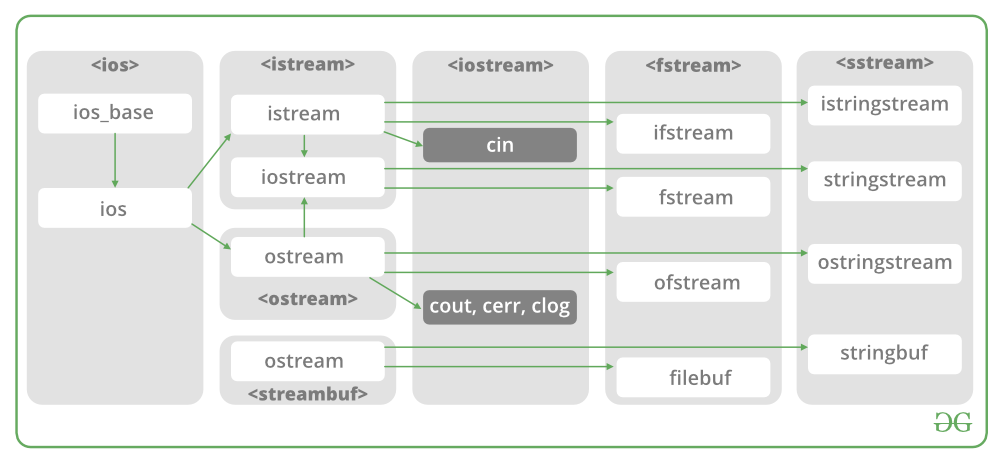

:toc:

// 保证所有的目录层级都可以正常显示图片
:path: C++/
:imagesdir: ../image/

// 只有book调用的时候才会走到这里
ifdef::rootpath[]
:imagesdir: {rootpath}{path}{imagesdir}
endif::rootpath[]

== C++常见知识点总结

=== STL原理及实现

STL有六大组件，六大组件之间可以嵌套使用。

- 容器(containers)

容器主要有，vector,list,queue,deque,set,map,multimap,multiset...，STL的容器是一种模板类

- 算法(algorithms)

各种算法比如：sort,search,copy,search,erase等，STL的算法是一种模板函数

- 迭代器(iterators)

迭代器扮演着容器和算法之间的胶着剂，迭代器是一种将operator*, operator->, operator++, operator--等指针相关操作予以多元化的 class template。所有的STL容器都有自己的专属的迭代器。#原生指针也是一种迭代器#

- 仿函数(functors)

仿函数行为类似函数，可以作为算法的某种策略，仿函数是一种重载了operator()的class或者class template，一般的函数指针也可以视为简单的仿函数

- 适配器(adapters)

一种用来修饰容器、仿函数、迭代器或接口的东西，例如queue或者stack，虽然看着是一种容器，但是内部完全借助deque实现，其实质上只能看做是一种容器的适配器，所有动作都有底层的deque实现。

- 配置器(allocators)

负责内存空间的配置与管理，配置器是一个实现了动态空间配置、空间管理、空间释放的class template

六大组件之间的的交互关系，容器通过配置器取得数据存储空间，算法通过迭代器获取容器中存储的内容，仿函数可以协助算法完成不同的策略，适配器修饰套接仿函数

.STL六大组件.png
image::image-2022-06-05-12-13-07-200.png[STL六大组件关系图]

==== 按照实现形式不同又可以将容器分为序列式容器和关联式容器
- 序列式容器
 1. vector-数组，当元素不够时会重新分配内存，copy原来数组中的元素到新分配的数组中去
 2. list-单链表
 3. deque-当内存不够时，deque的内存时由分配中央控制器会连接起来的一块一块的内存拼接而成，所以deque可以向前或者向后插入数据，当内存不够时会继续寻找空闲的内存块用来存储数据。
 4. stack-基于deque实现
 5. queue-基于deque实现
 6. heap-完全二叉树，使用最大堆排序，以数组(vector)的形式存放
 7. slist-双向链表
- 关联式容器
 set,map,multimap,multiset-基于红黑树实现(RB-tree)，一种加上额外平衡条件的二叉树
 hash table-散列表，详见：redis内存分析
 hash_map,hash_set,hash_multset,hash_multimap- 基于hash table实现

=== STL各个数据结构底层实现原理

- vector: 底层是动态数组实现

准确的来说是一个由三个指针管理的动态数组。

[source, cpp]
----
struct _Vector_impl
   : public _Tp_alloc_type
   {
 pointer _M_start;
 pointer _M_finish;
 pointer _M_end_of_storage;
};
----

- list: 双向链表
- map: 底层红黑树
- deque： 双端队列
- stack: 抽象容器适配器
- queue: 抽象容器适配器
- priority_queue: 优先队列

=== 虚函数

// 虚函数实现原理，这里说明

==== 虚函数实现
C++多态分为静态多态(编译时多态)和动态多态(运行时多态)两大类，静态多态通过重载，模板来实现；动态多态是通过虚函数实现。

虚函数通过虚函数表vtbl(virtual table)和虚函数表指针vptr(virtual table pointer)来实现动态多态。当调用一个虚函数时，被执行的代码和调用函数的对象的动态类型相一致，当一个类声明了虚函数或者继承了虚函数，这个类就会有自己的vtbl，vtbl实际上就是一个函数指针数组，有的编译器用的是链表，不过方法都差不多。vtbl中每一个元素都对应一个函数指针，函数指针指向该类的一个虚函数，实际上每一个对象都会包含一个vptr，vptr指向该类的vtbl;

|===
|结论

|声明虚函数之后的类，都会有自己的vtbl

|带有虚函数类的对象会包含一个vptr，该vptr指向vtbl

|虚函数按照其声明顺序存放于vtbl中，vtbl数组中每一个元素对应一个函数指针指向该类的虚函数

|如果子类覆盖了父类，会将子类的对象的虚函数放到原来父类虚函数的对应位置中

|在多继承情况下，每个父类都会有自己的虚表，子类成员函数被放到了第一个父类表中
|===

==== 为什么C++里访问虚函数比访问普通函数慢？
- 单继承时，性能差不多，多了一个虚函数表查找
- 多继承的时候会慢
通过实现原理可知，虚函数的调用过程如下：
 1. 通过对象的vptr找到类的vtbl，这只是一个指针寻址
 2. 找到vtbl中函数的索引，这一步也很简单，编译器为每一个虚函数都分配了唯一索引，这步的代价也只是在vtbl数组中进行地址偏移。

因此在单继承中，调用虚函数所需的代价基本上和非虚函数的效率一样，在大多数计算机上只是多执行了很少的一些指令，所以一概而论的说虚函数性能不行是不科学的。
在多继承的情况下，由于继承的情况下，由于根据多个父类生成多个vptr，在对象里寻找vptr而进行的偏移量会变得复杂一些，但这些也不是虚函数的性能瓶颈。虚函数运行时的主要代价是虚函数不能进行内联，这非常好理解，因为内联是指在编译期间被调用的函数体本省来代替函数调用的指令，但是虚函数是直到运行期间才知道要调用的是哪一个函数，所以没有办法进行内联。

==== 虚函数会使得类对象占用空间增大吗？
虚函数为了实现运行期间多态，编译器会给每一个包含虚函数或继承了虚函数的类自动建立一个虚函数表，所以虚函数的一个代价就是会增加类的体积。
当类中的虚函数比较少时这些体积并不明显，如果类中有大量的虚函数你就会发现vtbl会占用大量的地址空间。但这并不是主要的代价，如果类继承过程中，子类会生成自己的vtbl，如果自理只是覆盖父类的一部分虚函数，其余部分和父类的重复，如果有大量的子类继承都只覆盖一小部分父类的虚函数的情况下，会造成大量的地址空间浪费。比如很多UI库继承父类之后往往只实现一小部分接口，这也是为什么UI库会非常的大的原因。还有就是，由于虚函数vtpr的存在，在单继承或者多继承的情况下，虚函数只会导致类多出一个vtpr指针的体积；在多继承的情况下，类的每个对象会多出N个vptr的体积。当一个类对象本身体积比价大时这些增加的体积不明显，但当一个类对象体积比较小时，这些增加的体积就非常明显了。

==== 为什么需要虚析枸函数，什么时候不需要，父类的析枸函数为什么需要定义为虚函数
一般在析枸函数中会进行资源的释放，而析枸函数没有被调用的话就会造成内存泄露，这样是为了当用一个基类指针删除一个派生类对象时，派生类对象的析枸函数也能被调用。
因此，并不是所有类都需要定义虚析枸函数，当一个类被用作基类函数的时候，才需要把析枸函数写成虚析枸函数。

==== 内联函数、构造函数、静态成员函数可以是虚函数吗？

- 内联函数是编译期间展开的，必须有实体，不能是虚函数
- 静态成员函数属于class自己的，也必须有实体，不能是虚函数
- 虚函数需要虚函数表查找才能调用，构造函数调用之前对象的虚函数表不存在，根本找不到"虚构造函数"，因此构造函数不能是虚函数，这是一个鸡生蛋蛋生鸡的问题。

虚函数表现多态时不能被内联：虚函数运行时需要的代价主要是虚函数不能是内联函数。因为内联函数是在编译期间用被调用的函数体替换函数调用的指令,但是虚函数时在运行期间才能决定到底调用哪个函数，所以虚函数没法在编译期间就进行展开。
[yellow]#当然如果使用对象直接调用虚函数它是可以被内联的，但是大多数虚函数是通过对象的指针或引用被调用的，这种调用时不能被内联，而这种调用方式是通常标准的调用方式(谁会定义虚函数使用对象调用呢？ 这不是多此一举吗)#

构造函数不能是虚函数，而且构造函数中调用虚函数，实际执行的是虚函数对应的函数，因为自己没有构造好，多态也是被disable的。

静态成员是属于整个类的，不是针对对象而来的，同时其函数指针存放也不同于一般的成员函数，其无法成为一个对象的虚函数的指针，因此无法被定义为虚函数

==== 为什么需要纯虚函数？
纯虚函数：在基类中只有声明没有定义，但要求任何派生类都要对纯虚函数进行实现，在基类中通过函数原型后面添加=0来声明纯虚函数 [blue]#virtual int32_t Init() = 0;#

引入纯虚函数的原因：

1. 为了使用多态特性，我们常常需要在基类中定义各种虚拟函数
2. 在很多情况下，基类本身生成对象是不合理的，例如动物作为基类，可以派生狮子、老虎、孔雀、青蛙，将动物生成对象显然不合适。

为了解决以上问题，引入纯虚函数概念，将函数定义为纯虚函数，则编译器要求派生类中必须予以重写以实现多态性，同时含有纯虚函数的类称为抽象类，它不能生成对象。声明了纯虚函数的类不能创建实例，只能创建它的派生类的实例。

定义了纯虚函数的类，相当于java的接口。纯虚函数让所有类的对象(派生类)都可以执行纯虚函数的动作，但类无法为纯虚函数提供一个合理地缺省实现。所以纯虚函数的声明就是在告诉类的设计者，你必须提供一个纯虚函数的实现，但我不知道你会怎样实现它。

==== 虚函数常见问题

- 虚函数是动态绑定的，也就是说使用虚函数指针能够正确找到实际类对象对应的函数。
- 构造函数不能是虚函数，而且构造函数中执行虚函数，实际上是执行父类对应的函数，因为构造函数中自己类的对象还没有构造好，多态时被disable的。实际测试：即使定义的是子类对象，在父类中调用虚函数执行父类的，在子类中调用虚函数执行的是子类的。
- 析枸函数可以是虚函数，有继承的复杂的类中虚析枸函数往往还是必须的
- 将一个函数定义为纯虚函数，实际上是将这个类定义为抽象类，不能实例化对象
- 纯虚函数通常没有函数体, 使用=0声明函数是一个纯虚函数，我们可以为纯虚函数在类外定义函数体，但是通常没有必要。
- 析枸函数可以是一个纯虚函数，但是纯虚析枸函数必须有定义体，因为析枸函数的调用在子类对象中是隐含的，
- 非纯虚函数必须有定义体，不然是一个错误
- 派生类的override虚函数定义必须和父类的完全一致。除了一个特例，如果父类中的返回值是一个指针或者引用，子类override时可以返回这个指针(或引用)的派生。 例如:

[source, cpp]
----
class Animation {
public:
    virtual ~Animation() = default;
    virtual Animation *Clone() {
        return this;
    }
};

class Dog : public Animation {
public:
    ~Dog() override = default;
    Dog *Clone() override {
        return this;
    }
};
----

==== 为什么需要虚继承？虚继承实现的原理解析？
虚继承是多重继承中特有的概念，如图A，B都继承自C，D又继承了B和A，如果不使用虚继承，D中就会有两份C的函数和变量，为了节省内存，可以讲A,B对C的继承定义为虚继承，这样就能保证D中只有一份C的变量和函数。虚继承在一般的应用中很少被用到，所以往往被忽视，这也主要是因为在C++中多重继承不推荐也不常用，而一旦离开了多重继承虚继承就失去了存在的必要，因为这样只会降低使用效率和占用更多的空间。

虚继承的特点，在任何派生类中的virtual基类总用一个共享的对象来表示

[plantuml,sample-plantuml-diagram,alt="Class diagram", width="100", height="60"]
----
@startuml simple
' object

object A
object B
object C
object D

C <|-- B
C <|-- A
B <|-- D
A <|-- D

@enduml
----

=== 设计一个不能被继承的类

 通过将构造函数或析枸函数私有化可以防止该类被继承

.单例实现原理说明
****
静态函数相当于全局执行代码，除了域的范围（执行时的函数栈）区别，在执行上，它与任何正在执行的代码没有区别。而一个类的实例化（new ClassType()）这种操作，也是一句合法的代码，只要不被访问限制，在任何地方都可以执行。private这种限定词，将一个方法限定在只有与这个方法同类的方法中才可以使用。而某一个类的静态方法，属于这个类。在限定的语义上，它拥有调用private方法的权限。这种限定是在逻辑层面建立的，也就是，并非计算机的汇编层面或者原理层面导致这样的，而是c++这门语言强行实现并规定的
****

[source, cpp]
----
class NotImplemented {
public:
    // 类构造函数或析枸函数私有化之后，只能通过类static函数中进行创建
    // 不能在外部创建，因此如果只实现一个返回指针的instance函数
    // 就能保证该类只在堆中能够创建
    static NotImplemented* GetInstance() {
        return new NotImplemented;
    }

    static NotImplemented& GetInstanceRef() {
        static NotImplemented notImplemented;
        return notImplemented;
    }

private:
    NotImplemented() = default;
    ~NotImplemented() = default;
};

class NotImplementedImpl : public NotImplemented {
public:
    // Explicitly defaulted default constructor is implicitly deleted
    NotImplementedImpl() = default;
    ~NotImplementedImpl() = default;

};
----

[NOTE]
如果想创建只能在栈上进行实例化的类，可以将函数operator new和operator delete定义为私有，这样无法在外部使用new和delete调用operator new和operator delete，该类的对象只能在栈上创建。

==== 为什么需要私有继承

实现数据的封装

1. 私有继承的子类对象不能直接访问父类的任何成员
2. 基类指针不能指向私有继承的子类对象

|===
|继承描述符|父public成员|父protected成员 |父private成员

|public
|子public成员
|子protected成员
|-

|protected
|子protected成员
|子protected成员
|-

|private
|子private成员
|子private成员
|-

|===

[source, cpp]
----

class Logger {
public:
    void log(const std::string& message) {

    }
};

class Database : private Logger {
public:
    Database() = default;

    // 外部无法访问基类的log成员，实现将基类的public成员进行隐藏
    void connect(const std::string& host) {
        this->log("Connecting to database..."); // 使用基类的 log 方法
        // 实现数据库连接逻辑...
    }
};

// 私有继承的子类对象不能直接访问父类的任何成员
Database database;
database.connect("tether");

// 基类指针能指向私有继承的子类对象吗？
Logger *lpLog = &database; // 错误，基类指针不能指向私有继承的子类对象

----

=== 内存分配

//C++中虚拟内存映射规则

- 静态存储区分配。内存在程序编译期间就已经分配好，这块内存在程序整个运行期间都存在，例如全局变量，static 变量
- 在栈上创建，在执行函数时，函数内部局部变量的存储单元都可以在栈上创建，函数执行结束时这些存储单元自动被释放，栈内存分配运算内置于处理器的指令集中，效率很高，但是分配器的内存容量有限。
- 从堆上分配，亦称为动态分配，程序在运行的时候Malloc或者new申请任意多的内存，程序员自己负责在何时用free或delete释放内存，动态内存的生存期由我们决定，使用灵活，但是问题也多

=== 指针问题

将一个数组当成参数传递给函数，回退化为指针，说是指针退化，不如说是数组退化为指针

[source, cpp]
----
void function(char a[64]) {

}
----

==== 指针和引用的区别

a. 指针是一个实体,而引用是一个别名
b. 引用无需解引用，指针需要
c. 引用只能在定义时被初始化一次，之后不可变，指针可变
d. 引用没有const，指针有const
e. 引用不能为空，指针可以为空
f. sizeof引用是引用对象的大小，sizeof指针是指针本身的大小
g. 指针和引用搞得自增(++)运算意义不一样
h. 从内存分配上来看，程序为指针分配内存区域，而引用不需要分配内存区域

==== C++ 中为什么能用引用尽量不要用指针

1. 引用是变量的别名，代码清晰度更高
2. 避免不必要的参数检查
3. 引用无需解引用

其中第3点需要特别说一下，指针本身也是个变量，那么也存在自己的地址，每次通过指针调用对象，需要先通过指针变量的名字找到指针的地址，指针地址上又存储了对象所在的地址，需要取出来再找到具体对象所在的位置。

如图，p是一个指针，存的是a的地址， *p也就是对这个地址的解引用，拿到的就是地址里面的内容32，可以看到指针是有一个寻址的过程的，因此比引用慢。

image::cpp/image-2024-10-15-09-48-20-744.png[]

==== 智能指针
====
智能指针：实际上行为类似于指针的类对象，它的一种通用实现方法是采用引用计数的方法

- 智能指针将一个计数器于类指向的对象相关联，引用计数跟踪共有多少个对象共享同一指针
- 每次创建类的新对象时，初始化指针并将引用计数设置为1
- 当对象作为另一个对象的副本而创建时，拷贝构造函数拷贝指针并增加与之相应的引用计数
- 对一个对象进行赋值时，赋值操作符减少左操作符对象的引用计数，增加右操作符的引用计数
- 调用析枸函数时，构造函数减少引用计数
- 实现智能指针有两个经典的策略：
a. 引入辅助类
b. 使用句柄类
====

==== 不能再堆上创建的类

要实现一个不能在堆上创建的类，通常是指禁止使用`new`操作符来动态分配此类的对象。这可以通过多种方式来实现，例如：

1. **私有化构造函数**：将构造函数声明为私有，使外部无法直接实例化此类。
2. **私有化`new`操作符**：将`new`操作符声明为私有成员函数，使其无法在类外部使用。
3. **使用静态成员函数作为工厂方法**：提供一个静态成员函数来创建对象，而不是直接使用`new`。

下面是一个具体的例子，展示如何实现一个不能在堆上创建的类：

[source,cpp]
----
#include <iostream>

class NonHeapCreatable {
private:
    NonHeapCreatable() {} // 私有化构造函数，防止外部直接实例化

public:
    static NonHeapCreatable& getInstance() {
        static NonHeapCreatable instance; // 静态局部变量确保单一实例
        return instance;
    }

    void doSomething() const {
        std::cout << "Doing something useful." << std::endl;
    }
};

int main() {
    // 不能直接使用 new 创建 NonHeapCreatable 对象
    // NonHeapCreatable* ptr = new NonHeapCreatable(); // 错误

    // 使用静态成员函数创建单例对象
    NonHeapCreatable& singleton = NonHeapCreatable::getInstance();
    singleton.doSomething();

    return 0;
}
----

- 私有化 new操作符

[source, cpp]
----
class A
{
public:
    A(int a):_x(a){}
    int Display() {
        return _x;
    }
    void setVal(int x) {
        _x = x;
        return;
    }
private:
    //
    int _x;
    // 私有化 new 这样就不能调用 new 创建该对象了
    void* operator new(size_t t){
    }
};
----

=== C++对象模型

==== 为什么nullptr指针能调用成员函数

C++中非虚成员函数和普通函数都是存储在全局代码区的，区别就是C++总成员函数调用会默认生成一个this指针作为第一个参数传入到函数中，如：

[source, cpp]
----
class MyClass {
public:
    MyClass(int value) : data(value) {}

    void printData() const {
        //std::cout << data << std::endl;
    }

private:
    int data;
};
----

调用堆栈如下，编译器会自动将函数首个参数设置为this指针。

[source, cpp]
----
#0  MyClass::printData (this=0x0) at E:\work\note_book\src\main.cpp:34
#1  0x0000000000401571 in main () at E:\work\note_book\src\main.cpp:44
#2  0x00000000004013c7 in __tmainCRTStartup ()
----

因此，非虚函数能从全局代码去找到，this指针虽然为nullptr依然能够当成正常的参数传递，只要不再函数内部使用this指针就行。

但是虚函数不能使用nullptr指针调用，因为虚函数是动态绑定的，需要调用对象里面的虚函数表查找对应的函数，因此需要调用this指针。

=== 重载和重写的区别

- override(重写)
a. 方法名、参数、返回值相同
b. 子方法不能缩小父类方法的访问权限
c. 子类方法不能抛出比父类方法更多的异常(但子类方法可以不抛出异常,因为子类和父类的关系是is-a的关系，所有能使用父类的地方肯定都能使用子类代替，要是子类能抛出更多的异常，那么按照调用父类方法使用的地方就会出现问题)
d. 存在父类和子类之间
e. 方法被定义为final不能进行重写
- overload(重载)
a. 参数类型、个数、顺序至少一个不相同
b. 不能重载只有返回值不同的方法名
c. 存在与父类和子类、同类中

=== 重载、重写和重定义

.重载
****
- 仅仅函数名相同，参数个数、类型、返回值、参数顺序总有一个不同的

[blue]#关联知识#：函数匹配规则，类成员函数重载，模板函数重载
****

.重写(也称为覆盖)
****
- 发生在基类和派生类之间
- 重写的函数除了函数体不同其他的都一致(返回值为指针时子类可以返回子类地想类型的指针或引用)
- 被重写的函数，在父类中必须有virtual修饰
****

.重定义(隐藏)
****
- 派生类重定义与基类同名的函数
- 若基类为非虚函数，只要函数名相同(不管参数列表是否相同)
- 若基类为虚函数，参数列表需不同(因为参数，返回值都相同为重写; 参数相同，返回值不同编译不通过，说明函数继承时，是否重写看的是函数参数)
****

=== C++文件

this指针是右值
虚函数也能被inline修饰，只是当虚函数实现多态时就算使用了inline关键字照样不会被内联

=== 关键字

==== volatile作用

1. volatile关键词的第一个特性：易变性。所谓的易变性，在汇编层面反应出来，就是两条语句，下一条语句不会直接使用上一条语句对应的volatile变量的寄存器内容，而是重新从内存中读取。
2. volatile关键词的第二个特性：不可优化特性，volatile告诉编译器不要对我这个变量进行各种激进的优化，甚至将变量直接消除，保证程序员写在代码中的指令一定会被执行。
3. volatile关键词第三个特性：顺序性。能够保证volatile变量间的顺序行，编译器不会进行乱序优化。
但是当volatile变量于非volatile变量之间进行操作时，是有可能被编译器交换顺序的。只是volatile变量之间进行操作不会被编译器交换顺序。哪怕你把所有的变量都声明成volatile变量，哪怕你杜绝编译器的乱序优化，这也只能够保证生成的汇编代码不是乱序的，CPU仍然可能进行乱序执行指令，导致程序依赖的逻辑出错，volatile对此是无能为力的。这个时候要想保证内存交换的顺序就要使用到内存屏障技术了，具体的实现可以参考： C++内存模型和原子类型操作

==== static关键字的作用
static无论在C还是在C++语言里面都可以永爱控制存储方式和可见性

- 修饰局部变量:

一般情况下局部变量都是放到栈上的，在语句块结束的时候变量的生命周期也就结束了。但是如果给局部变量添加上static进行修饰的话，该变量便存放到了静态数据区域，其生命周期一直会延续到整个程序结束。需要注意一点的是，使用static声明的局部变量只是改变了声明周期，其作用域还是局部的，只是在该语句块中可见，作用域也仅限于该语句块。

- 修饰全局变量

全局变量可以通过extern在整个工程中可见，但是经过static修饰过的全局变量就只能本源文件中可见

- 修饰函数

static修饰的函数(C语言中)，情况和修饰全局变量大同小异，就是改变了函数的作用域
- C++中的static
如果使用static修饰C++类中的函数，则说明该函数不属于该类的任何特定对象；如果对类中某个变量进行修饰，表示该变量为类以及其所有的对象所有。它们在存储空间中都只存在一个副本，可以通过类或者对象去调用。

==== const含义及其实现机制

const可以用来限定特定变量，以通知编译器该变量不可被修改。要习惯使用const，这样可以避免在函数中修改某些不应该修改的变量。
const的在不同场景的中的表现有些不同。

- const修饰基本数据类型
1. const修饰常量或者数组，基本数据类型，const放到类型说明符前后效果一样，都是告诉编译器这些值不能修改
2. const修饰指针或者引用变量，如果const位于指针的左侧，则const就是用来修饰指针指向的变量，如果const位于指针的右侧，则const就是用来修饰指针，即指针本身是常量。引用同理
- 作为函数返回值的const修饰符
1. 修饰参数的const修饰符，调用函数时用相应变量初始化常量参数，按照const修饰的部分进行常量化，保护了原对象的属性，常用于指针或者引用的情况
2. 修饰函数返回值，声明为函数返回值为const之后const可以对返回值起到同样的保护作用，常用来返回类中不想被外部更改的变量
- const在类中
1. const修饰的类成员变量，只能在构造函数的初始化列表中进行初始化，const修饰的成员函数int function() const;，其意义是该函数不能修改所在类中的任何成员变量
- 修饰类对象
1. 常量对象只能调用常量函数，别的成员函数不能调用

.memory_management.cpp
[source, cpp]
----
    const MemoryManagement memoryManagement;
    memoryManagement.GetCount();
    //MemoryManagement.SetCount();
----

==== typeof

C语言新增关键字，在Linux内核中非常常见，一个类型很难手写确定时可以使用typeof来让编译器自动推敲，该关键字在C99中已经支持

1. 如果是函数表达式，则给出函数的返回类型

2. 如果是其他变量，推导出对应变量的类型

==== new在C++中是？

关键字和运算符，

malloc是库函数，不在编译器控制范围之内；
new是运算符，在编译器控制范围之内；调用
malloc时，从堆中申请内存；调用
new时，从堆中申请内存并为内存调用构造函数。

C++程序执行时将内存大方向分为4个区域：

- 代码区域：存放函数体的二进制代码，由操作系统进行管理的
- 全局区：存放全局变量和静态变量以及常量
- 栈区：由编译器自动分配释放，存放函数的参数值，局部变量等
- 堆区：由程序员分配和释放，若程序员不释放程序结束时由操作系统回收

new可分为operator new(new 操作)、new operator(new 操作符)和placement new(定位 new)，其中operator new执行和malloc相同的任务，即分配内存，但对构造函数一无所知；而 new operator则调用operator new，分配内存后再调用对象构造函数进行对象的构造。

==== nodiscard属性
可用来防止以下问题

-  **内存泄露** ，例如返回值中含有动态分配的内存，但并未使用。
-  **未知的或出乎意料的行为** ，例如因为没有使用返回值而导致了一些奇怪的行为。
-  **不必要的开销** ，例如因为返回值没被使用而进行了一些无意义的行为。

.防止出乎意料的行为
[source, cpp]
----
class MyContainer {
    ...
public:
    // 部分人会把empty当成清空函数使用，添加nodiscard之后就能有效的避免
    // 把empty当成clear使用的情况出现
    [[nodiscard]] bool empty() const noexcept;
    ...
};
----

.内存泄露
[source, cpp]
----
class MyContainer {
    ...
public:
    // 添加nodiscard防止调用CreateBuffer函数不处理返回值，导致内存泄露
    [[nodiscard]] char* CreateBuffer(int32_t size) const noexcept {
        return new (std::nothrow) char[size];
    }
    ...
};
----

.无意义的调用
[source, cpp]
----
class Helpers {
    ...
public:
    // 非必要不要调用的函数，因为调用会非常耗时
    [[nodiscard]] bool IsAllRunning() const noexcept {
        // 连接各个分布式服务端，查看是否都正常运行
        bool bRunning = false;
        ...
        return bRunning;
    }
    ...
};
----

==== fallthrough属性

部分switch中如果想case打通时总是编译器总是会给出警告，如果想不给出警告可以通过设置fallthrough属性来告诉编译器这里就是要打通case

[source, cpp]
----
void commentPlace(int place)
{
    switch (place) {
        case 1:
            std::cout << "very ";
            [[fallthrough]];
        case 2:
            std::cout << "well\n";
            break;
        default:
            std::cout << "OK\n";
            break;
    }
}
----

==== mutable

当定义一个map对象，需要向里面插入数据时，总是需要对对应的对象实现const入参类型的赋值构造函数，但是这种构造函数对于需要内部申请内存做转移的功能非常不友好，这个时候就需要使用mutable关键字了，也就是说，添加mutable之后的成员变量能无视所有的const修饰

[source, cpp]
----
struct ConditionLIst {

    ConditionLIst() = default;
    ConditionLIst(const ConditionLIst& other) {
        iCount = other.iCount;
        lpData = other.lpData;
        // other是const类型也能对other对象的成员变量的值进行更改
        // 因为lpData 有mutable关键字修饰
        other.lpData = nullptr;
    }

    virtual void ShowData() {

    }

    int iCount{};  // 计数器
    mutable char *lpData{nullptr}; // 数据内存申请
};

// -----
std::map<int, ConditionLIst> mapCondition;
ConditionLIst conditionList{};
mapCondition.insert(std::make_pair(1, conditionList));
----

==== explicit

两种常见的隐式转换

- 单参数的构造函数或N个参数中有N-1个默认参数的构造函数

[source, cpp]
----
// 其他类型转化为该类
class A
{
public:
      A(stirng s);
      A(string s,int a = 0);
};
----

- 使用 `operator what_you_want_to_convert_type() const`

[source, cpp]
----
// 该类转化为其他类型
class A
{
public:
      operator char*() const
      {
          return data;//当从其他类型转换到char*时自动调用
      }
private:
      char* data;
};
----

- 解决办法

在单参数的构造函数或N个参数中有N-1个是默认参数的构造函数声明之前加上explicit。

=== 什么是C++ RAIL

Resource Acquisition Is Initialization or RAII, is a C++ programming technique which binds the life cycle of a resource that must be acquired before use (allocated heap memory, thread of execution, open socket, open file, locked mutex, disk space, database connection—anything that exists in limited supply) to the lifetime of an object.

资源获取即初始化 （RAII） 是一种 C++ 编程技术，它将使用前必须获取的资源的生命周期（分配的堆内存、执行线程、开放套接字、打开的文件、锁定的互斥锁、磁盘空间、数据库连接 - 任何供应有限的东西）绑定到对象的生命周期。

=== 跨平台

==== 普通继承

[source, cpp]
----
class A
{
        int i;    //4byte
        char c1;//1byte
};
class B :  public A
{
        char c2;//1byte
};
class C :  public B
{
     char c3;//1byte
};
----

在64位g++下，调用sizeof(A)、sizeof(B)、sizeof(C)后的结果均为8；在vs2013下分别为8,12,16

.g++于vs结构体对其不一致
****
g++下：普通继承时，派生类和基类的内存空间没有间隔。
    A：4+1+3(补齐) = 8
    B：4+1+1(c2)+2(补齐) = 8
    C：4+1+1(c2)+1(c3)+1(补齐) = 8
注意这里所有成员均为私有成员，如果改成public或protected则大小会有变化
vs2013下：普通继承时，派生类和基类的内存空间需要独立，即先补齐基类，再分配派生类。
    A：4+1+3(补齐) = 8
    B：4+1+3(补齐) + 1(c2)+3(补齐) = 12
    C：4+1+3(补齐) + 1(c2)+3(补齐) + 1(c3)+3(补齐) = 16
****

==== 虚拟继承

[source, cpp]
----
class A
{
        int i;    //4byte
        char c1;//1byte
};
class B : virtual public A
{
        char c2;//1byte
};
class C : virtual public B
{
     char c3;//1byte
};
----

调用sizeof(A)、sizeof(B)、sizeof(C)后，32位g++下，分别为8,16,24；64位g++下，分别为：8,24,40；vs2013下分别为8,16,24

.g++于vs结构体对其不一致
****
32位g++下：
    A：仍然是4+1+3(补齐) = 8
    B：4+1+3 + 4(vptr)+1(c2)+3(补齐) = 16
    C；4+1+3 + 4(vptr)+1(c2)+3(补齐) + 4(vptr)+1(c3)+3(补齐) = 24

64位g++下：
    A：仍然是4+1+3(补齐) = 8
    B：4+1+3 + 8(vptr)+1(c2)+7(补齐) = 24
    C；4+1+3 + 8(vptr)+1(c2)+7(补齐) + 8(vptr)+1(c3)+7(补齐) = 40

vs2013下：
    A：仍然是4+1+3(补齐) = 8
    B：4+1+3 + 4(vptr)+1(c2)+3(补齐) = 16
    C；4+1+3 + 4(vptr)+1(c2)+3(补齐) + 4(vptr)+1(c3)+3(补齐) = 24

注意这里vs2013的情况表面看上去和32位g++相同，实则不然。例如去掉class B对于A的虚拟继承性
****

调用sizeof(A)、sizeof(B)、sizeof(C)后，32位g++下，分别为8,16,24；64位g++下，分别为：8,24,40；vs2013下分别为8,16,24

=== 参数

==== 变参回调函数的使用

.调用变参回调函数的案例
[source, cpp]
----
template<typename CB>
class CountCalls
{
private:
    CB callback;    // 要调用的回调函数
    long calls = 0; // 调用的次数
public:
    explicit CountCalls(CB cb) : callback(cb) {}
    template<typename... Args>
    int32_t operator() (Args&&... args) {
        ++calls;
        return callback(std::forward<Args>(args)...);
    }
    long count() const {
        return calls;
    }
};
----

==== 为什么函数参数的入栈的顺序是从右往左
因为好多函数是不定参数个数的，比如最常用的printf，所以需要参数的入栈顺序是从右往左。

那么从右向左压栈之后，只需要从栈定开始挨个取
如果参数是从右向左入栈，那么printf可以从栈顶开始依次读取参数，直到所有的参数都被处理完毕

=== 工具

==== sourcetrail

image::image-2024-07-31-09-43-05-019.png[]

image::image-2024-07-31-09-44-08-226.png[]

==== Understand

image::image-2024-07-31-09-44-44-147.png[]

