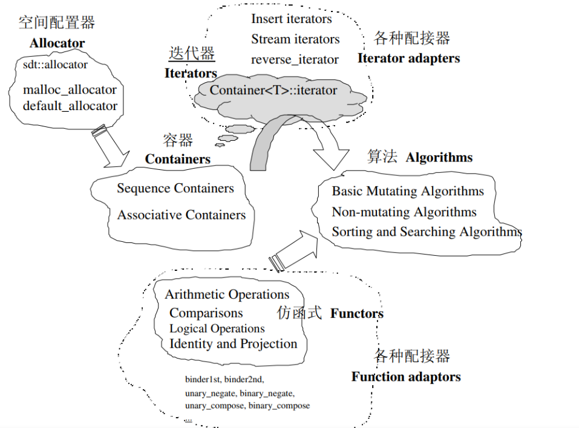

:toc:

// 保证所有的目录层级都可以正常显示图片
:path: C++知识点总结/
:imagesdir: ../image/

// 只有book调用的时候才会走到这里
ifdef::rootpath[]
:imagesdir: {rootpath}{path}{imagesdir}
endif::rootpath[]

== C++常见知识点总结
=== 关键字作用解释
=== 1. 某文件中定义的静态全局变量(静态外部变量(函数外部定义))其作用域是？
本文件，静态全局变量限制了其作用域，导致该变量只能在其所在的源文件有效。正是因为作用域局限于一个源文件内，因此可以避免其他源文件中同名变量引起的错误。如果当前源文件已经有同名静态变量，会优先使用静态变量。

=== 2. 通常使用__plusplus来判断一段程序是使用C++编译器编译的还是使用C编译器编译的
[source, cpp]
----
#ifdef __cplusplus
// C++
#else
//C
#endif
----
=== 3. C++函数中值的传递方式有哪几种，以及相互之间的区别
C++函数有三种传递方式：值传递、指针传递和引用传递
- 指针有自己的内存空间，引用知识一个别名
- sizeof计算指针的大小为4,而引用的大小为对象的大小
- 可以用 const指针但是不能有 const引用
[source, cpp]
----
int * const data = &dataSize;   // 可以有const指针
int & const data = dataSize;    // 但是引用不能是const的， 但是别名可以定义成const，其实这一切都是因为引用只是值得别名
const & int data = dataSize;   // 引用的别名是可以定义为const的
----
- 指针可以被初始化为
nullptr，但是引用必须被初始化，且必须是一个已有对象的引用
- 指针可以一有多级指针(**p)，而引用只能有一级

=== 4. new在C++中是？
关键字和运算符，
malloc是库函数，不在编译器控制范围之内；
new是运算符，在编译器控制范围之内；调用
malloc时，从堆中申请内存；调用
new时，从堆中申请内存并为内存调用构造函数。
C++程序执行时将内存大方向分为4个区域：
- 代码区域：存放函数体的二进制代码，由操作系统进行管理的
- 全局区：存放全局变量和静态变量以及常量
- 栈区：由编译器自动分配释放，存放函数的参数值，局部变量等
- 堆区：由程序员分配和释放，若程序员不释放程序结束时由操作系统回收

=== 5. 多态的作用以及产生条件
多态是指不同的子类在继承父类后分别都重写覆盖了父类的方法，即父类同一个方法，在继承的子类中表现出不同的形式。因此可以实现调用同一函数能产生不同的行为
产生条件：

- 调用函数的对象必须是指针或者引用
- 被调用的函数必须是虚函数，且完成了虚函数的重写

作用：
 1. 隐藏实现细节，使得代码能够模块化；扩展代码模块，实现代码重用
 2. 接口重用

=== 6. 多态类的虚函数表是Compile-Time，还是Run-Time时建立的？
虚函数在编译期间就建立了，各个虚函数在编译时组织成一个虚函数地址数组，而对象的隐藏成员-虚函数表指针是在运行期间，也就是构造函数被调用时进行初始化的，这是实现多态的关键

=== 7. 面向对象的三个基本特征，并简单叙述
-  封装，将客观事物抽象成类，每个类对自身的数据和方法实行protection(private, protected, public)
-  广义的继承有三种实现形式：实现继承(指使用基类的属性和方法而无需额外的编码能力)、可视继承(子窗体使用父窗体的外观和实现代码)、接口继承(仅使用属性和方法，实现滞后子类实现)。前两种(类继承)和后一种(接口继承)构成了功能复用的两种方式。
-  多态：允许将子类类型的指针赋值给父类类型的指针(使用父类类型引用子类对象)
-  main函数执行之前还会执行什么代码？
全局对象的构造函数会在main函数执行之前执行

[source, cpp]
----
using namespace std;

 class B {
 public:
     B() {
         cout << "Construct B " << endl;
     }
 };

 B b;

 int main(int argc, char* argv[]) {
     cout << "main Run" << endl;
     return 0;
 }
----

=== 9. 内存分配的方式有几种？
- 静态存储区域分配，内存在程序编译的时候就已经分配好了，这块内存在程序的整个运行期间都存在。例如全局变量，静态局部变量。
- 在栈上创建，在执行函数时，函数局部变量的存储单元可以在栈上创建，函数执行结束时这些存储单元自动被释放。栈内存分配运算内值于处理器的指令集中，效率很高但是分配的内存容量有限-普通的局部变量。
- 从堆上分配，也称为动态内存分配。程序在运行的时候采用malloc或new申请任意多少内存，程序员自己负责在任何时候free或delete释放内存。动态内存的生存期由我们决定，使用非常灵活但是问题最多

=== 10. 引用和指针有什么区别？
- 引用必须被初始化，指针不必
- 引用初始化后不能被改变，指针可以改变所指的对象
- 不存在指向空值的引用，但是存在指向空值的指针

=== 11. C++是不是类型安全的？
不是， 类型的指针可以强制转换类型，类型之间也是可以强制转换

=== 12. volatile作用
1. volatile关键词的第一个特性：易变性。所谓的易变性，在汇编层面反应出来，就是两条语句，下一条语句不会直接使用上一条语句对应的volatile变量的寄存器内容，而是重新从内存中读取。
2. volatile关键词的第二个特性：不可优化特性，volatile告诉编译器不要对我这个变量进行各种激进的优化，甚至将变量直接消除，保证程序员写在代码中的指令一定会被执行。
3. volatile关键词第三个特性：顺序性。能够保证volatile变量间的顺序行，编译器不会进行乱序优化。
但是当volatile变量于非volatile变量之间进行操作时，是有可能被编译器交换顺序的。只是volatile变量之间进行操作不会被编译器交换顺序。哪怕你把所有的变量都声明成volatile变量，哪怕你杜绝编译器的乱序优化，这也只能够保证生成的汇编代码不是乱序的，CPU仍然可能进行乱序执行指令，导致程序依赖的逻辑出错，volatile对此是无能为力的。这个时候要想保证内存交换的顺序就要使用到内存屏障技术了，具体的实现可以参考： C++内存模型和原子类型操作

=== 13. static关键字的作用
static无论在C还是在C++语言里面都可以永爱控制存储方式和可见性

- 修饰局部变量:

一般情况下局部变量都是放到栈上的，在语句块结束的时候变量的生命周期也就结束了。但是如果给局部变量添加上static进行修饰的话，该变量便存放到了静态数据区域，其生命周期一直会延续到整个程序结束。需要注意一点的是，使用static声明的局部变量只是改变了声明周期，其作用域还是局部的，只是在该语句块中可见，作用域也仅限于该语句块。

- 修饰全局变量

全局变量可以通过extern在整个工程中可见，但是经过static修饰过的全局变量就只能本源文件中可见

- 修饰函数

static修饰的函数(C语言中)，情况和修饰全局变量大同小异，就是改变了函数的作用域
- C++中的static
如果使用static修饰C++类中的函数，则说明该函数不属于该类的任何特定对象；如果对类中某个变量进行修饰，表示该变量为类以及其所有的对象所有。它们在存储空间中都只存在一个副本，可以通过类或者对象去调用。

=== 14. const含义及其实现机制

const可以用来限定特定变量，以通知编译器该变量不可被修改。要习惯使用const，这样可以避免在函数中修改某些不应该修改的变量。
const的在不同场景的中的表现有些不同。

- const修饰基本数据类型
 1. const修饰常量或者数组，基本数据类型，const放到类型说明符前后效果一样，都是告诉编译器这些值不能修改
 2. const修饰指针或者引用变量，如果const位于指针的左侧，则const就是用来修饰指针指向的变量，如果const位于指针的右侧，则const就是用来修饰指针，即指针本身是常量。引用同理
- 作为函数返回值的const修饰符
 1. 修饰参数的const修饰符，调用函数时用相应变量初始化常量参数，按照const修饰的部分进行常量化，保护了原对象的属性，常用于指针或者引用的情况
 2. 修饰函数返回值，声明为函数返回值为const之后const可以对返回值起到同样的保护作用，常用来返回类中不想被外部更改的变量
- const在类中
 1. const修饰的类成员变量，只能在构造函数的初始化列表中进行初始化，const修饰的成员函数int function() const;，其意义是该函数不能修改所在类中的任何成员变量
- 修饰类对象
 1. 常量对象只能调用常量函数，别的成员函数不能调用

.memory_management.cpp
[source, cpp]
----
    const MemoryManagement memoryManagement;
    memoryManagement.GetCount();
    //MemoryManagement.SetCount();
----

=== 15. extern关键字
- 用来修饰变量或者函数，说明此变量或者函数是在别处定义，这里要进行引用，需要注意的是，extern有作用域，在一个函数中extern的只能在该函数中使用
- C++extern还有另外一个作用，可以用来知识C、C++的调用规范比如在C++中调用C函数需要使用extern "C"声明要引用的函数，这是给连接器用的，告诉连接器，在链接的时候用C函数的规范来进行链接，这样做的主要原因是因为C编译器编译后的代码命名和C++编译器编译后的命名规则不一样。

#说明#
extern的声明的位置和作用域相关，如果在一个函数中声明extern，那么extern声明的函数只能在该函数中使用。使用extern声明函数可以避免include引入所有的函数声明，提升编译速度

[source, cpp]
----
uint32_t RoundUp(uint32_t x, uint32_t align) {
    // extern有作用域在一个函数中声明extern只能在该函数中使用
    extern void Externally();
    Externally();
    return (x + align - 1) & ~ (align - 1);
}

int main(int argc, char *argv[]) {
    std::cout << RoundUp(13, 8) << endl;
    // extern也有作用域
    //Externally();
    return 0;
}
----
=== 16. 宏定义和内联函数的区别
- 内联函数和宏定义类似，都是将代码插入到调用处，可以通过避免函数调用的开销来提高执行效率，编译器还能够优化调用过程。
- 不同的是宏定义不对参数、返回值等进行检查，因此使用内联函数会更加安全；
- 在处理过程上，宏定义是由预处理器进行宏替代，而内联函数时通过编译器处理来实现的，内联函数在需要调用的地方会进行展开，避免了函数压栈，减少了调用开销。

#有了内联函数宏定义还有必要使用吗？#

1. 内联不能完全替代宏，有些宏可以在当前作用域生成一些变量，内联函数做不到
2. 内联函数只是函数的一种，内联只是程序员建议编译器最好把这个函数在被调用的地方展开，这样可以省去函数调用的开销(压栈、跳转、返回)等，但是编译器可以不按照程序员的建议来，如果内联函数体过大，一般的编译器就会放弃内联方式，而采用普通的方式调用函数，这样内联函数就是普通函数了。

=== STL原理及实现
STL有六大组件，六大组件之间可以嵌套使用。

- 容器(containers)

容器主要有，vector,list,queue,deque,set,map,multimap,multiset...，STL的容器是一种模板类

- 算法(algorithms)

各种算法比如：sort,search,copy,search,erase等，STL的算法是一种模板函数

- 迭代器(iterators)

迭代器扮演着容器和算法之间的胶着剂，迭代器是一种将operator*, operator->, operator++, operator--等指针相关操作予以多元化的 class template。所有的STL容器都有自己的专属的迭代器。#原生指针也是一种迭代器#

- 仿函数(functors)

仿函数行为类似函数，可以作为算法的某种策略，仿函数是一种重载了operator()的class或者class template，一般的函数指针也可以视为简单的仿函数

- 适配器(adapters)

一种用来修饰容器、仿函数、迭代器或接口的东西，例如queue或者stack，虽然看着是一种容器，但是内部完全借助deque实现，其实质上只能看做是一种容器的适配器，所有动作都有底层的deque实现。

- 配置器(allocators)

负责内存空间的配置与管理，配置器是一个实现了动态空间配置、空间管理、空间释放的class template

六大组件之间的的交互关系，容器通过配置器取得数据存储空间，算法通过迭代器获取容器中存储的内容，仿函数可以协助算法完成不同的策略，适配器修饰套接仿函数

.STL六大组件.png

==== 按照实现形式不同又可以将容器分为序列式容器和关联式容器
- 序列式容器
 1. vector-数组，当元素不够时会重新分配内存，copy原来数组中的元素到新分配的数组中去
 2. list-单链表
 3. deque-当内存不够时，deque的内存时由分配中央控制器会连接起来的一块一块的内存拼接而成，所以deque可以向前或者向后插入数据，当内存不够时会继续寻找空闲的内存块用来存储数据。
 4. stack-基于deque实现
 5. queue-基于deque实现
 6. heap-完全二叉树，使用最大堆排序，以数组(vector)的形式存放
 7. slist-双向链表
- 关联式容器
 set,map,multimap,multiset-基于红黑树实现(RB-tree)，一种加上额外平衡条件的二叉树
 hash table-散列表，详见：redis内存分析
 hash_map,hash_set,hash_multset,hash_multimap- 基于hash table实现

=== 虚函数
==== 虚函数实现
C++多态分为静态多态(编译时多态)和动态多态(运行时多态)两大类，静态多态通过重载，模板来实现；动态多态是通过虚函数实现。
虚函数通过虚函数表vtbl(virtual table)和虚函数表指针vptr(virtual table pointer)来实现动态多态。当调用一个虚函数时，被执行的代码和调用函数的对象的动态类型相一致，当一个类声明了虚函数或者继承了虚函数，这个类就会有自己的vtbl，vtbl实际上就是一个函数指针数组，有的编译器用的是链表，不过方法都差不多。vtbl中每一个元素都对应一个函数指针，函数指针指向该类的一个虚函数，实际上每一个对象都会包含一个vptr，vptr指向该类的vtbl;

|===
|结论

|声明虚函数之后的类，都会有自己的vtbl

|带有虚函数类的对象会包含一个vptr，该vptr指向vtbl

|虚函数按照其声明顺序存放于vtbl中，vtbl数组中每一个元素对应一个函数指针指向该类的虚函数

|如果子类覆盖了父类，会将子类的对象的虚函数放到原来父类虚函数的对应位置中

|在多继承情况下，每个父类都会有自己的虚表，子类成员函数被放到了第一个父类表中
|===

==== 为什么C++里访问虚函数比访问普通函数慢？
- 单继承时，性能差不多，多了一个虚函数表查找
- 多继承的时候会慢
通过实现原理可知，虚函数的调用过程如下：
 1. 通过对象的vptr找到类的vtbl，这只是一个指针寻址
 2. 找到vtbl中函数的索引，这一步也很简单，编译器为每一个虚函数都分配了唯一索引，这步的代价也只是在vtbl数组中进行地址偏移。

因此在单继承中，调用虚函数所需的代价基本上和非虚函数的效率一样，在大多数计算机上只是多执行了很少的一些指令，所以一概而论的说虚函数性能不行是不科学的。
在多继承的情况下，由于继承的情况下，由于根据多个父类生成多个vptr，在对象里寻找vptr而进行的偏移量会变得复杂一些，但这些也不是虚函数的性能瓶颈。虚函数运行时的主要代价是虚函数不能进行内联，这非常好理解，因为内联是指在编译期间被调用的函数体本省来代替函数调用的指令，但是虚函数是直到运行期间才知道要调用的是哪一个函数，所以没有办法进行内联。

==== 虚函数会使得类对象占用空间增大吗？
虚函数为了实现运行期间多态，编译器会给每一个包含虚函数或继承了虚函数的类自动建立一个虚函数表，所以虚函数的一个代价就是会增加类的体积。
当类中的虚函数比较少时这些体积并不明显，如果类中有大量的虚函数你就会发现vtbl会占用大量的地址空间。但这并不是主要的代价，如果类继承过程中，子类会生成自己的vtbl，如果自理只是覆盖父类的一部分虚函数，其余部分和父类的重复，如果有大量的子类继承都只覆盖一小部分父类的虚函数的情况下，会造成大量的地址空间浪费。比如很多UI库继承父类之后往往只实现一小部分接口，这也是为什么UI库会非常的大的原因。还有就是，由于虚函数vtpr的存在，在单继承或者多继承的情况下，虚函数只会导致类多出一个vtpr指针的体积；在多继承的情况下，类的每个对象会多出N个vptr的体积。当一个类对象本身体积比价大时这些增加的体积不明显，但当一个类对象体积比较小时，这些增加的体积就非常明显了。

==== 为什么需要虚析枸函数，什么时候不需要，父类的析枸函数为什么需要定义为虚函数
一般在析枸函数中会进行资源的释放，而析枸函数没有被调用的话就会造成内存泄露，这样是为了当用一个基类指针删除一个派生类对象时，派生类对象的析枸函数也能被调用。
因此，并不是所有类都需要定义虚析枸函数，当一个类被用作基类函数的时候，才需要把析枸函数写成虚析枸函数。

==== 内联函数、构造函数、静态成员函数可以是虚函数吗？

- 内联函数是编译期间展开的，必须有实体，不能是虚函数
- 静态成员函数属于class自己的，也必须有实体，不能是虚函数
- 虚函数需要虚函数表查找才能调用，构造函数调用之前对象的虚函数表不存在，根本找不到"虚构造函数"，因此构造函数不能是虚函数，这是一个鸡生蛋蛋生鸡的问题。

虚函数表现多态时不能被内联：虚函数运行时需要的代价主要是虚函数不能是内联函数。因为内联函数是在编译期间用被调用的函数体替换函数调用的指令,但是虚函数时在运行期间才能决定到底调用哪个函数，所以虚函数没法在编译期间就进行展开。
[yellow]#当然如果使用对象直接调用虚函数它是可以被内联的，但是大多数虚函数是通过对象的指针或引用被调用的，这种调用时不能被内联，而这种调用方式是通常标准的调用方式(谁会定义虚函数使用对象调用呢？ 这不是多此一举吗)#

构造函数不能是虚函数，而且构造函数中调用虚函数，实际执行的是虚函数对应的函数，因为自己没有构造好，多态也是被disable的。

静态成员是属于整个类的，不是针对对象而来的，同时其函数指针存放也不同于一般的成员函数，其无法成为一个对象的虚函数的指针，因此无法被定义为虚函数

==== 为什么需要纯虚函数？
纯虚函数：在基类中只有声明没有定义，但要求任何派生类都要对纯虚函数进行实现，在基类中通过函数原型后面添加=0来声明纯虚函数 [blue]#virtual int32_t Init() = 0;#

引入纯虚函数的原因：

1. 为了使用多态特性，我们常常需要在基类中定义各种虚拟函数
2. 在很多情况下，基类本身生成对象是不合理的，例如动物作为基类，可以派生狮子、老虎、孔雀、青蛙，将动物生成对象显然不合适。

为了解决以上问题，引入纯虚函数概念，将函数定义为纯虚函数，则编译器要求派生类中必须予以重写以实现多态性，同时含有纯虚函数的类称为抽象类，它不能生成对象。声明了纯虚函数的类不能创建实例，只能创建它的派生类的实例。

定义了纯虚函数的类，相当于java的接口。纯虚函数让所有类的对象(派生类)都可以执行纯虚函数的动作，但类无法为纯虚函数提供一个合理地缺省实现。所以纯虚函数的声明就是在告诉类的设计者，你必须提供一个纯虚函数的实现，但我不知道你会怎样实现它。

==== 虚函数常见问题

- 虚函数是动态绑定的，也就是说使用虚函数指针能够正确找到实际类对象对应的函数。
- 构造函数不能是虚函数，而且构造函数中执行虚函数，实际上是执行父类对应的函数，因为构造函数中自己类的对象还没有构造好，多态时被disable的。实际测试：即使定义的是子类对象，在父类中调用虚函数执行父类的，在子类中调用虚函数执行的是子类的。
- 析枸函数可以是虚函数，有继承的复杂的类中虚析枸函数往往还是必须的
- 将一个函数定义为纯虚函数，实际上是将这个类定义为抽象类，不能实例化对象
- 纯虚函数通常没有函数体, 使用=0声明函数是一个纯虚函数，我们可以为纯虚函数在类外定义函数体，但是通常没有必要。
- 析枸函数可以是一个纯虚函数，但是纯虚析枸函数必须有定义体，因为析枸函数的调用在子类对象中是隐含的，
- 非纯虚函数必须有定义体，不然是一个错误
- 派生类的override虚函数定义必须和父类的完全一致。除了一个特例，如果父类中的返回值是一个指针或者引用，子类override时可以返回这个指针(或引用)的派生。 例如:

[source, cpp]
----
class Animation {
public:
    virtual ~Animation() = default;
    virtual Animation *Clone() {
        return this;
    }
};

class Dog : public Animation {
public:
    ~Dog() override = default;
    Dog *Clone() override {
        return this;
    }
};
----

==== 为什么需要虚继承？虚继承实现的原理解析？
虚继承是多重继承中特有的概念，如图A，B都继承自C，D又继承了B和A，如果不使用虚继承，D中就会有两份C的函数和变量，为了节省内存，可以讲A,B对C的继承定义为虚继承，这样就能保证D中只有一份C的变量和函数。虚继承在一般的应用中很少被用到，所以往往被忽视，这也主要是因为在C++中多重继承不推荐也不常用，而一旦离开了多重继承虚继承就失去了存在的必要，因为这样只会降低使用效率和占用更多的空间。

虚继承的特点，在任何派生类中的virtual基类总用一个共享的对象来表示

[plantuml,sample-plantuml-diagram,alt="Class diagram", width="100", height="60"]
----
@startuml simple
' object

object A
object B
object C
object D

C <|-- B
C <|-- A
B <|-- D
A <|-- D

@enduml
----

=== 设计一个不能被继承的类

 通过将构造函数或析枸函数私有化可以防止该类被继承

[source, cpp]
----
class NotImplemented {
public:
    // 类构造函数或析枸函数私有化之后，只能通过类static函数中进行创建
    // 不能在外部创建，因此如果只实现一个返回指针的instance函数
    // 就能保证该类只在堆中能够创建
    static NotImplemented* GetInstance() {
        return new NotImplemented;
    }

    static NotImplemented& GetInstanceRef() {
        static NotImplemented notImplemented;
        return notImplemented;
    }

private:
    NotImplemented() = default;
    ~NotImplemented() = default;
};

class NotImplementedImpl : public NotImplemented {
public:
    // Explicitly defaulted default constructor is implicitly deleted
    NotImplementedImpl() = default;
    ~NotImplementedImpl() = default;

};
----

如果想创建只能在栈上进行实例化的类，可以将函数operator new和operator delete定义为私有，这样无法在外部使用new和delete调用operator new和operator delete，该类的对象只能在栈上创建。

=== 内存分配
- 静态存储区分配。内存在程序编译期间就已经分配好，这块内存在程序整个运行期间都存在，例如全局变量，static 变量
- 在栈上创建，在执行函数时，函数内部局部变量的存储单元都可以在栈上创建，函数执行结束时这些存储单元自动被释放，栈内存分配运算内置于处理器的指令集中，效率很高，但是分配器的内存容量有限。
- 从堆上分配，亦称为动态分配，程序在运行的时候Malloc或者new申请任意多的内存，程序员自己负责在何时用free或delete释放内存，动态内存的生存期由我们决定，使用灵活，但是问题也多

=== 指针问题
将一个数组当成参数传递给函数，回退化为指针，说是指针退化，不如说是数组退化为指针

[source, cpp]
----
void function(char a[64]) {

}
----

《C语言陷阱》

https://baijiahao.baidu.com/s?id=1718109965042627128&wfr=spider&for=pc

this指针是右值
虚函数也能被inline修饰，只是当虚函数实现多态时就算使用了inline关键字照样不会被内联

