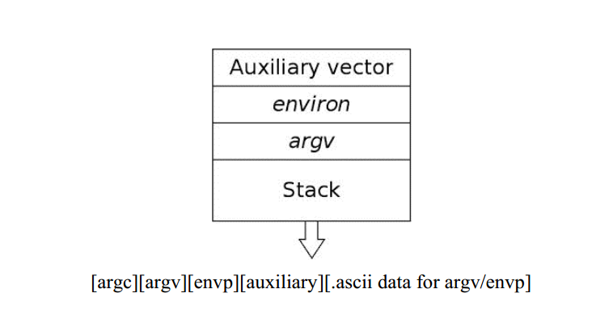
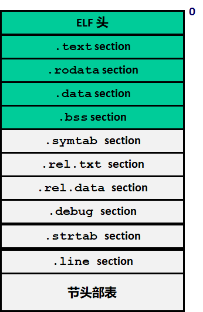

:toc:

:icons: font

// 保证所有的目录层级都可以正常显示图片
:path: Linux/
:imagesdir: ../image/
:srcdir: ../src

// 只有book调用的时候才会走到这里
ifdef::rootpath[]
:imagesdir: {rootpath}{path}{imagesdir}
:srcdir: {rootpath}../src/
endif::rootpath[]

ifndef::rootpath[]
:rootpath: ../
:srcdir: {rootpath}{path}../src/
endif::rootpath[]

== Linux二进制分析

.汇编
****
如果你能够读得懂汇编源，那么所有的程序对你来说，都是开源的
****

== Linux环境和相关工具

[NOTE]
====
Linux自带了很多好用的二进制分析工具，这些可以在binutils中获取，具体的网址：
http://www.gnu.org/software/binutils[binutils]，里面包含了一些用于分析和破解的工具
====

=== Linux工具

==== *GDB* 后端程序员必备

我在飞书上有对应的文章讲解
https://ny5odfilnr.feishu.cn/docs/doccn3oRPLnUMmKnfc1qu4WKZIe[GDB]，同时也在b站上更新了视频讲解
https://www.bilibili.com/video/BV1Df4y1c7gG?spm_id_from=333.999.0.0&vd_source=d0f1fc53c13a7dcbda92faa2e368b71e[GDB讲解]

==== objdump

对代码和二进制文件可以进行快速的反汇编，但是要针对有挑战性或者针对恶意软件时，objdump就显现出局限性了。其最主要的缺陷就是需要依赖ELF头，并且不会进行控制流分析

- 查看ELF文件中所有节的数据或代码

`objdump -D
[red]#object#`

- 只查看ELF文件中的程序代码

`objdump -d
[red]#object#`

- 查看ELF文件所有符号

`objdump -tT
[red]#object#`

==== objcopy

`objcopy` 很小但也很强大，可以用他来分析和修改任意类型的ELF文件，可以单独修改ELF文件的一小段，比如将A文件的 `.data` 段复制到B文件中

`objcopy –only-section=.data <infile> <outfile>`

==== *strace*

系统调用追踪，基于ptrace,strace 通过在一个循环中使用PTRACE_SYSCALL 请求来显示运行中程序的系统调用（也称为 syscalls）活动相关的信息以及程序执行中捕捉到 的信号量。 strace 在调试过程中非常有用，也可以用来收集运行时系统调用相关的信息

- 使用strace来追踪一个基本的程序

`strace ./main -o ls.out`

- 附加到一个运行的进程上

`strace -p <pid> -o deamon.out`

- 如果想看读入到文件描述符3中的所有数据，可以运行下面的命令

`strace –e read=3 /bin/ls`

同样使用 `-e write=3` 可以查看写入到对应文件描述符中国的数据

==== ltrace

库追踪，追踪库中用到的库函数

[source, bash]
----
- Print (trace) library calls of a program binary:
   ltrace ./{{program}}

 - Count library calls. Print a handy summary at the bottom:
   ltrace -c {{path/to/program}}

 - Trace calls to malloc and free, omit those done by libc:
   ltrace -e malloc+free-@libc.so* {{path/to/program}}

 - Write to file instead of terminal:
   ltrace -o {{file}} {{path/to/program}}
----

==== ftrace

函数追踪

[red]#https://github.com/elfmaster/ftrace[github ftrace]#

==== readelf

readelf命令是一个非常有用的解析工具，在进行正式的反汇编之前需要收集目标文件的相关信息，该工具能够提供收集信息所需要特定的ELF的所有数据。主要有以下几种：

a. 符号
b. 段
c. 节
d. 重定向入口
e. 数据动态链接

*常用语句*

- 查询节表头

`readelf -S <object>`

- 查询程序表头

`readelf -l <object>`

- 查询ELF文件头数据

`readelf -e <object>`

- 查询符号表

`readelf -s <object>`

- 查询重定位入口

`readelf -r <object>`

- 查询动态段

`readelf -d <object>`

=== 设备和文件

linux中有许多设备和文件，还有/proc入口，对于反汇编和工程师来说都非常有用

==== `/proc/<pid>/maps`

该maps中保存了一个进程镜像的布局，通过展现每个内存映射来实现，展现的内容包含可执行文件、共享库、栈、堆和VDSO等，在解析进程空间布局的时候非常有用

==== `/proc/kcore`
kcore是proc文件系统的一项，linux内核的动态核心文件。其实就是使用ELF核心文件形式来 展现出原生内核内存转储，可以使用gdb对  `/proc/kcore/` 来对内核进行调试和分析

==== `/bootstrap/System.map.*`

里面包含了内核的所有符号表

==== `/proc/kallsyms`

和System.map类似，区别就是kallsyms是内核所属的/proc的一个入口并且可以动态更新，如果安装了新的LKM(Linux Kernel Module)，符号会自动添加到 `/processor/kallsyms` 中，如果能在 `CONFIG_KALLSYMS_ALL` 内核配置中指明，这可以包含内核中的全部符号。

==== `/proc/iomem`

iomem与`/proc/<pid>/maps` 类似，不过是和系统内存相关的，如果想知道内核text段所映射的物理内存地址，可以通过搜索`Kernel` 字符串进行查找，要使用root查找，否则给出的地址都是空的

`grep "Kernel" /proc/iomem`

[source, bash]
----
andrew@andrew-G3-3590:/proc$ sudo grep "Kernel" /proc/iomem
  195c00000-196c02666 : Kernel code
  196e00000-197840fff : Kernel rodata
  197a00000-197d6e33f : Kernel data
  198068000-1985fffff : Kernel bss
----

==== `ECFS`

extended core file snapshot 扩展核心文件快照，是一项特殊的核心转存储技术，专门为进程镜像的高级取证分析所设计。
https://github.com/elfmaster/ecfs[ECFS]

=== 连接器相关环境指针

动态加载/连接器以及链接的概念，在程序链接执行的过程中都是避不开的基本组成部分。

==== `LD_PRELOAD` 环境变量

指定到一个库的路径，这里面的库比其他库有更高的优先级，这就允许预加载库中的函数和符号能够覆盖掉后续链接库中的函数和符号。 +
运用该技术，允许你通过重定向共享库函数来进行运行时修复，通常运用该技术绕过反调试代码。

==== `LD_SHOW_AUXV` 环境变量

该环境变量能够通知程序加载器来展示程序运行时的辅助向量，辅助向量是放在程序栈(通过内核的ELF常规加载方式)上的信息，附带了传递给动态连接器的程序相关的信息。
例如，要想获取进程镜像 VDSO 页的内存地址（也可以使用 maps 文件获取，之前介绍过），就需要查询 AT_SYSINFO。

[source, bash]
----
andrew@andrew-G3-3590:/proc$ LD_SHOW_AUXV=1 whoami
AT_SYSINFO_EHDR:      0x7ffdd6ae4000
AT_HWCAP:             bfebfbff
AT_PAGESZ:            4096
AT_CLKTCK:            100
AT_PHDR:              0x55afacc19040
AT_PHENT:             56
AT_PHNUM:             13
AT_BASE:              0x7f99995fc000
AT_FLAGS:             0x0
AT_ENTRY:             0x55afacc1b700
AT_UID:               1000
AT_EUID:              1000
AT_GID:               1000
AT_EGID:              1000
AT_SECURE:            0
AT_RANDOM:            0x7ffdd6a2e279
AT_HWCAP2:            0x2
AT_EXECFN:            /usr/bin/whoami
AT_PLATFORM:          x86_64
andrew
----

==== 连接器脚本

连接器脚本是一个值得重点关注，因为连接器脚本是由连接器解释的，把程序划分为相应的节、内存和符号。默认的连接器脚本可以使用 `ld -verbose` 进行查看

ld 链接器程序有其自己解释的一套语言，当有文件（如可重定位的目标
文件、共享库和头文件）输入时， ld 链接器程序会用自己的语言来决定输出
文件（如可执行程序）的组织方式。例如，如果输出的是一个 ELF 可执行文
件，链接器脚本能够决定该输出文件的布局，以及每个段里面包含哪些节。
另外举一个例子： .bss 节总是放在 data 段的末尾，这就是链接器脚本决定
的

== ELF二进制格式

ELF文件已经成为UNIX和类UNIX系统的标准二进制格式。 ELF文件可以用于可执行文件，共享库，目标文件，coredump文件以及内核引导镜像文件。

通过对ELF文件的学习你可以理解程序如何映射到磁盘兵加载到内存中的

[TIP]
.ELF文件知识点
====
- ELF文件类型
- 程序头
- 节头
- 符号
- 重定位
- 动态链接
- 编码ELF解析器
====

=== ELF文件类型

ELF通常有以下几种文件类型

- `ET_NONE` 未知类型，标明文件类型不确定或者还没有被定义
- `ET_REL` 从定位文件，ELF类型标记为relocatable意味着该文件被标记为一段可重定位的代码，有时也称之为目标文件，其实说白了就是编译代码之后留下的.o文件，这些文件中包含了创建可执行文件所需的代码和数据。
- `ET_EXEC` 可执行文件。ELF类型为executable，表明这个文件被标记为可执行文件，也就是可执行程序
- `ET_DYN` 共享目标文件，ELF类型为dynamic，也称之为动态共享库(实际上x86_64的可执行文件也都是这个类型)
- `ET_CORE` 核心文件，也成为核心转存储文件，是程序崩溃时的镜像信息

可以通过 `man 5 elf` 来查看ELF文件的详细信息

ELF文件头的结构体定义如下

[source, cpp]
----

#define EI_NIDENT (16)

typedef struct
{
  unsigned char	e_ident[EI_NIDENT];	/* Magic number and other info */
  Elf32_Half	e_type;			/* Object file type */
  Elf32_Half	e_machine;		/* Architecture */
  Elf32_Word	e_version;		/* Object file version */
  Elf32_Addr	e_entry;		/* Entry point virtual address */
  Elf32_Off	e_phoff;		/* Program header table file offset */
  Elf32_Off	e_shoff;		/* Section header table file offset */
  Elf32_Word	e_flags;		/* Processor-specific flags */
  Elf32_Half	e_ehsize;		/* ELF header size in bytes */
  Elf32_Half	e_phentsize;		/* Program header table entry size */
  Elf32_Half	e_phnum;		/* Program header table entry count */
  Elf32_Half	e_shentsize;		/* Section header table entry size */
  Elf32_Half	e_shnum;		/* Section header table entry count */
  Elf32_Half	e_shstrndx;		/* Section header string table index */
} Elf32_Ehdr;

typedef struct
{
  unsigned char	e_ident[EI_NIDENT];	/* Magic number and other info */
  Elf64_Half	e_type;			/* Object file type */
  Elf64_Half	e_machine;		/* Architecture */
  Elf64_Word	e_version;		/* Object file version */
  Elf64_Addr	e_entry;		/* Entry point virtual address */
  Elf64_Off	e_phoff;		/* Program header table file offset */
  Elf64_Off	e_shoff;		/* Section header table file offset */
  Elf64_Word	e_flags;		/* Processor-specific flags */
  Elf64_Half	e_ehsize;		/* ELF header size in bytes */
  Elf64_Half	e_phentsize;		/* Program header table entry size */
  Elf64_Half	e_phnum;		/* Program header table entry count */
  Elf64_Half	e_shentsize;		/* Section header table entry size */
  Elf64_Half	e_shnum;		/* Section header table entry count */
  Elf64_Half	e_shstrndx;		/* Section header string table index */
} Elf64_Ehdr;
----

=== ELF程序头

ELF程序头是对二进制文件段的描述，是程序装载必必需的一部分。段(segment)是内核装载时被解析的，描述了磁盘上可执行文件的内存布局，以及如何映射到内存中。可以通过引用原始ELF头中名为e_phoff(程序头偏移量)的偏移量来得到程序比头表。

[[PHdr01]]
[source, cpp]
----
typedef struct {
   uint32_t   p_type;
   Elf32_Off  p_offset;
   Elf32_Addr p_vaddr;
   Elf32_Addr p_paddr;
   uint32_t   p_filesz;
   uint32_t   p_memsz;
   uint32_t   p_flags;
   uint32_t   p_align;
} Elf32_Phdr;

typedef struct {
   uint32_t   p_type;   // 段类型
   uint32_t   p_flags; // 段标记 I.E (execute|read|write)
   Elf64_Off  p_offset; // 段偏移
   Elf64_Addr p_vaddr; // 段虚拟地址
   Elf64_Addr p_paddr; // 段物理地址
   uint64_t   p_filesz; // 段在文件中的大小
   uint64_t   p_memsz;  // 段在内存中的大小
   uint64_t   p_align; // 段在内存中的对其方式
} Elf64_Phdr;
----

==== `PT_LOAD`

一个可执行程序最少有一个`PT_LOAD`类型的段，这类程序头秒数的是可装载的段，也就是说这种类型的段将被装载或者映射到内存中。 +
一个需要动态链接的ELF可执行文件，通常需要包含以下两个可装载的段(PT_LOAD):

- 存放程序代码的text段
- 存放全局变量和动态链接信息的dta段

上面两个段，会按照p_align的对其的方式在内存中对其。

[IMPORTANT]
====
通常将text段代码权限设置为 PF_X|PF_R(读和可执行) +
将data段的权限设置为 PF_W|PF_R(读和写)，有些病毒通过修改ELF文件的这些权限来实现病毒感染，如：千面人病毒(polymorphic virus)
====

==== `PT_DYNAMIC` 动态段的 `Phdr`

动态段是动态链接可执行文件特有的，包含了动态连接器所必须的一些信息，在动态段包含了一些标记和指针。

- 运行时需要链接的共享库列表
- 全局偏移表(GOT)的地址
- 从定位条目的相关信息

man手册中有这样一段内容，说明了d_tag的作用

.d_tag
****
The .dynamic section contains a series of structures that hold relevant dynamic linking  informa‐
tion.  The d_tag member controls the interpretation of d_un.
[source, cpp]
typedef struct {
   Elf32_Sword    d_tag;
   union {
       Elf32_Word d_val;
       Elf32_Addr d_ptr;
   } d_un;
} Elf32_Dyn;
extern Elf32_Dyn _DYNAMIC[];

[source, cpp]
typedef struct {
   Elf64_Sxword    d_tag;
   union {
       Elf64_Xword d_val;
       Elf64_Addr  d_ptr;
   } d_un;
} Elf64_Dyn;
extern Elf64_Dyn _DYNAMIC[];
****

动态段包含了一些结构体，如上，这些结构体中存放着动态链接相关的信息，d_tag成员变量控制着d_un的含义。

[cols="1,3"]
.标记名List
|===
|标记名 |描述

|DT_HASH
|符号散列表地址

|DT_STRTAB
|字符串表的地址

|DT_SYMTAB
|符号表地址

|DT_RELA
|相对地址重定位表的地址

|DT_RELASZ
|Rela 表的字节大小

|DT_RELAENT
|Rela 表条目的字节大小

|DT_STRSZ
|字符串表的字节大小

|DT_SYMENT
|符号表条目的字节大小

|DT_INIT
|初始化函数的地址

|DT_FINI
|终止函数的地址

|DT_SONAME
|共享目标文件名的字符串表偏移量

|DT_RPATH
|库搜索路径的字符串表偏移量

|DT_SYMBOLIC
|修改链接器，在可执行文件之前的共享目标文件中搜索符号

|DT_REL
|Rel relocs 表的地址

|DT_RELSZ
|Rel 表的字节大小

|DT_RELENT
|Rel 表条目的字节大小

|DT_PLTREL
|PLT 引用的 reloc 类型（ Rela 或 Rel）

|DT_DEBUG
|还未进行定义，为调试保留

|DT_TEXTREL
|缺少此项表明重定位只能应用于可写段

|DT_JMPREL
|仅用于 PLT 的重定位条目地址

|DT_BIND_NOW
|指示动态链接器在将控制权交给可执行文件之前处理所有的重定位

|DT_RUNPATH
|库搜索路径的字符串表偏移量

|===

==== PT_NONE

该段可以用来保存与特定供应商或者系统相关的附加信息，一些供应商或者系统构建者有时需要在目标文件中标记上特定的信息，以便于对程序的一致性、兼容性进行检查。比较有意思的是，因为可执行文件运行时并不需要这一段，这个段成为了很容易受感染的段。

具体的可参见：
http://vxheavens.com/lib/vhe06.html[VHE]

==== PT_INTERP
PT_INTERP段只将位置和大小信息存放在一个以null结尾的字符串中，是对程序解释器位置的描述。例如 /libc/linux-ld.so.2一般是指动态连接器的位置，也即程序解释器的位置

==== PT_PHDR
PT_PHDR段保存了程序头表本身的位置和大小。phdr表保存了所有Phdr对文件中段的描述信息

可以使用 `readelf –l <filename>` 命令来查看文件的Phdr表：

[[JT01]]
[source, bash]
.readelf -f <filename>
----
andrew@andrew-G3-3590:/work/note_book/cmake-build-debug/src$ readelf -l ./main

Elf 文件类型为 DYN (共享目标文件)
Entry point 0x1100
There are 13 program headers, starting at offset 64

程序头：
  Type           Offset             VirtAddr           PhysAddr
                 FileSiz            MemSiz              Flags  Align
  PHDR           0x0000000000000040 0x0000000000000040 0x0000000000000040
                 0x00000000000002d8 0x00000000000002d8  R      0x8
  INTERP         0x0000000000000318 0x0000000000000318 0x0000000000000318
                 0x000000000000001c 0x000000000000001c  R      0x1
      [Requesting program interpreter: /lib64/ld-linux-x86-64.so.2]
  LOAD           0x0000000000000000 0x0000000000000000 0x0000000000000000
                 0x0000000000000ab8 0x0000000000000ab8  R      0x1000
  LOAD           0x0000000000001000 0x0000000000001000 0x0000000000001000
                 0x00000000000003f5 0x00000000000003f5  R E    0x1000
  LOAD           0x0000000000002000 0x0000000000002000 0x0000000000002000
                 0x0000000000000250 0x0000000000000250  R      0x1000
  LOAD           0x0000000000002d60 0x0000000000003d60 0x0000000000003d60
                 0x00000000000002b0 0x00000000000003f8  RW     0x1000
  DYNAMIC        0x0000000000002d80 0x0000000000003d80 0x0000000000003d80
                 0x0000000000000200 0x0000000000000200  RW     0x8
  NOTE           0x0000000000000338 0x0000000000000338 0x0000000000000338
                 0x0000000000000020 0x0000000000000020  R      0x8
  NOTE           0x0000000000000358 0x0000000000000358 0x0000000000000358
                 0x0000000000000044 0x0000000000000044  R      0x4
  GNU_PROPERTY   0x0000000000000338 0x0000000000000338 0x0000000000000338
                 0x0000000000000020 0x0000000000000020  R      0x8
  GNU_EH_FRAME   0x0000000000002014 0x0000000000002014 0x0000000000002014
                 0x0000000000000074 0x0000000000000074  R      0x4
  GNU_STACK      0x0000000000000000 0x0000000000000000 0x0000000000000000
                 0x0000000000000000 0x0000000000000000  RW     0x10
  GNU_RELRO      0x0000000000002d60 0x0000000000003d60 0x0000000000003d60
                 0x00000000000002a0 0x00000000000002a0  R      0x1

 Section to Segment mapping:
  段节...
   00
   01     .interp
   02     .interp .note.gnu.property .note.gnu.build-id .note.ABI-tag .gnu.hash .dynsym .dynstr .gnu.version .gnu.version_r .rela.dyn .rela.plt
   03     .init .plt .plt.got .plt.sec .text .fini
   04     .rodata .eh_frame_hdr .eh_frame
   05     .init_array .fini_array .dynamic .got .data .bss
   06     .dynamic
   07     .note.gnu.property
   08     .note.gnu.build-id .note.ABI-tag
   09     .note.gnu.property
   10     .eh_frame_hdr
   11
   12     .init_array .fini_array .dynamic .got
----

从上到下一次是，PT_PHDR,PT_INTERP,PT_LOAD段 +
text段是可读可执行，data段是可读可写，这两个段都是按照0x1000(4096)的对其标识符，放好对应一页

=== ELF节头

[IMPORTANT]
.segment and section
====
在开始之前段(segment)和节不能搞混了，经常有人把段和节搞混了，节不是段。段是程序执行的必要组成部分，在每个段中会有代码或者数据被划分为不同的节。节头表是对这些节的位置和大小的描述，主要用于调试。
====

节头对于程序来说不是必需的，没有节头表程序仍然可以正常执行，因为节头表没有对程序的内存布局进行描述，对程序内存布局的描述是程序头表的任务。节头只是对程序头的补充。使用命令 `readelf -l` 可以查看一个可执行程序的节头，可以很直观的看到节和段之间的关系

<<JT01,节头>>

如果一个程序没有节头，并不是意味着可执行文件中没有节了，知识节头的信息没有，无法通过节头来引用节而已。对于调试器或者反汇编的程序来说只是可以参考的信息变少了。

.总结
每一个节都保存了某种类型的代码或者数据，数据可以是程序中的全局变量，也可以是连接器所需的动态链接信息。每个可执行程序都有节但是不一定有节头，尤其是有人故意将节头从表中删除(去除节头增加调试难度)，当然程序默认是有节头的。
常见的调试工具gdb，objcopy, objdump等都需要使用节头来定位到符号数据的节来获取符号信息。如果没有节头，那么gdb和objdump这些工具几乎无用武之地

上面我们展示了Phdr<<PHdr01,程序头>>，这里我们看一下节头的数据结构：

[source, cpp]
.section struct
----
typedef struct {
   uint32_t   sh_name;
   uint32_t   sh_type;
   uint32_t   sh_flags;
   Elf32_Addr sh_addr;
   Elf32_Off  sh_offset;
   uint32_t   sh_size;
   uint32_t   sh_link;
   uint32_t   sh_info;
   uint32_t   sh_addralign;
   uint32_t   sh_entsize;
} Elf32_Shdr;

typedef struct {
   uint32_t   sh_name;  // offet into shdr string table for shdr name
   uint32_t   sh_type; // 类型 I.E SHT_PROGBITS
   uint64_t   sh_flags; // shdr flags I.E SHT_ERITE|SHT_ALLOC
   Elf64_Addr sh_addr;  // 指向节开始的地址
   Elf64_Off  sh_offset; // shdr在文件开头的偏移的大小
   uint64_t   sh_size; // 当前节占用的大小
   uint32_t   sh_link; // 指向其他节
   uint32_t   sh_info; // 具体含义 依赖类型的设置
   uint64_t   sh_addralign; // 当前节对其方式 按照那种方式对其
   uint64_t   sh_entsize; // size of each certain entries that may be in section
} Elf64_Shdr;
----

==== `.text` 节

..text
****
[yellow]#.text# 节是保存了程序代码指令的代码节。一段可执行程序，如果存在 Phdr，.text就会存在于text段中。由于.text保存了程序代码，因此此节类型为SHT_PROGBITS
****

==== `.rodata` 节

..rodata
****
只读数据如 `printf("hello world")` 中的字符串就会被存放到只读节.rodata中。因为是只读的，所以只能在text段找到.rodata而data段中不存在.rodata节。因为是只读的所以.rodata节的类型为SHT_PROGBITS
****

==== `.plt` 节

..plt
****
`.plt` 节中包含了动态连接器调用从共享库导入的函数所必须的相关代码，由于其存在于text段，同样也是保存了代码，因此类型为SHT_PROGBITS
****

==== `.data` 节

..data
****
这里千万不要弄混了，.data节和data段是两个东西，.data节存在于data段中，保存了初始化的全局变量等数据。由于其保存了程序的变量数据，因此此类型为SHT_PROGBITS
****

==== `.bss` 节

..bss
****
该节保存了未进行初始化的全局数据，属于data段的一部分，占用的空间一般也不会超过4字节，仅仅用来表示这个节本身的空间大小。由于.bss节未保存实际数据，因此节类型为SHT_NOBITS
****

==== `.got.plt` 节

..got.plt
****
`.got` 节保存了全局偏移表，.got和.plt节一起提供了对导入的共享库函数的访问入口，由于动态连接器在运行时进行修改，如果攻击者获得了堆或者.bss漏洞的一个指针大小的写原语，就可以实现对该节进行任意的修改。因为该节跟程序执行密切相关，因此该节类型为SHT_PROGBITS
****

==== `.dynsym` 节

..dynsym
****
共享库的动态符号信息，该节保存在text段中，类型为SHT_DYNSYM
****

==== `.synstr` 节

..synstr
****
动态符号字符串表，这些字符串代表了符号的名称，都以空字符串为终止符
****

==== `.rel.*` 节

..rel.*
****
重定位节保存了重定位相关的信息， 这些信息描述了如何在链接或者运行
时，对 ELF 目标文件的某部分内容或者进程镜像进行补充或修改。该节类型为SHT_REL
****

==== `.hash` 节

..hash
****
`.hash` 节有时也被称为.gnu.hash, 保存了一个用于查询符号表的散列表
****

==== `.symtab` 节

..symtab
****
该节保存了Elfn_sym类型的符号信息，类型为SHT_SYMTAB
****

==== `.strtab` 节

..strtab
****
保存符号字符串表，表中的内容会被.symtab的Elfn_sym结构中的st_name条目引用，因为保存了字符串表类型为SHT_STRTAB
****

==== `.shstrtab` 节

..shstrtab
****
保存节头字符串表，该表是一个以空字符终止的字符串的 集合，字符串保存了每个节的节名，如.text、 .data 等。有一个名为 e_shsrndx 的 ELF 文件头条目会指向.shstrtab 节， e_shstrndx 中保存 了.shstrtab 的偏移量。由于其保存了字符串表，因此节类型被标记为
SHT_STRTAB
****

==== `.ctors` 和 `.dtors` 节

..ctors 和 .dtors
****
这两个节保存了指向构造函数 和析构函数的函数指针，构造函数是在 main 函数执行之前需要执行的代码， 析构函数是在 main 函数之后需要执行的代码。
****

=== 段的布局

==== text段的布局如下

- [.text] : 程序代码
- [.rodata] : 只读数据
- [.hash] : 符号散列表
- [.dynsym] : 共享目标文件符号数据
- [.dynstr] : 共享目标文件符号名称
- [.plt] : 过程链接表
- [.rel.got] : G.O.T重定位数据

==== data段的布局

- [.data] : 全局初始化变量
- [.dynamic] : 动态链接结构和对象
- [.got.plt] : 全局偏移表
- [.bss] : 全局未初始化变量

==== 查看目标的段布局

test.o由 gcc -c 编译出来的 ET_REL文件(目标文件)，我们可以使用readelf -S 来查看该文件的节头

.readelf -S
[source, bash]
----
andrew@andrew-G3-3590:/work/note_book/cmake-build-debug/src$ readelf -S  test.o
There are 12 section headers, starting at offset 0x258:

节头：
  [号] 名称              类型             地址              偏移量
       大小              全体大小          旗标   链接   信息   对齐
  [ 0]                   NULL             0000000000000000  00000000
       0000000000000000  0000000000000000           0     0     0
  [ 1] .text             PROGBITS         0000000000000000  00000040
       0000000000000010  0000000000000000  AX       0     0     1
  [ 2] .data             PROGBITS         0000000000000000  00000050
       0000000000000000  0000000000000000  WA       0     0     1
  [ 3] .bss              NOBITS           0000000000000000  00000050
       0000000000000000  0000000000000000  WA       0     0     1
  [ 4] .comment          PROGBITS         0000000000000000  00000050
       000000000000002c  0000000000000001  MS       0     0     1
  [ 5] .note.GNU-stack   PROGBITS         0000000000000000  0000007c
       0000000000000000  0000000000000000           0     0     1
  [ 6] .note.gnu.propert NOTE             0000000000000000  00000080
       0000000000000020  0000000000000000   A       0     0     8
  [ 7] .eh_frame         PROGBITS         0000000000000000  000000a0
       0000000000000038  0000000000000000   A       0     0     8
  [ 8] .rela.eh_frame    RELA             0000000000000000  000001d8
       0000000000000018  0000000000000018   I       9     7     8
  [ 9] .symtab           SYMTAB           0000000000000000  000000d8
       00000000000000f0  0000000000000018          10     9     8
  [10] .strtab           STRTAB           0000000000000000  000001c8
       0000000000000010  0000000000000000           0     0     1
  [11] .shstrtab         STRTAB           0000000000000000  000001f0
       0000000000000067  0000000000000000           0     0     1
Key to Flags:
  W (write), A (alloc), X (execute), M (merge), S (strings), I (info),
  L (link order), O (extra OS processing required), G (group), T (TLS),
  C (compressed), x (unknown), o (OS specific), E (exclude),
  l (large), p (processor specific)
----

可以发现，可重定位文件(类型为ET_REL的ELF文件)中不存在程序头，因为.o文件会被链接到可执行文件中，但是不会被加载到内存中，所以无法使用readelf -l 来读取程序头的信息。不过有个例外的是linux内核模块LKM，LKM是ET_REL类型的文件，但是它会被直接加载进内核的内存中并自动的进行重定位

=== ELF符号

符号是对某些类型的数据或代码的符号引用，如printf会在动态符号表.dynsym中存在一个指向该函数的符号条目。在大多数的共享库和动态链接可执行文件中，存在两个符号表 .dynsym和.symtab

`.dynsym` 保存了引用来自外部文件符号的全局符号，如printf库函数；`.dynsym`保存的符号是.symtab所保存符号的子集，.symtab中还保存了可执行文件的本地符号，如全局变量或者代码中定义的本地函数等，因此 .symtab中包成年了所有符号，而.dynsym只保存动态/全局符号

就存在这样一个问题：既然.symtab 中保存了.dynsym 中所有的符号，那么为什么还需要两个符号表呢？使用 readelf –S 命令查看可执行文件的输出， 可以看到一部分节被标记为了 A（ALLOC）、 WA（WRITE/ALLOC）或者 AX（ALLOC/EXEC）。 .dynsym 是被标记了 ALLOC 的，而.symtab则没有标记。

ALLOC 表示有该标记的节会在运行时分配并装载进入内存，而.symtab不是在运行时必需的，因此不会被装载到内存中。 .dynsym 保存的符号只能在运行时被解析，因此是运行时动态链接器所需要的唯一符号。 .dynsym 符号表对于动态链接可执行文件的执行来说是必需的，而.symtab 符号表只是用来进行调试和链接的，有时候为了节省空间，会将.symtab 符号表从生产二进制文
件中删掉，使用strip对可执行文件处理，主要的就是删除.symtab等符号信息

=== Elf*_Sym 符号表结构
[source, cpp]
.Elf*_Sym
----
typedef struct {
   uint32_t      st_name;
   Elf32_Addr    st_value;
   uint32_t      st_size;
   unsigned char st_info;
   unsigned char st_other;
   uint16_t      st_shndx;
} Elf32_Sym;

typedef struct {
   uint32_t      st_name;
   unsigned char st_info;
   unsigned char st_other;
   uint16_t      st_shndx;
   Elf64_Addr    st_value;
   uint64_t      st_size;
} Elf64_Sym;
----

==== `st_name`

保存了指向符号表中字符串表(位于.synstr或者.strtab)的偏移地址，偏移地址存放着符号的名称，如printf

==== `st_value`

用来存放符号的值(可能是地址或者偏移量)

==== `st_size`

存放一个符号的大小，如全局函数指针的大小，具体占用字节和系统位数有关，如32位系统通常是4字节

==== `st_other`

用来定义符号的可见性

==== `st_shndx`

每个符号表条目的定义都于某些节对应，st_shndx变量保存了相关节头表的索引

==== `st_info`

指定符号类型及其绑定属性，符号类型以STT开头，符号绑定以STB开头

1. 符号类型
 - STT_NOTYPE : 符号类型未定义
 - STT_FUNC ： 表示符号与函数或者其他可执行代码关联
 - STT_OBJECT : 表示该符号与数据目标相关联

2. 符号绑定
 - STB_LOCAL : 本地符号在目标之外是不可见的，目标文件包含了符号的定义，如声明一个static函数
 - STB——GLOBAL : 全局符号对于所有要合并的目标文件都是可见的，一个全局符号在一个文件中进行定义之后，另外一个文件可以对这个符号进行引用。
 - STB——WEAK ： 语全局绑定类似，不过比STB_GLOBAL的优先级低，被标记为STB_WEAK的符号有可能会被同名的未标记为STB_WEAK的符号覆盖。

3. 对绑定和类型字段进行打包和解包的宏指令
 - ELF32_ST_BIND(info)或者ELF64_ST_BIND(info)：从st_info中提取一个绑定
 - ELF32_ST_TYPE(info)或者 ELF64_ST_TYPE(info)：从 st_info 值中提取类型。
 - ELF32_ST_TYPE(bind,type)或者 ELF64_ST_INFO(bind,type)： 将一个绑定和类型转换成 st_info 值

定义如下文件
[source, cpp]
.test.c
----
static inline void foochu(){
    /* Do nothing */
}

void func1() {
    /* Do nothing */
}

_start()
{
    func1();
    foochu();
}
----

并执行gcc -c test.c，之后使用readelf查看函数表条目：

TIP: 注意这里是 -s 小s

`readelf -s test.o  | egrep 'foochu|func1'`

[source, bash]
----
andrew@andrew-G3-3590:/work/note_book/cmake-build-debug/src$ readelf -s test.o  | egrep 'foochu|func1'
     5: 0000000000000000     7 FUNC    LOCAL  DEFAULT    1 foochu
    10: 0000000000000007    11 FUNC    GLOBAL DEFAULT    1 func1
----

foochu是一个有本地符号绑定(STB_LOCAL)的函数(STT_FUNC)，因此foocho对于外界是不可见的，只有本文件中才能使用

这些符号给我们带来了许多便利，作为ELF文件的一部分，符号可用来链接、重定位、反汇编、调试等。

===  ftrace的使用

ftrace是一个动态分析工具，当你手上没有源码时可以使用该工具对二进制文件进行分析

将以下源文件编译成二进制可执行文件test
[source, cpp]
.test.c
----
#include <stdio.h>

void func1(int a, int b, int c) {
    printf("%d %d %d\n", a, b ,c);
}

int main(void) {
    func1(1, 2, 3);
}
----

NOTE: ftrace已经放到note_book的文档中，可以编译后直接使用

假设不知道上面的源码，使用ftrace对以上源码生成的二进制文件进行分析。

先看下ftrace的命令使用提示

[source, bash]
----
$ ./ftrace -h
Usage: ./ftrace [-p <pid>] [-Sstve] <prog>
[-p] Trace by PID
[-t] Type detection of function args
[-s] Print string values
[-v] Verbose output
[-e] Misc. ELF info. (Symbols,Dependencies)
[-S] Show function calls with stripped symbols
[-C] Complete control flow analysis
----

如果我们只想看函数的反汇编，不想被标准库中的加载的函数干扰可以在编译的时候加上 -nostdlib编译选项， `gcc -nostdlib test.c -o test` , 因为没有stdlib库，我们需要实现  _start接口来启动函数

[source, cpp]
.test2.c
----
void foo(void) {

}
int _start()
{
    foo();
    __asm__("leave");
}
----

对其进行反汇编：

[source, cpp]
----
andrew@andrew-G3-3590:/work/note_book/cmake-build-debug/src$ objdump -d test

test：     文件格式 elf64-x86-64

Disassembly of section .text:

0000000000001000 <foo>:
    1000:	f3 0f 1e fa          	endbr64
    1004:	55                   	push   %rbp
    1005:	48 89 e5             	mov    %rsp,%rbp
    1008:	90                   	nop
    1009:	5d                   	pop    %rbp
    100a:	c3                   	retq

000000000000100b <_start>:
    100b:	f3 0f 1e fa          	endbr64
    100f:	55                   	push   %rbp
    1010:	48 89 e5             	mov    %rsp,%rbp
    1013:	e8 e8 ff ff ff       	callq  1000 <foo>
    1018:	c9                   	leaveq
    1019:	90                   	nop
    101a:	5d                   	pop    %rbp
    101b:	c3                   	retq
----

首地址会存放到基地址存放寄存器ebp/rbp中，通过首地址的正向偏移可以依次访问栈中的变量。

=== ELF重定位

重定位就是将符号定义和符号引用进行连接的过程。可重定位文件需要包 含描述如何修改节内容的相关信息，从而使得可执行文件和共享目标文件能够保存进程的程序镜像所需的正确信息。重定位条目就是我们上面说的相关信息。

重定位实际上是一种给二进制文件打补丁的机制，如果使用了动态链接器，可以使用重定位在内存中打热补丁。用于创建可执行文件和共享库的链接程序/bin/ld，需要某种类型的元数据来描述如
何对特定的指令进行修改。

假设要将两个目标文件链接到一起产生一个可执行文件。 obj1.o 文件中存放了调用函数 foo()的代码， 而函数 foo()是存放在目标文件 obj2.o 中的。链接程序会对 obj1.o 和 obj2.o 中的重定位记录进行分析并将这两个文件链接在一起产生一个可以独立运行的可执行程序。

符号引用会被解析成 符号定义，这是什么意思呢？目标文件是可重定位的代码，也就是说，目标
文件中的代码会被重定位到可执行文件的段中一个给定的地址。在进行重定位之前，无法确定 obj1.o 或者 obj2.o 中的符号和代码在内存中的位置，因此无法进行引用。只能在链接器确定了可执行文件的段中存放的指令或者符号的位置之后才能够进行修改。

=== ELF动态链接

当一个程序被加载进内存时，动态连接器会把需要的共享库加载并绑定到该进程的地址空间中

共享库在被编译成到可执行文件中时是位置独立的，因此很容易被重定位到进程的地址空间中。

当一个共享库被加载进一个进城的地址空间中时，一定有指向其他共享库的重定位，动态连接器会修改可执行文件中的GOT(Global Offset Table, 全局偏移表，位于.got.plt节的数据段中)，动态连接器会使用解析好的共享库地址来修改GOT

==== 辅助向量

通过系统调用sys_execve() 将程序加载到内存中时，对应的可执行文件会被映射到内存的地址空间，并为该进程的地址空间分配一个栈。这个栈会使用特定的方式向动态链接器传递信息。这种特定的对信息的设置和安排即为辅助向量(auxv)。在栈底存放了如下信息：

==== 了解PLT/GOT

我们调用共享库中的函数，需要到运行时才能解析这些函数调用，那么一定存在动态链接共享并解析共享函数地址的机制。

动态库采用默认的延迟链接方式时，不会在函数第一次调用时就对函数地址进行解析，延迟链接意味着动态链接器不会在程序第一次加载时就解析每一个函数，而是在调用时通过.plt和.got.plt节(分别对应各自的过程链接表和全局偏移表)来对函数进行解析。当然可以通过修改LD_BIND_NOW环境变量来将链接方式修改为严格加载，以便在程序加载的同时进行动态链接。之所以采用延迟链接，是因为延迟链接能够提高装载时的性能。不过有时候可能有一些不可预知的链接错误可能在程序运行一段时间后才能被发现。

值得注意的是，有些安全特性，如只读重定位，只能在严格链接的模式下使用，因为.plt.got
节是只读的。在动态链接器完成对.plt.got 的补充之后才能够进行只读重定位，因此必须使用严格链接

==== 如何读这些汇编语句

都是因为延迟链接的存在 +
`1632:	e8 29 fb ff ff       	callq  1160 <pthread_create@plt>`

地址由于低位在前，所以地址为： 0xfffffb29e8
1160是偏移地址
因为只有在实际调用时连接器才会对动态库函数中的函数进行解析，因此 函数pthread_create@plt 说的是pthread_create函数在.plt(过程链接表)偏移 1160的地方

==== 重温动态段

动态连接器映射到内存中时，首先会处理自身的重定位，因为链接器本身就是一个共享库。接着会查看可执行文件的动态段并查找DT_NEEDED参数，该参数保存了指向所需要的共享库的字符串或路径名。当一个共享库被映射到内存中后，连接器会获取共享库的动态段，并将共享库的符号表添加到符号表链中，符号表链存储了所有映射到内存中的共享库符号表。

链接器为每个共享库生成一个link_map结构的条目，并将其存放到一个链表中：

[source, cpp]
----
struct link_map
{
    ElfW(Addr) l_addr; /* Base address shared object is loaded at. */
    char *l_name; /* Absolute file name object was found in. */
    ElfW(Dyn) *l_ld; /* Dynamic section of the shared object. */
    struct link_map *l_next, *l_prev; /* Chain of loaded objects. */
}
----

链接器构建完依赖列表后，会挨个处理每个库的重定位（与本章之前讨论 的重定位过程类似），同时会补充每个共享库的 GOT。 延迟链接对共享库的PLT/GOT 仍然适用，因此，只有当一个函数真正被调用时，才会进行GOT重定位（R_386_JMP_SLOT 类型）

=== 实现ELF解析器

参见 src/elf_parser/elf_parser.c src/elf_parser/elf_parser32.c

== Linux进程追踪

ELF程序是完全映射到进程的地址空间的，因此可以附加到进程上，对ELF镜像进行解析或者修改，根直接修改磁盘上的实际ELF文件类似。区别是需要使用ptrace获取程序，在磁盘上可以使用open/mmap/read/|write 调用ELF文件

我们可以使用 ptrace 来控制程序的执行流程，这就意味着可以对程序“做各种手脚”，从内存病毒感染和病毒分析/检测，到用户级内存 rootkit、高级调试任务、热补丁，再到反编译

=== ptrace的重要性

Linux中，ptrace(2)系统调用时获取进程地址空间的用户态方法。用户可以通过ptrace对进程进行修改、分析、反编译和调试。常见的分析工具，gdb、strace和ltrace都使用ptrace进行辅助。

程序员可以利用ptrace附加到一个进程上并修改内存，如代码注入，修改一些比较重要的数据结构，如共享库重定向所需要的GOT等

=== ptrace 的请求

与其他系统调用一样ptrace系统调用也有一个libc的封装，因此在使用时需要引入ptrace.h 头文件，通过传入一个请求参数和一个进程ID来实现调用，

[source, cpp]
----
#include <synstr/ptrace.h>
long ptrace(enum _ptrace_request request, pid_t pid, void* addr, void* data);
----

.ptrace的请求类型

[cols="1,3", options="header"]
|===
|请求参数 |描述信息

|PTRACE_ATTACH
|附加到pid对应的进程上，使得pid对应的进程成为调用进城的tracee。

|PTRACE_TRACEME
|表明该进程会被父进程追踪。如果父进程不希望追踪该进程，就不要用这个请求参数

|PTRACE_PEEKTEXT +
PTRACE_PEEKDATA +
PTRACE_PEEKUSER
|这些参数允许追踪进程读取被追踪进程镜像的虚拟内存地址。

|PTRACE_POKTEXT +
PTRACE_POKDATA +
PTRACE_POKUSER
|允许追踪进程修改被追踪进程镜像的任意地址

|PTRACE_GETREGS
|允许追踪进程获取被追踪进程的寄存器的一份副本，每个线程都有自己的寄存器集合

|PTRACE_SETREGS
|允许追踪进程为被追踪进程设置新的寄存器值，如将指令的指针值进行修改，指向shell代码

|PTRACE_CONT
|重启已经终止的被追踪进程，对应GDB调试的(C命令)

|PTRACE_DETACH
|重启被追踪进程，并解除追踪，对应GDB调试的(quit命令)

|PTRACE_SYSCALL
|重启被追踪进程，在下条系统调用开始/退出时终止该进程，可以通过这项参数来检查甚至修改系统调用参数，strace对这项参数应用非常多

|PTRACE_SINGLESTEP
|重启被追踪进程，并在下一条指令执行结束后将进程状态切换为终止状态，调试器通过该参数实现单步调试执行每条指令，用户可以通过该参数检查每条指令执行后寄存器的值和进程的状态，对应GDB调试的(s指令)

|PTRACE_GETSIGINFO
|检索引起进程停止的信号信息，可以检索到siginfo_t结构的一份副本，进行分析或者修改并传回给被追踪进程

|PTRACE_SETSIGINFO
|设置信号信息，从追踪进程的地址数据中复制一份siginfo_t结构到被追踪进程中。这只针对从追踪进程传到被追踪进程的常规信号。

|PTRACE_SETOPTIONS
|从数据设置ptrace的选项，数据可以理解为选项的位掩码。

|===

=== 进程寄存器状态和标记

x86_64的user_regs_struct结构体保存了一些通用的寄存器、段寄存器、栈指针、指令指针、CPU标记和TLS寄存器

[source, cpp]
----
<sys/user.h>
struct user_regs_struct
{
    __extension__ unsigned long long int r15;
    __extension__ unsigned long long int r14;
    __extension__ unsigned long long int r13;
    __extension__ unsigned long long int r12;
    __extension__ unsigned long long int rbp;
    __extension__ unsigned long long int rbx;
    __extension__ unsigned long long int r11;
    __extension__ unsigned long long int r10;
    __extension__ unsigned long long int r9;
    __extension__ unsigned long long int r8;
    __extension__ unsigned long long int rax;
    __extension__ unsigned long long int rcx;
    __extension__ unsigned long long int rdx;
    __extension__ unsigned long long int rsi;
    __extension__ unsigned long long int rdi;
    __extension__ unsigned long long int orig_rax;
    __extension__ unsigned long long int rip;
    __extension__ unsigned long long int cs;
    __
    extension__ unsigned long long int eflags;
    __extension__ unsigned long long int rsp;
    __extension__ unsigned long long int ss;
    __extension__ unsigned long long int fs_base;
    __extension__ unsigned long long int gs_base;
    __extension__ unsigned long long int ds;
    __extension__ unsigned long long int es;
    __extension__ unsigned long long int fs;
    __extension__ unsigned long long int gs;
};
----

.32位和64位的区别
****
32位linux中使用%gs作为线程本地存储(thread-local-storage, TLS)指针，从x86_64开始已经使用%fs寄存器替换%gs了。通过利用user_regs_struct中的寄存器，以及ptrace来读取进程的内存，可以获得对进程的完全控制权。
****

=== 基于ptrace的调试器

基于以上的信息，我们知道可以通过利用user_regs_struct中的寄存器和ptrace来实现对程序的控制，我们使用这些方法来实现一个调试器，实现将程序在断点停止，并打印出寄存器的值和函数的参数。

ELF可执行文件在内存中的结构除了数据段的变量、全局偏移表、函数指针和未初始化变量.bss节的变化外，剩余部分几乎跟磁盘上一样。这就意味着用于ELF文件感染的技术同样能用于进程运行时的内存感染。

=== 内存感染类型

****
.常见感染技术
[cols = "3,3,4", options = "header"]
|===
|感染技术
|目标结果
|寄存类型

|GOT感染
|劫持共享库函数
|进程内存或可执行文件

|过程链接表(plt)感染
|劫持共享库函数
|进程内存或可执行文件

|.ctors/.dtors函数指针修改
|将控制流转向恶意代码
|进程内存或可执行文件

|Function trampolines(函数蹦床)
|劫持任意函数
|进程内存或可执行文件

|共享库注入
|插入恶意代码
|进程内存或可执行文件

|重定位代码注入
|插入恶意代码
|进程内存或可执行文件

|直接修改text段
|插入恶意代码
|进程内存或可执行文件

|进程占用(将整段程序注入地址空间)
|运行隐藏在现存进程中完全不同的可执行程序
|进程内存

|===

****

== ELF病毒技术-(LinuxSll/Unix技术)

每个可执行文件都有一个控制流，也就是执行路径。ELF病毒首要任务就是劫持控制流，暂时改变程序的执行路径来执行寄生代码。寄生代码同通常设置钩子来劫持函数，还会将自身的代码复制到没有被感染的程序中。

image::image-2022-06-22-22-53-46-043.png[]

防止trace常用技术

- PTRACE_TRACEME
利用特性一个进程同一时间内只能被一个进程追踪

[source, cpp]
----
void anti_debug_check(void)
{
    if (ptrace(PTRACE_TRACEME, 0, 0, 0) < 0) {
        printf("A debugger is attached, but not for long!\n");
        kill(getpid());
        exit(0);
    }
}
----

- SIGTRAP

当进程被设置断点并执行到断点时，会出发该信号量

[source, cpp]
----
static int caught = 0;
int sighandle(int sig)
{
    caught++;
}
int detect_debugger(void)
{
    __asm__ volatile("int3");
    if (!caught) {
        printf("There is a debugger attached!\n");
    return 1;
    }
}
----

- /proc/self/status 技术

[source, cpp]
----
andrew@andrew-G3-3590:~$ head /proc/self/status
Name:	head
Umask:	0002
State:	R (running)
Tgid:	20223
Ngid:	0
Pid:	20223
PPid:	2498
TracerPid:	0     // 0表示没有人追踪
Uid:	1000	1000	1000	1000
Gid:	1000	1000	1000	1000
----
每个程序都有自己的 /proc/self/status，可以打开查看TracerPid的值如果为0说明没有人追踪

== Linux二进制保护

image::image-2022-06-22-23-21-08-603.png[]

== 认识可执行程序

一个源文件在生成可执行程序的过程中地址需要经过以下几个主要步骤。

[plantuml, target=elf-process, format=png]
....
@startuml
:main.c;
:翻译器;
:main.o;
:连接器(ld);
:可执行程序(a.out);
@enduml
....

源文件在经过编译器处理之后会生成可重定位目标文件，也就是我们常见的.o文件，经过链接器处理之后，会将多个.o文件处理成可执行文件。

- 可从定位目标

`.o` 称为可重定位目标，包含二进制代码和数据，其形式可以和其他目标进行合并，创建一个可执行目标文件

因为.o文件也是ELF文件的一种，所以我么可以使用readelf -h 来查看.o文件的elf头数据

[source, bash]
----
$ readelf -h main.o
ELF 头：
  Magic：   7f 45 4c 46 02 01 01 00 00 00 00 00 00 00 00 00
  类别:                              ELF64
  数据:                              2 补码，小端序 (little endian)
  Version:                           1 (current)
  OS/ABI:                            UNIX - System V
  ABI 版本:                          0
  类型:                              REL (可重定位文件)
  系统架构:                          Advanced Micro Devices X86-64
  版本:                              0x1
  入口点地址：               0x0
  程序头起点：          0 (bytes into file)
  Start of section headers:          960 (bytes into file)
  标志：             0x0
  Size of this header:               64 (bytes)
  Size of program headers:           0 (bytes)
  Number of program headers:         0
  Size of section headers:           64 (bytes)
  Number of section headers:         14
  Section header string table index: 13
----

通过与文件头结构体对比
[source, cpp]
.Elf64_Ehdr
----
typedef struct
{
  unsigned char	e_ident[EI_NIDENT];	/* Magic number and other info */
  Elf64_Half	e_type;			/* Object file type */
  Elf64_Half	e_machine;		/* Architecture */
  Elf64_Word	e_version;		/* Object file version */
  Elf64_Addr	e_entry;		/* Entry point virtual address */
  Elf64_Off	e_phoff;		/* Program header table file offset */
  Elf64_Off	e_shoff;		/* Section header table file offset */
  Elf64_Word	e_flags;		/* Processor-specific flags */
  Elf64_Half	e_ehsize;		/* ELF header size in bytes */
  Elf64_Half	e_phentsize;		/* Program header table entry size */
  Elf64_Half	e_phnum;		/* Program header table entry count */
  Elf64_Half	e_shentsize;		/* Section header table entry size */
  Elf64_Half	e_shnum;		/* Section header table entry count */
  Elf64_Half	e_shstrndx;		/* Section header string table index */
} Elf64_Ehdr;
----

首先看到的是Magic魔法数字，这些数字的大小由宏定义  `#define EI_NIDENT (16)` 来进行限定，Magic放在ELF文件的头部的16字节，其中各个字节的含义如下：

[cols="1,3", options = "header"]
|===
|Magic
|含义

|0x7f
|ELF文件

|45
|'E'

|4c
|'L'

|46
|'F'

|02
|文件类型，1:32位文件，2:64位文件

|01
|大小端：1是小端，2是大端

|01
|版本

|00
|系统类型

|00
|ABI 版本

|00
|Byte index of padding bytes

|Other
| 保留

|===

[cols="1,3",options="header"]
|===
|类型
|作用

|e_type
|文件类型，常见的有可重定位文件，可执行文件，共享文件等

|e_machine
|主机类型

|e_version
|版本

|e_entry
|程序虚拟地址入口

|e_phoff
|程序段地址偏移量

|e_shoff
|程序节地址偏移量

|e_flags
|程序特殊标记

|e_ehsize
|ELF文件头大小

|e_phentsize
|段头表大小

|e_phnum
|段表个数

|e_shentsize
|节表的大小，所有的节头大小都是一致的

|e_shnum
|节头个数

|e_shstrndx
|节头的字符串表索引

|===

通过readelf -S 我们可以根据地址的偏移来大致给出可重定位文件的组成组成如下：

- 可执行文件

我们将同样的源码编译成可执行程序，然后使用readelf -h查看可执行文件的的头：

[source, bash]
----
$ readelf -h a.out
ELF 头：
  Magic：   7f 45 4c 46 02 01 01 00 00 00 00 00 00 00 00 00
  类别:                              ELF64
  数据:                              2 补码，小端序 (little endian)
  Version:                           1 (current)
  OS/ABI:                            UNIX - System V
  ABI 版本:                          0
  类型:                              DYN (共享目标文件)
  系统架构:                          Advanced Micro Devices X86-64
  版本:                              0x1
  入口点地址：               0x1060
  程序头起点：          64 (bytes into file)
  Start of section headers:          14744 (bytes into file)
  标志：             0x0
  Size of this header:               64 (bytes)
  Size of program headers:           56 (bytes)
  Number of program headers:         13
  Size of section headers:           64 (bytes)
  Number of section headers:         31
  Section header string table index: 30

----

使用readelf -S 来看一下可执行文件的段组成大致如下：

image::../image/image-2022-06-23-15-16-10-005.png[可执行文件]

''''
通过对可重定位文件和可执行文件的头部对比，我们可以看出主要有如下几点不同：

[cols="1,2,3",options="header"]
.差异分析
|===

|索引
|元素
|差异分析

|1
|入口点地址
|
因为可重定位目标文件不是可执行程序，因此没有程序入口点地址

|2
|程序头起点
|程序头起点，也就是段头表的起点，同样可重定位目标不存在

|3
|程序段头表
|可重定位目标不存在程序段头，因此为0

|4
|程序段头数量
|可重定位目标0

|5
|节表相关
|因为可重定位目标不需要考虑执行，因此还会比可执行程序少去.interp等于连接器等其他相关的节

|===

[IMPORTANT]
上面的过程都是通过官方的工具才看到的，那么官方工具会不会欺骗我们，真实的可执行程序真的是readelf输出的这样来组成的吗？

我们可以仿照readelf给出的信息自己来解析一下ELF文件，来从一个切实存在的ELF文件来了解ELF文件的构成

[source, cpp]
.https://github.com/zzu-andrew/note_book/src/elf_parser/elf_parser.h
----
// 1. 将可执行文件加载到内存中
mmap_res = ::mmap(nullptr, program_length_, PROT_READ, MAP_PRIVATE, fd_, 0);
if (mmap_res == MAP_FAILED)
{
    ERROR_EXIT("mmap");
}

mmap_program_ = static_cast<std::uint8_t *>(mmap_res);
// 2. 取出文件头
file_header = reinterpret_cast<Elf64_Ehdr *>(mmap_program_);
// 3. 取出段头和表头
const Elf64_Ehdr *file_header;
const Elf64_Shdr *section_table;
const char *section_string_table;
size_t section_string_table_index;
Elf64_Xword section_number;

file_header = reinterpret_cast<Elf64_Ehdr *>(mmap_program_);
section_table = reinterpret_cast<Elf64_Shdr *>(mmap_program_ + file_header->e_shoff);

// e_shstrndx = 35
section_string_table_index = file_header->e_shstrndx == SHN_XINDEX ?
                             reinterpret_cast<Elf64_Shdr *>(&mmap_program_[file_header->e_shoff])->sh_link :
                             file_header->e_shstrndx;
section_string_table = reinterpret_cast<char *>(&mmap_program_[section_table[section_string_table_index].sh_offset]);

section_number = reinterpret_cast<Elf64_Shdr *>(&mmap_program_[file_header->e_shoff])->sh_size;
----

经过以上步骤之后将文件头的信息打印如下:

[source, bash]
.readelf -h
----
$3 = {e_ident = "\177ELF\002\001\001\000\000\000\000\000\000\000\000", e_type = 3, e_machine = 62, e_version = 1, e_entry = 4512, e_phoff = 64, e_shoff = 36184, e_flags = 0, e_ehsize = 64, e_phentsize = 56,
e_phnum = 13, e_shentsize = 64, e_shnum = 36, e_shstrndx = 35}
----

通过读取打开文件的大小，得出整个可执行文件的大小为： fileSize = 38488
通过文件头我们可以知道： +
ELF头大小为： e_ehsize = 64 +
段头表偏移为： e_phoff = 64 大小为 e_phentsize = 56， 个数为 e_phnum = 13 +
节头表偏移地址为 ：e_shoff = 36184, 大小为 e_shentsize = 64, 个数为 e_shnum = 36 +
节地址偏移： 36184 +

ELF头在头部， 我们直接将指向头部的指针强转成 `Elf64_Ehdr` 之后，取出的数据完全和对应的文件相符，因此可以看出ELF头放在文件的头部确实和readelf输出的一样。

然后按照偏移量来计算，段头部应该紧跟ELF头部之后，因此，段的位置应该在头部指针向后偏移64位的地方通过查看e_phoff的值确实是64

那么我们在来验证一下尾部是否是节头表存放的地方，通过ELF头我们知道，节头的大小为64, 节头的偏移位置为36184, 节头个数为36，按照上图来说，节头在最后的部分，那么肯定会存在fileSize - e_shoff = e_shentsize * e_shnum这种等式，否则就说明节头没有把ELF可执行程序的尾部填满。
[source, cpp]
----
38488 - 36184 = 2304 = 36 * 64(节头长度)
----
经过计算，整个ELF文件的尾部确实都是节头填充的。
其他节占用的验证大家可以在原有程序的基础上进行验证，这里就不一一进行验证了

=== -pie && -no-pie

细心的读者有可能会发现，我上面使用readelf -h读出可执行文件的类型都显示为共享类型，这个是因为我的系统是ubuntu导致的，现在很多Ubuntu系统的默认编译器都会在编译程序是默认添加 `-pie` 选项而这个选项会导致生成的可执行程序被标记为共享类型

pie(Position-Independent-Executable)能用来创建介于共享库和通常可执行程序之间的程序，是一种能像共享库一样可重分配地址的程序。

PIE最早由RedHat的⼈实现，他在连接器上增加了-pie选项，这样使⽤-fPIE编译的对象就能通过链接器得到位置⽆关可执⾏程序。

标准的可执⾏程序需要固定的地址，并且只有被装载到这个地址时，程序才能正确执⾏。PIE能使程序像共享库⼀样在主存任何位置装载，这需要将程序编译成位置⽆关，并链接为ELF共享对象。

引⼊PIE的原因是让程序能装载在随机的地址，通常情况下，内核都在固定的地址运⾏，如果能改⽤位置⽆关，那攻击者就很难借助系统中的可执⾏码实施攻击了。类似缓冲区溢出之类的攻击将⽆法实施。⽽且这种安全提升的代价很⼩。

