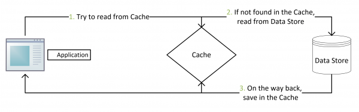
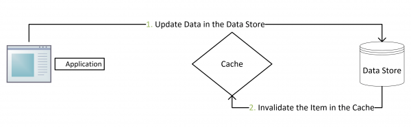
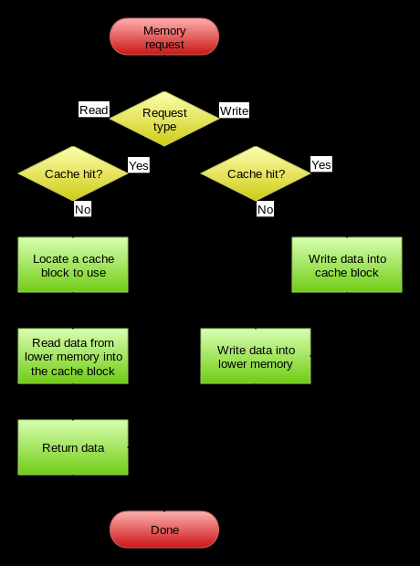
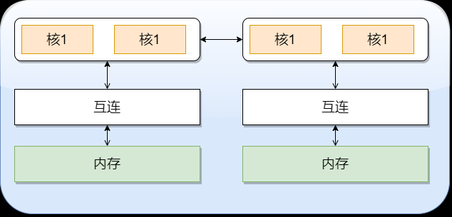

:toc:

:icons: font

:path: Linux/
:imagesdir: ../image/

// 只有book调用的时候才会走到这里
ifdef::rootpath[]
:imagesdir: {rootpath}{path}{imagesdir}
endif::rootpath[]

== 系统知识

=== PC系统架构

[[PCSystem]]
image::image-2022-07-02-10-29-44-536.png[PC系统架构]

=== 一个程序的执行过程

[plantuml, diagram=helloworld-exec,format=png]
....
编译器 : ccl
汇编器 : as
链接器 : ld

[*] -> 预处理起 : hello.c
预处理起 -> 编译器 : hello.i
编译器 -> 汇编器 : hello.s
汇编器 -> 链接器 :  hello.o
链接器 -> [*] : hello
....

[IMPORTANT]
处理器的核心就是PC寄存器，用来存储计算机下一步需要执行的指令

<<PCSystem, 程序执行过程>> +
假如有一个可执行程序hello, 正常程序是存储在磁盘的中的，当需要执行时，系统会将程序加载到内存中(主内存中)，当处理器开始执行程序hello时，会将指令通过寄存器送往运算单元，并将需要打印的字符等通过寄存器复制到现实设备

=== CPU缓存

无论什么样的代码最终都会交给CPU来执行，不要觉得CPU缓存这些知识没有用，正是这些知识能让你写出比别人快的代码拉开与别的程序员之间的差距。

首先，我们都知道现在的CPU多核技术，都会有几级缓存，老的CPU会有两级内存（L1和L2），新的CPU会有三级内存（L1，L2，L3 ），如下图所示：

image::image-2023-06-05-10-59-06-497.png[cpu-cache]

https://ny5odfilnr.feishu.cn/docs/doccn5LErBvC5qtwGZRyhb9SJgc[参考 CPU-cache]

其中：

- L1缓存分成两种，一种是指令缓存，一种是数据缓存。L2缓存和L3缓存不分指令和数据。
- L1和L2缓存在每一个CPU核中，L3则是所有CPU核心共享的内存。
- L1、L2、L3的越离CPU近就越小，速度也越快，越离CPU远，速度也越慢。

再往后面就是内存，内存的后面就是硬盘。我们来看一些他们的速度：

- L1 的存取速度：4 个CPU时钟周期
- L2 的存取速度： 11 个CPU时钟周期
- L3 的存取速度：39 个CPU时钟周期
- RAM内存的存取速度：107 个CPU时钟周期

我们可以看到，L1的速度是RAM的27倍，但是L1/L2的大小基本上也就是KB级别的，L3会是MB级别的。例如：Intel(R) Xeon(R) CPU E5-2650 v4 @ 2.20GHz ，
是一个6核的CPU，每核上的L1是64KB（数据和指令各32KB），L2 是 256K，L3有30MB。

_我们可以通过lscpu来查看cpu的缓存信息_
[source, bash]
.cpu cache
----
$lscpu
···
L1d 缓存：          32K
L1i 缓存：          32K
L2 缓存：           256K
L3 缓存：           30720K
NUMA 节点0 CPU：    0-3
···
----

我们的数据就从内存向上，先到L3，再到L2，再到L1，最后到寄存器进行CPU计算。为什么会设计成三层？这里有下面几个方面的考虑：

一个方面是物理速度，如果要更大的容量就需要更多的晶体管，除了芯片的体积会变大，更重要的是大量的晶体管会导致速度下降，
因为访问速度和要访问的晶体管所在的位置成反比，也就是当信号路径变长时，通信速度会变慢。这部分是物理问题。
另外一个问题是，多核技术中，数据的状态需要在多个CPU中进行同步，并且，我们可以看到，cache和RAM的速度差距太大，所以，多级不同尺寸的缓存有利于提高整体的性能。
这个世界永远是平衡的，一面变得有多光鲜，另一面也会变得有多黑暗。建立这么多级的缓存，一定就会引入其它的问题，这里有两个比较重要的问题，

一个是比较简单的缓存的命中率的问题。
另一个是比较复杂的缓存更新的一致性问题。
尤其是第二个问题，在多核技术下，这就很像分布式的系统了，要对多个地方进行更新。

[[HC1]]
==== [red]#缓存的命中#

在说明这两个问题之前。我们需要要解一个术语 Cache Line。 +
缓存基本上来说就是把后面的数据加载到离自己近的地方，对于CPU来说，它是不会一个字节一个字节的加载的。
因为这非常没有效率，一般来说都是要一块一块的加载的，对于这样的一块一块的数据单位，术语叫“Cache Line”。
一般来说，一个主流的CPU的Cache Line 是 64 Bytes（也有的CPU用32Bytes和128Bytes），
64Bytes也就是16个32位的整型，这就是CPU从内存中捞数据上来的最小数据单位。

比如：Cache Line是最小单位（64Bytes），所以先把Cache分布多个Cache Line，比如：L1有32KB，那么，32KB/64B = 512 个 Cache Line。

一方面，缓存需要把内存里的数据放到放进来，英文叫 CPU Associativity。Cache的数据放置的策略决定了内存中的数据块会拷贝到CPU Cache中的哪个位置上，
因为Cache的大小远远小于内存，所以，需要有一种地址关联的算法，能够让内存中的数据可以被映射到Cache中来。
这个有点像内存地址从逻辑地址向物理地址映射的方法，但不完全一样。

基本上来说，我们会有如下的一些方法。

- 一种方法是，任何一个内存地址的数据可以被缓存在任何一个Cache Line里，这种方法是最灵活的，但是，如果我们要知道一个内存是否存在于Cache中，
我们就需要进行O(n)复杂度的Cache遍历，这是很没有效率的。
- 另一种方法，为了降低缓存搜索算法，我们需要使用像Hash Table这样的数据结构，最简单的hash table就是做“求模运算”，比如：我们的L1 Cache有512个Cache Line，那么，公式：（内存地址 mod 512）* 64 就可以直接找到所在的Cache地址的偏移了。但是，这样的方式需要我们的程序对内存地址的访问要非常地平均，不然冲突就会非常严重。这成了一种非常理想的情况了。
- 为了避免上述的两种方案的问题，于是就要容忍一定的hash冲突，也就出现了 N-Way 关联。也就是把连续的N个Cache Line绑成一组，然后，先把找到相关的组，然后再在这个组内找到相关的Cache Line。这叫 Set Associativity。如下图所示。

image::image-2023-06-05-17-11-53-833.png[]

对于 N-Way 组关联，可能有点不好理解，这里个例子，并多说一些细节（不然后面的代码你会不能理解），Intel 大多数处理器的L1 Cache都是32KB，8-Way 组相联，Cache Line 是64 Bytes。这意味着，

- 32KB的可以分成，32KB / 64 = 512 条 Cache Line。
- 因为有8 Way，于是会每一Way 有 512 / 8 = 64 条 Cache Line。
- 于是每一路就有 64 x 64 = 4096 Byts 的内存。

为了方便索引内存地址:

- Tag：每条 Cache Line 前都会有一个独立分配的 24 bits来存的 tag，其就是内存地址的前24bits
- Index：内存地址后续的6个bits则是在这一Way的是Cache Line 索引，2^6 = 64 刚好可以索引64条Cache Line
- Offset：再往后的6bits用于表示在Cache Line 里的偏移量

如下图所示：（图片来自《Cache: a place for concealment and safekeeping》）

当拿到一个内存地址的时候，先拿出中间的 6bits 来，找到是哪组。

image::image-2023-06-05-17-20-07-957.png[]

.缓存命中
然后，在这一个8组的cache line中，再进行O(n) n=8 的遍历，主是要匹配前24bits的tag。如果匹配中了，就算命中，如果没有匹配到，那就是cache miss，如果是读操作，就需要进向后面的缓存进行访问了。L2/L3同样是这样的算法。而淘汰算法有两种，一种是随机一种是LRU。现在一般都是以LRU的算法（通过增加一个访问计数器来实现）

image::image-2023-06-05-17-33-50-430.png[]

这也意味着：

- L1 Cache 可映射 36bits 的内存地址，一共 2^36 = 64GB的内存
- 当CPU要访问一个内存的时候，通过这个内存中间的6bits 定位是哪个set，通过前 24bits 定位相应的Cache Line。
- 就像一个hash Table的数据结构一样，先是O(1)的索引，然后进入冲突搜索。
- 因为中间的 6bits 决定了一个同一个set，所以，对于一段连续的内存来说，每隔4096的内存会被放在同一个组内，导致缓存冲突。

此外，当有数据没有命中缓存的时候，CPU就会以最小为Cache Line的单元向内存更新数据。当然，CPU并不一定只是更新64Bytes，因为访问主存实在是太慢了，所以，一般都会多更新一些。好的CPU会有一些预测的技术，如果找到一种pattern的话，就会预先加载更多的内存，包括指令也可以预加载。这叫 Prefetching 技术 （参看，Wikipedia 的 Cache Prefetching 和 纽约州立大学的 Memory Prefetching）。比如，你在for-loop访问一个连续的数组，你的步长是一个固定的数，内存就可以做到prefetching。

了解这些细节，会有利于我们知道在什么情况下有可以导致缓存的失效。

==== 缓存的一致性
对于主流的CPU来说，缓存的写操作基本上是两种策略（《 https://coolshell.cn/articles/17416.html[缓存更新的套路]》），

- 一种是Write Back，先写到在cache上，然后通过flush存储到内存上。
- 一种是Write Through，写操作同时写到cache和内存上。

为了提高写的性能，一般来说，主流的CPU（如：Intel Core i7/i9）采用的是Write Back的策略，因为直接写内存实在是太慢了。

好了，现在问题来了，如果有一个数据 x 在 CPU 第0核的缓存上被更新了，那么其它CPU核上对于这个数据 x 的值也要被更新，这就是缓存一致性的问题。（当然，对于我们上层的程序我们不用关心CPU多个核的缓存是怎么同步的，这对上层的代码来说都是透明的）

一般来说，在CPU硬件上，会有两种方法来解决这个问题。

- Directory 协议。这种方法的典型实现是要设计一个集中式控制器，它是主存储器控制器的一部分。其中有一个目录存储在主存储器中，其中包含有关各种本地缓存内容的全局状态信息。当单个CPU Cache 发出读写请求时，这个集中式控制器会检查并发出必要的命令，以在主存和CPU Cache之间或在CPU Cache自身之间进行数据同步和传输。
- Snoopy 协议。这种协议更像是一种数据通知的总线型的技术。CPU Cache通过这个协议可以识别其它Cache上的数据状态。如果有数据共享的话，可以通过广播机制将共享数据的状态通知给其它CPU Cache。这个协议要求每个CPU Cache 都可以“窥探”数据事件的通知并做出相应的反应。如下图所示，有一个Snoopy Bus的总线。

image::image-2023-06-06-09-15-49-155.png[]

因为Directory协议是一个中心式的，会有性能瓶颈，而且会增加整体设计的复杂度。而Snoopy协议更像是微服务+消息通讯，所以，现在基本都是使用Snoopy的总线的设计。

这里，我想多写一些细节，因为这种微观的东西，让人不自然地就会跟分布式系统关联起来，在分布式系统中我们一般用Paxos/Raft这样的分布式一致性的算法。而在CPU的微观世界里，则不必使用这样的算法，原因是因为CPU的多个核的硬件不必考虑网络会断会延迟的问题。所以，CPU的多核心缓存间的同步的核心就是要管理好数据的状态就好了。
这里介绍几个状态协议，先从最简单的开始，MESI协议，这个协议跟那个著名的足球运动员梅西没什么关系，其主要表示缓存数据有四个状态：Modified（已修改）, Exclusive（独占的）,Shared（共享的），Invalid（无效的）。

这些状态的状态机如下所示

image::image-2023-06-06-09-17-46-030.png[]

下面是个示例（如果你想看一下动画演示的话，这里有一个网页（ https://www.scss.tcd.ie/Jeremy.Jones/VivioJS/caches/MESIHelp.htm[MESI Interactive Animations]），你可以进行交互操作，这个动画演示中使用的Write Through算法）：

教程ppt详见 https://www.scss.tcd.ie/Jeremy.Jones/CSU34021/6%20multiprocessors.pdf[multiprocessors]

MESI 这种协议在数据更新后，会标记其它共享的CPU缓存的数据拷贝为Invalid状态，然后当其它CPU再次read的时候，就会出现 cache miss 的问题，此时再从内存中更新数据。从内存中更新数据意味着20倍速度的降低。我们能不能直接从我隔壁的CPU缓存中更新？是的，这就可以增加很多速度了，但是状态控制也就变麻烦了。还需要多来一个状态：Owner(宿主)，用于标记，我是更新数据的源。于是，出现了 MOESI 协议

MOESI协议的状态机和演示示例我就不贴了（有兴趣可以上Berkeley上看看相关的课件），我们只需要理解MOESI协议允许 CPU Cache 间同步数据，于是也降低了对内存的操作，性能是非常大的提升，但是控制逻辑也非常复杂。

==== 程序性能

[source, cpp]
----
const int LEN = 64*1024*1024;
int *arr = new int[LEN];

for (int i = 0; i < LEN; i += 1) arr[i] *= i;

for (int i = 0; i < LEN; i += 8) arr[i] *= i;
----

> 跑的时候，一定得让两个循环分开跑，否则第一次从内存中加载cache会影响第二次的数据

按照循环的次数，第二个循环应该比第一个循环快8倍，但是实际的计算结果是，第二个循环耗时只比第一个循环耗时快2.5倍左右，第一次耗时235ms第二次93ms，这里最主要的原因就是cache line，因为CPU会以一个cache line为最小单位加载，也就是16个32bits，所以无论是步长1还是8相差都差不多，后面的乘法不消耗CPU时间，有乘法运算单元。

[source, cpp]
----
for (int i = 0; i < 10000000; i++) {
    for (int j = 0; j < size; j += increment) {
        memory[j] += j;
    }
}
----

我们测试一下，在下表中， 表头是步长，也就是每次跳多少个整数，而纵向是这个数组可以跳几次（你可以理解为要几条Cache Line），于是表中的任何一项代表了这个数组有多少，而且步长是多少。比如：横轴是 512，纵轴是4，意思是，这个数组有 4*512 = 2048 个长度，访问时按512步长访问，也就是访问其中的这几项：[0, 512, 1024, 1536] 这四项。

表中同的项是，是循环1000万次的时间，单位是“微秒”（除以1000后是毫秒）

[source, cpp]
----
| count |   1    |   16  |  512  | 1024  |
------------------------------------------
|     1 |  17539 | 16726 | 15143 | 14477 |
|     2 |  15420 | 14648 | 13552 | 13343 |
|     3 |  14716 | 14463 | 15086 | 17509 |
|     4 |  18976 | 18829 | 18961 | 21645 |
|     5 |  23693 | 23436 | 74349 | 29796 |
|     6 |  23264 | 23707 | 27005 | 44103 |
|     7 |  28574 | 28979 | 33169 | 58759 |
|     8 |  33155 | 34405 | 39339 | 65182 |
|     9 |  37088 | 37788 | 49863 |156745 |
|    10 |  41543 | 42103 | 58533 |215278 |
|    11 |  47638 | 50329 | 66620 |335603 |
|    12 |  49759 | 51228 | 75087 |305075 |
|    13 |  53938 | 53924 | 77790 |366879 |
|    14 |  58422 | 59565 | 90501 |466368 |
|    15 |  62161 | 64129 | 90814 |525780 |
|    16 |  67061 | 66663 | 98734 |440558 |
|    17 |  71132 | 69753 |171203 |506631 |
|    18 |  74102 | 73130 |293947 |550920 |
----

我们可以看到，从 [9，1024] 以后，时间显著上升。包括 [17，512] 和 [18,512] 也显著上升。这是因为，我机器的 L1 Cache 是 32KB, 8 Way 的，前面说过，8 Way的有64组，每组8个Cache Line，当for-loop步长超过1024个整型，也就是正好 4096 Bytes时，也就是导致内存地址的变化是变化在高位的24bits上，而低位的12bits变化不大，尤其是中间6bits没有变化，导致全部命中同一组set，导致大量的cache 冲突，导致性能下降，时间上升。而 [16, 512]也是一样的，其中的几步开始导致L1 Cache开始冲突失效。

*逐行遍历快还是逐列遍历好*

接下来，我们再来看个示例。下面是一个二维数组的两种遍历方式，一个逐行遍历，一个是逐列遍历，这两种方式在理论上来说，寻址和计算量都是一样的，执行时间应该也是一样的。

[source,cpp]
----
const int row = 1024;
const int col = 512
int matrix[row][col];

//逐行遍历
int sum_row=0;
for(int _r=0; _r<row; _r++) {
    for(int _c=0; _c<col; _c++){
        sum_row += matrix[_r][_c];
    }
}

//逐列遍历
int sum_col=0;
for(int _c=0; _c<col; _c++) {
    for(int _r=0; _r<row; _r++){
        sum_col += matrix[_r][_c];
    }
}
----
然而，并不是，在我的机器上，得到下面的结果。

- 逐行遍历：0.081ms
- 逐列遍历：1.069ms
执行时间有十几倍的差距。其中的原因，就是逐列遍历对于CPU Cache 的运作方式并不友好，所以，付出巨大的代价。

接下来，我们来看一下多核下的性能问题，参看如下的代码。两个线程在操作一个数组的两个不同的元素（无需加锁），线程循环1000万次，做加法操作。在下面的代码中，我高亮了一行，就是p2指针，要么是p[1]，或是 p[30]，理论上来说，无论访问哪两个数组元素，都应该是一样的执行时间。

[source, cpp]
----
void fn (int* data) {
    for(int i = 0; i < 10*1024*1024; ++i)
        *data += rand();
}

int p[32];

int *p1 = &p[0];
int *p2 = &p[1]; // int *p2 = &p[30];

thread t1(fn, p1);
thread t2(fn, p2);
----

然而，并不是，在我的机器上执行下来的结果是：

- 对于 p[0] 和 p[1] ：560ms
- 对于 p[0] 和 p[30]：104ms

这是因为 p[0] 和 p[1] 在同一条 Cache Line 上，而 p[0] 和 p[30] 则不可能在同一条Cache Line 上 ，CPU的缓存最小的更新单位是Cache Line，所以，[red]*这导致虽然两个线程在写不同的数据，但是因为这两个数据在同一条Cache Line上，就会导致缓存需要不断进在两个CPU的L1/L2中进行同步，从而导致了5倍的时间差异*。

线程越多就越快吗？

接下来，我们再来看一下另外一段代码：我们想统计一下一个数组中的奇数个数，但是这个数组太大了，我们希望可以用多线程来完成这个统计。下面的代码中，我们为每一个线程传入一个 id ，然后通过这个 id 来完成对应数组段的统计任务。这样可以加快整个处理速度。

[source, cpp]
----
int total_size = 16 * 1024 * 1024; //数组长度
int* test_data = new test_data[total_size]; //数组
int nthread = 6; //线程数（因为我的机器是6核的）
int result[nthread]; //收集结果的数组

void thread_func (int id) {
    result[id] = 0;
    int chunk_size = total_size / nthread + 1;
    int start = id * chunk_size;
    int end = min(start + chunk_size, total_size);

    for ( int i = start; i < end; ++i ) {
        if (test_data[i] % 2 != 0 ) ++result[id];
    }
}
----

然而，在执行过程中，你会发现，6个线程居然跑不过1个线程。因为根据上面的例子你知道 result[] 这个数组中的数据在一个Cache Line中，所以，所有的线程都会对这个 Cache Line 进行写操作，导致所有的线程都在不断地重新同步 result[] 所在的 Cache Line，所以，导致 6 个线程还跑不过一个线程的结果。这叫 False Sharing。

优化也很简单，使用一个线程内的变量

[source, cpp]
----
void thread_func (int id) {
    result[id] = 0;
    int chunk_size = total_size / nthread + 1;
    int start = id * chunk_size;
    int end = min(start + chunk_size, total_size);

    int c = 0; //使用临时变量，没有cache line的同步了
    for ( int i = start; i < end; ++i ) {
        if (test_data[i] % 2 != 0 ) ++c;
    }
    result[id] = c;
}
----

参考：
https://coolshell.cn/articles/20793.html[与程序员相关的CPU缓存知识] +
https://people.freebsd.org/~lstewart/articles/cpumemory.pdf[cpumemory] +
https://queue.acm.org/detail.cfm?id=2492433[Nonblocking Algorithms and Scalable Multicore Programming] +
https://www.eetimes.com/optimizing-for-instruction-caches-part-1/[Optimizing for instruction caches, part 1] +
https://www.eetimes.com/optimizing-for-instruction-caches-part-2/[Optimizing for instruction caches, part 2] +
https://www.eetimes.com/optimizing-for-instruction-caches-part-3/[Optimizing for instruction caches, part 3] +
http://igoro.com/archive/gallery-of-processor-cache-effects/[gallery-of-processor-cache-effects] +
https://www.cs.swarthmore.edu/~kwebb/cs31/f18/memhierarchy/caching.html[caching] +

'''

=== 缓存更新套路

现在很多人写缓存更新代码时，都是先删除缓存，然后再更新数据库，再然后会把数据在装载到缓存中，试想，两个并发操作，一个是更新操作，另一个是查询操作，更新操作删除缓存后，查询操作没有命中缓存，先把老数据读出来后放到缓存中，然后更新操作更新了数据库。于是，在缓存中的数据还是老的数据，导致缓存中的数据是脏的，而且还一直这样脏下去了。

[TIP]
更新缓存的的Design Pattern有四种：Cache aside, Read through, Write through, Write behind caching

==== Cache Aside Pattern
可以说Cache Aside Pattern是最常用的模式了，具体逻辑如下：

- 失效：[red]#也可以说缓存未命中，应用程序从缓存中取数据，没有得到，则从数据库中取数据，成功后将数据放到缓存中#
- 命中：[yellow]#应用程序从cache中取得数据，然后返回#
- 更新：[blue]#先把数据更新到数据库，成功后再让缓存中的数据失效#

==== Read/Write Through Pattern
可以看到Cache Aside模式中，应用程序需要时刻维护着两个数据存储，一个是缓存-cache，一个是数据库-repository。所以在实现过程比较麻烦，而在/Write Through模式中把更新数据库repository的过程交给缓存自己来完成了，这样一来对于应用程序来说就非常简单了。可以认为后端就是一个单一的存储。

*Read Through*

Read Through就是查询操作中的更新缓存，也就是说，当缓存失效的时候(过期或者LRU替换出)，Cache aside模式中是调用方负责把数据加载入缓存，而Read Through则用缓存服务自己来加载，从而对应用方式透明的。

*Write Through*

Write Through在更新数时，如果没有命中缓存直接更新数据库然后返回，如果命中了缓存，则更新缓存，并由缓存自己更新数据库。注意上述步骤是事务操作

[TIP]
关于缓存命中可以参考缓存的命中章节 <<HC1,缓存的命中>>

==== Write Behind Caching Pattern
Write Behind又被称为Write Back。一些了解Linux内核的同学对Write Back应该非常熟悉，这不就是Linux文件系统的Page Cache的算法吗？是的不要怀疑就是这样的，所以基础很重要。

Write Back就是在更新数据的时候只对缓存进行更新，不更新数据库，缓存会异步批量的更新数据库。经过这样的设计之后数据IO会快的飞起

==== 再多说几句

可以看出上面这些看似高深的设计模式，其实并不是什么软件架构里面如redis/memcache的更新策略，这些东西都是计算机体系结构里面的设计，比如CPU的缓存，硬盘文件系统中的缓存，硬盘上的缓存，数据库中的缓存。基本上来说，这些缓存更新的设计模式都是非常古董的，而且是长时间经受过时间考验的过的策略。也就是工程中的Best Practice，我们在实际的设计中只要进行遵从即可。

因此、就算是做宏观架构的人，也需要对微观的这些东西熟练地掌握。比如云计算很多虚拟技术原理，和传统的虚拟内存不是很像？Unix下的IO模型是不是和同步异步模型很像，Unix中的管道不就是数据流式计算架构吗？TCP的很多设计也用在不同系统之间的通讯设计中，仔细看微观的这些东西你会发现很多精妙的设计。所以，请允许我在这里放句观点鲜明的话——如果你要做好架构，首先你得把计算机体系结构以及很多老古董的基础技术吃透了。

软件设计应该优先参考已有设计，多看看响应的guideline, best practice和design pattern，吃透已有的东西，再决定是否重新发明轮子，千万不能事实而非想当然的设计软件。

参考：

https://coolshell.cn/articles/17416.html[缓存更新套路]

== ARM

=== ARM寄存器以及工作模式

image::image-2022-07-02-10-56-42-650.png[ARM处理器以及工作模式]

ARM在实际工作中，各个模式之间会相互切换，其中比较特殊的事FIQ，因为FIQ拥有的寄存器比较多，又因为FIQ的响应优先级比较高，因此FIQ能能更快的切换状态。

1. R0-R12是通用寄存器，放通用数据
2. 各个模式R0-R12与User模式是共享的除了FIQ(F8-F12自有)，PC CPSR共享
3. User模式没有SPSR

==== 什么是大小端

小端(Little-endian)：就是低字节排放在内存的的低地址端，高位字节排放到内存的高地址端 +
大端(Big-endian)：就是高位字节排放在内存的低地址端，低字节排放到内存的高地址端

[TIP]
1)大端模式：
低地址 -----------------> 高地址
0x12  |  0x34  |  0x56  |  0x78
2)小端模式：
低地址 ------------------> 高地址
0x78  |  0x56  |  0x34  |  0x12

判断系统大小端

.BgiEndian.cpp
[source, cpp]
----
bool BigEndian()
{
    union
    {
        uint16_t a;
        char b;
    }num;
    num.a = 0x1234;
    if(num.b == 0x12)
    {
        return true;
    }
    return false;
}
----

=== 文件IO

=== 进程间通信

=== 线程间同步

=== 守护进程

=== 内存

共享内存系统中使用一个或者多个多核处理器，这些核之间每个核有自己的L1Cache，其他的Cache可以在核之间进行共享，也可以不进行共享。

image::image-2022-10-17-09-28-59-095.png[]

在拥有多个多核处理器的共享内存系统中，互联网络可以将所有的处理器直接连接到主存上，或者将每个处理器直接连接到一块内存，通过处理器内置的特殊的硬件使得各个处理器可以访问内存中的其他块。

当所有核都链接到一块内存上时，访问内存中任何一个区域的时间都相同，因此又被称为一致内存访问系统UMA(Uniform Memory Access)。

.UMA系统
image::image-2022-10-17-09-33-51-443.png[UMA ,550, align=center]

核访问与自己直接相连的内存区域，比访问其它区域快的多，因为访问其它区域需要通过另外一个芯片，因此被称为非一致性内存访问系统NUMA(Nonuniform Memory Access).

.NUMA系统

=== 内存管理

Linux内存管理，内存寻址，虚拟内存，内存调页算法，任务调度算法

[TIP]
Linux虚拟内存实现需要6种机制支持：地址映射机制、内存分配回收机制、缓存和刷新机制、请求页机制、交换机机制、内存共享机制

内存管理程序通过映射机制(MMU)可以把用户程序的逻辑地址映射到物理地址。当用户程序运行时，如果发现程序中的虚拟地址没有对应的物理地址，就发出请求页的请求，如果有空闲的内存可供分配，就请求分配内存(此处需要内存的分配和回收机制)，并把使用的物理页记录到缓存中(使用了缓存机制)。如果没有足够的内存可供分配，那么就调用交换机制，腾出一部分内存。另外在地址映射中要通过TLB(翻译后缓存储器)来寻找物理页；交换机知中也要用到交换缓存，并且把物理页内容交换到文件中，也要修改页表来映射文件地址。

=== 信号
常见的信号？ 操作系统如何将一个信号通知到进程

[source, bash]
----
andrew@andrew-G3-3590:~$ kill -l
 1) SIGHUP	 2) SIGINT	 3) SIGQUIT	 4) SIGILL	 5) SIGTRAP
 6) SIGABRT	 7) SIGBUS	 8) SIGFPE	 9) SIGKILL	10) SIGUSR1
11) SIGSEGV	12) SIGUSR2	13) SIGPIPE	14) SIGALRM	15) SIGTERM
16) SIGSTKFLT	17) SIGCHLD	18) SIGCONT	19) SIGSTOP	20) SIGTSTP
21) SIGTTIN	22) SIGTTOU	23) SIGURG	24) SIGXCPU	25) SIGXFSZ
26) SIGVTALRM	27) SIGPROF	28) SIGWINCH	29) SIGIO	30) SIGPWR
31) SIGSYS	34) SIGRTMIN	35) SIGRTMIN+1	36) SIGRTMIN+2	37) SIGRTMIN+3
38) SIGRTMIN+4	39) SIGRTMIN+5	40) SIGRTMIN+6	41) SIGRTMIN+7	42) SIGRTMIN+8
43) SIGRTMIN+9	44) SIGRTMIN+10	45) SIGRTMIN+11	46) SIGRTMIN+12	47) SIGRTMIN+13
48) SIGRTMIN+14	49) SIGRTMIN+15	50) SIGRTMAX-14	51) SIGRTMAX-13	52) SIGRTMAX-12
53) SIGRTMAX-11	54) SIGRTMAX-10	55) SIGRTMAX-9	56) SIGRTMAX-8	57) SIGRTMAX-7
58) SIGRTMAX-6	59) SIGRTMAX-5	60) SIGRTMAX-4	61) SIGRTMAX-3	62) SIGRTMAX-2
63) SIGRTMAX-1	64) SIGRTMAX
----
信号是进程之间传递消息的一种方法，信号全称为软中断信号，当然有诶有些人称作软中断 +
进程间可以通过调用系统调用kill发送信号，
[red]#几种常见的信号#：

[source, bash]
----
SIGHUP 1 A 终端挂起或者控制进程终止
SIGINT 2 A 键盘中断（如break键被按下）
SIGQUIT 3 C 键盘的退出键被按下
SIGILL 4 C 非法指令
SIGABRT 6 C 由abort(3)发出的退出指令
SIGFPE 8 C 浮点异常
SIGKILL 9 AEF Kill信号
SIGSEGV 11 C 无效的内存引用
SIGPIPE 13 A 管道破裂: 写一个没有读端口的管道
----

=== 在线编译工具

https://www.godbolt.org[在线编译工具]

=== qemu 内核调试

www.kernel.org内核地址

https://www.bilibili.com/read/cv11271232 教程

