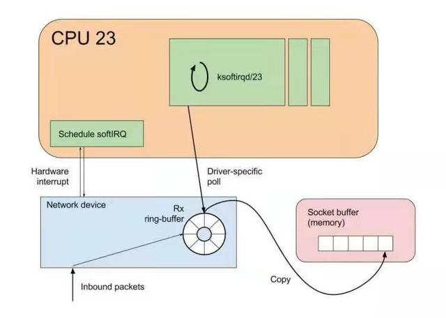
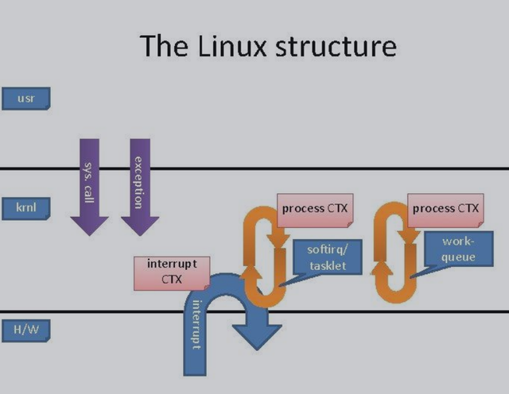
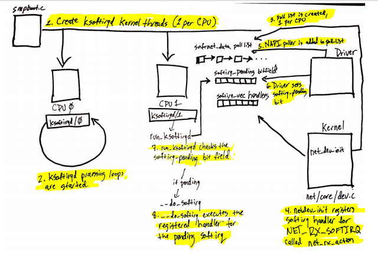

:toc:

// 保证所有的目录层级都可以正常显示图片
:path: C++知识点总结/
:imagesdir: ../image/

// 只有book调用的时候才会走到这里
ifdef::rootpath[]
:imagesdir: {rootpath}{path}{imagesdir}
endif::rootpath[]

== 高性能

=== placement new

placement new允许我们将对象创建于已经申请的内存中，因为placement new实际上并没有申请内存，所以也不存在所谓的placement delete

[source,cpp]
----
// PlacementNew
void PlacementNew() {
    char *buffer = new char[sizeof(MemoryManagement) * 3];

    auto *lp1 = new(buffer) MemoryManagement;
    auto *lp2 = new(buffer + sizeof(MemoryManagement)) MemoryManagement;
    auto *lp3 = new(buffer + sizeof(MemoryManagement) * 2) MemoryManagement;

    // 如果需要析枸，需要自己调用析枸函数
    lp1->~MemoryManagement();
    lp2->~MemoryManagement();
    lp3->~MemoryManagement();

    delete[] buffer;
}
----

=== SMP IRQ affinity

当一个硬件(如磁盘控制器或者以太网卡), 需要打断CPU的工作时, 它就触发一个中断. 该中断通知CPU发生了某些事情并且CPU应该放下当前的工作去处理这个事情. 为了防止多个设置发送相同的中断, Linux设计了一套中断请求系统, 使得计算机系统中的每个设备被分配了各自的中断号, 以确保它的中断请求的唯一性. 从2.4 内核开始, Linux改进了分配特定中断到指定的处理器(或处理器组)的功能. 这被称为SMP IRQ affinity, 它可以控制系统如何响应各种硬件事件. 允许你限制或者重新分配服务器的工作负载, 从而让服务器更有效的工作. 以网卡中断为例，在没有设置SMP IRQ affinity时， 所有网卡中断都关联到CPU0, 这导致了CPU0负载过高，而无法有效快速的处理网络数据包，导致了瓶颈。 通过SMP IRQ affinity， 把网卡多个中断分配到多个CPU上，可以分散CPU压力，提高数据处理速度。

==== 相关设置文件

- `/proc/irq/<irqnumber>/smp_affinity`

/proc/irq/IRQ#/smp_affinity 和 /proc/irq/IRQ#/smp_affinity_list 指定了哪些CPU能够关联到一个给定的IRQ源. 这两个文件包含了这些指定cpu的cpu位掩码(smp_affinity)和cpu列表(smp_affinity_list). 不允许关闭所有CPU， 同时如果IRQ控制器不支持中断请求亲和(IRQ affinity)，则这些设置的值将保持不变(既关联到所有CPU).

设置方法，按照bitmask进行设置，十六进制表示，转化为二进制之后，每一位代表一个CPU

[source, cpp]
----
           二进制  十六进制
   CPU 0   0001    1
   CPU 1   0010    2
   CPU 2   0100    4
   CPU 3   1000    8
----

假如有一个4个CPU的系统， 我们能给一个IRQ分配15种不同的CPU组合(实际上有16种，但我们不能给任何中断分配中断亲和为”0”的值， 即使你这么做，系统也会忽略你的做法)

[source, bash]
----
echo $bitmask > /proc/irq/IRQ#/smp_affinity

# 把44号中断绑定到前4个CPU上
echo f > /proc/irq/44/smp_affinity
----

- `/proc/irq/IRQ#/smp_affinity_list`

设置该文件取得的效果与/proc/irq/IRQ#/smp_affinity是一致的，它们两者是联动关系(既设置其中之一，另一个文件也随着改变), 有些系统可能没有该文件, 设置方法如下

[source, bash]
----
echo $cpuindex1-$cpuindex2 >/proc/irq/IRQ#/smp_affinity_list
# 将44号中断绑定到前4个CPU上(CPU0-3)上
echo 0-3 > /proc/irq/44/smp_affinity_list
----

- `/proc/irq/default_smp_affinity`

/proc/irq/default_smp_affinity 指定了默认情况下未激活的IRQ的中断亲和掩码(affinity mask).一旦IRQ被激活，它将被设置为默认的设置(即default_smp_affinity中记录的设置). 该文件能被修改. 默认设置是0xffffffff.

对于UDP测试在IRQ affinity上性能的下降， 查阅了内核源码(drivers/net/bnx2.c)及资料, bnx2 网卡的RSS hash不支持对UDP的端口进行计算，从而导致单独启用IRQ affinity的时候(这时候由硬件进行hash计算), UDP的数据只被hash了IP地址而导致数据包的转发出现集中在某个CPU的现象. 这是此次测试的局限所在，由于测试只是一台服务器端及一台客户端，所有UDP的IP地址都相同，无法体现UDP性能在单独启用IRQ affinity的性能提升

=== 如何更快的接收数据

物理网卡到内核的网络数据的接收流程

1. 驱动加载
2. 数据包到达网卡控制器(NIC)
3. 数据包被复制到内核空间(DMA -> ring_buffer)
4. 产生硬件中断，通知系统数据可读
5. 驱动调用NAPI激活poll函数，读取ring_buffer中的数据
6. ring_buffer对应的内存区域被解除映射(unmapped)
7. 数据包被封装为skb结构体，准备传递到上层协议站
8. 如果开启网卡多队列，数据帧会被负载到多个CPU上进行处理
9. 数据帧经过队列，递交上层协议栈

以上过程需要程序员重点关注的地方：

a. 数据包到达网卡
b. 网卡接收数据包时，需要产生一个软中断，告诉CPU数据已经到了，CPU调用ksoftirqd线程处理，中断事件
c. 内核接管，将数据从网卡中取出来，并将数据交给后面的内核协议栈处理

[plantuml, diagram=nic-queickdata, format=png]
.内核网络数据流程
....
@startuml
[*] -> packets
packets -> NIC : internet
NIC -> CPU : NAPI
CPU -> Kernel
Kernel -> skb
skb -> [*]
@enduml
....

网卡在收到数据时，都必须把数据从链路层拷贝到机器的内存里，而这块内存就是网卡在启动时，通过接口向内核、向操作系统申请而来的。内存一旦申请下来，地址确定之后，后续网卡在收到数据的时候，就可以直接通过 DMA 的机制，直接把数据包传送到内存固定的地址中去，甚至不需要 CPU 的参与。

image::nicpic.jpeg[nicpic]

到队列内存的分配可以看下上图，很早之前的网卡都是单队列的机制，但现代的网卡大多都是多队列的。好处就是机器网卡的数据接收可以被负载均衡到多个 CPU 上，因此会提供多个队列

NAPI是现代网络数据包处理框架中非常重要的一个扩展。之所以现在能支持 10G、20G、25G 等非常高速的网卡，NAPI 机制起到了非常大的作用。当然 NAPI 并不复杂，其核心就两点：中断、轮循。一般来说，网卡在接收数据时肯定是收一个包，产生一个中断，然后在中断处理函数的时候将包处理掉。处在收包、处理中断，下一个收包，再处理中断，这样的循环中。而 NAPI 机制优势在于只需要一次中断，收到之后就可以通过轮循的方式，把队列内存中所有的数据都拿走，达到非常高效的状态。

==== 驱动监控

[source,bash]
.ethtool -S
----
andrew@andrew-G3-3590:~$ ethtool -S wlp4s0
NIC statistics:
     rx_packets: 2778911
     rx_bytes: 2758807450
     rx_duplicates: 5
     rx_fragments: 2468225
     rx_dropped: 1185
     tx_packets: 927109
     tx_bytes: 101761735
     tx_filtered: 0
     tx_retry_failed: 0
     tx_retries: 0
     ...
----

使用ethtool工具可以拿到网卡中常规的统计信息，而这里最值得关注的当然是那些异常的信息.

同样可以通过查看系统的net信息获取这些信息，`/sys/class/net/<interface>/statistics/` 目录中会记录对应网卡的一些信息统计。

[source,back]
----
andrew@andrew-G3-3590:~$ cat /sys/class/net/wlp4s0/statistics/rx_
rx_bytes          rx_dropped        rx_frame_errors   rx_nohandler
rx_compressed     rx_errors         rx_length_errors  rx_over_errors
rx_crc_errors     rx_fifo_errors    rx_missed_errors  rx_packets
andrew@andrew-G3-3590:~$ cat /sys/class/net/wlp4s0/statistics/rx_dropped
0
----

相同的信息也会在 `/proc/net/dev` 中进行体现，这些信息差不多，只是获取的方法不一致而已

[source,bash]
----
:~$ cat /proc/net/dev
Inter-|   Receive                                                |  Transmit
 face |bytes    packets errs drop fifo frame compressed multicast|bytes    packets errs drop fifo colls carrier compressed
    lo: 67220678  409483    0    0    0     0          0         0 67220678  409483    0    0    0     0       0          0
enp3s0:       0       0    0    0    0     0          0         0        0       0    0    0    0     0       0          0
enx00e04c68053d:       0       0    0    0    0     0          0         0        0       0    0    0    0     0       0          0
wlp4s0: 2628562869 2161689    0    0    0     0          0         0 102174407  929847    0    0    0     0       0          0
docker0:       0       0    0    0    0     0          0         0        0       0    0    0    0     0       0          0

----

[TIP]
====
1. 如果overruns错误，说明Rx Tx的队列太小了，需要扩大
2. 如果frame错误，一般是网络数据的RAR校验不通过，需要考虑，互联网上的需要考虑数据是否被篡改，网线直连的需要考虑是否网线或者网卡出现了问题
====

==== 调优

调优能够更改的地方比较少，主要针对多队列的调整，比较直观，调整队列数目、大小、各个队列之间的权重、哈希字段等

使用 `ethtool -l <interface>` 可以查看网卡的预设信息

举个例子，比如有个 web server 绑定到了 CPU2，而机器有多个 CPU，这个机器的网卡也是多队列的，其中某个队列会被 CPU2 处理。这个时候就会有一个问题，因为网卡有多个队列，所以 80 端口的流量只会被分配到其中一个队列上去。假如这个队列不是由 CPU2 处理的，就会涉及到一些数据的腾挪。底层把数据接收上来后再交给应用层的时候，需要把这个数据移动一下。如果本来在 CPU1 处理的，需要挪到 CPU2 去，这时会涉及到 CPU cache 的失效，这对高速运转的 CPU 来说是代价很高的操作

我们可以通过前面提到的工具，特意把 80 端口 tcp 数据流量导向到对应 CPU2 处理的网卡队列。这么做的效果是数据包从到达网卡开始，到内核处理完再到送达应用层，都是同一个 CPU。这样最大的好处就是缓存，CPU 的 cache 始终是热的，如此整体下来，它的延迟、效果也会非常好。

==== 内核网络子系统

内核网络子系统，需要关注的主要有软中断于网络子系统

硬件和内核之间交互必须通过中断，这种机制处理其它事情好可以，但是作为网络数据来说如果一个数据就上报一个中断的话会带来如下问题：

1. 中断处理期间，会对之前的中断信信号进行屏蔽，当一个中断处理的时间很长，在处理期间收到的中断信号都会丢掉
2. 一个数据包触发一次中断，当有大量数据包到来后，就会产生大量的中断。网络数据量大时会导致CPU忙于处理中断而没办法干其他事情。

针对以上问题的解决办法就是让终端处理尽量的短。具体来说就是不能在中断中处理的数据，将需要处理的数据丢出来交给软中断进行处理

[source, cpp]
.ksoftirqd
----
// 软中断
static struct smp_hotplug_thread softirq_threads = {
	.store			= &ksoftirqd,
	.thread_should_run	= ksoftirqd_should_run,
	.thread_fn		= run_ksoftirqd,
	.thread_comm		= "ksoftirqd/%u",
};
// 为每一个CPU都注册一个软中断线程，服务器上每一个CPU都会分配一个这样的线程
// 软中断和网络相关的就是 NET-Tx NET-Rx
static __init int spawn_ksoftirqd(void)
{
	register_cpu_notifier(&cpu_nfb);

	BUG_ON(smpboot_register_percpu_thread(&softirq_threads));

	return 0;
}
----

查看软中断信息

[source, bash]
----
# cat /proc/softirqs
                    CPU0       CPU1       CPU2       CPU3
          HI:          0          0          0          0
       TIMER: 2623983768 2668790241 2685144852 2721179533
      NET_TX:       5811       5942       5124    3113782
      NET_RX: 2016198897 1627027198 1593502916 2264407343
       BLOCK:   15697043    9637765   18050603   38241598
BLOCK_IOPOLL:          0          0          0          0
     TASKLET:   15807487   19225321    8343774   16115362
       SCHED: 1192747035 1125818886 1070286566 1060203270
     HRTIMER:          0          0          0          0
         RCU:   86329660   73790543   76646829   91746559

----

内核初始化流程

- 针对每个CPU，创建一个数据结构
- 注册一个软中断处理函数(NET-RX, NET-Tx)

[plantuml, diagram=softwareirq-index, format=png]
----
@startuml
[*] -> NIC : packets
NIC -> RAM : DMA
RAM : RingBuffer
NIC --> CPU : IRQ is raised
NIC --->Driver : IRQ Cleared
CPU --> Driver : RUns IRQ Handler
Driver ->  [*] : NAPI is started
@enduml
----

1. 网卡收到数据包
2. 把数据通过DMA拷贝到内存里面
3. 产生一个中断，告诉CPU并开始处理中断(将中断信号屏蔽->环形NAPI机制)

[source,cpp]
----
static irqreturn_t igb_msix_ring(int irq, void *data)
{
	struct igb_q_vector *q_vector = data;

	/* Write the ITR value calculated from the previous interrupt. */
	igb_write_itr(q_vector);

	napi_schedule(&q_vector->napi);

	return IRQ_HANDLED;
}
----

上面的代码是 igb 网卡驱动中断处理函数做的事情。如果省略掉开始的变量声明和后面的返回，这个中断处理函数只有两行代码，非常短。需要关注的是第二个，在硬件中断处理函数中，只用激活外部 NIPA 软中断处理机制，无需做其他任何事情。因此这个中断处理函数会返回的非常快。

[source, cpp]
----
/* Called with irq disabled */
static inline void ____napi_schedule(struct softnet_data *sd,
				     struct napi_struct *napi)
{
	list_add_tail(&napi->poll_list, &sd->poll_list);
	__raise_softirq_irqoff(NET_RX_SOFTIRQ);
}
----
NIPI 的激活也很简单，主要为两步。内核网络系统在初始化的时每个 CPU 都会有一个结构体，它会把队列对应的信息插入到结构体的链表里。换句话说，每个网卡队列在收到数据的时候，需要把自己的队列信息告诉对应的 CPU，将这两个信息绑定起来，保证某个 CPU 处理某个队列。

除此之外，还要与触发硬中断一样，需要触发软中断。下图将很多步骤放到了一块，前面讲过的就不再赘述了。图中要关注的是软中断是怎么触发的。与硬中断差不多，软中断也有中断的向量表。每个中断号，都会对应一个处理函数，当需要处理某个中断，只需要在对应的中断向量表里找就好了，跟硬中断的处理是一模一样的。

*数据接收监控*

每个设备都有独立的中断号，在当前机器上56-59就是王康ens160的收发中断号，正常保证每个CPU都处理一个中断时效率是最高的，如果不是就需要做些调整将这些中断进行分散。

[source, bash]
----
[root@localhost lib]# cat /proc/interrupts
           CPU0       CPU1       CPU2       CPU3
  0:         52          0          0          0   IO-APIC-edge      timer
 56:  386021285  329753204  490753058  368168795   PCI-MSI-edge      ens160-rxtx-0
 57:  215302811  207102966  225180046  902275735   PCI-MSI-edge      ens160-rxtx-1
 58:  942480710  258907890  289008190  258273639   PCI-MSI-edge      ens160-rxtx-2
 59:   90400625  461816820  228991190  378142346   PCI-MSI-edge      ens160-rxtx-3
 60:          0          0          0          0   PCI-MSI-edge      ens160-event-4
----

==== 数据接收调优

- 中断可以做的调优有两个，一是中断合并，二是中断亲和性

.自适应中断合并
****
rx-usecs:数据帧到达后延迟多长时间产生中断信号，单位微秒
rx-frames:触发中断前积累数据帧的最大个数
rx-usecs-irq:如果中断处理正在执行，当前中断延迟多久送达CPU
rx-frames-irq:如果中断正在执行，最多积累多少数据帧
****

上面都是硬件网卡支持的功能，NAPI本质上也是中断合并机制，如果有很多包进来，NAPI就可以做到只产生一个中断，因此不需要使用硬件帮助做中断合并，实际效果和NAPI是相同的，都是用来减少中断的数量。

.中断亲和性
****
`echo 1 > /proc/irq/8/smp_affinity` +
通过设置亲和性，将对应的中断交给指定的CPU处理
****

==== 内核-数据处理

最后是数据处理部分了。当数据到达网卡，进入队列内存后，就需要内核从队列内存中将数据拉出来。如果机器的 PPS 达到了十万甚至百万，而 CPU 只处理网络数据的话，那其他基本的业务逻辑也就不用干了，因此不能让数据包的处理独占整个 CPU，而核心点是怎么去做限制。

整体限制就是一个CPU对应一个队列，如果CPU的数量比队列数量少，那么一个CPU可能需要处理多个队列

单次限制则是一个队列在一轮处理包的数量，达到限制之后就停下来，等待下一轮处理(分而治之的思想)

而停下来是很关键的节点，幸运的是有对应的指标记录，有Time-squeeze这样的中断计数，拿到这个信息就可以判断出机器网络处理是否有瓶颈，被迫中断频次的高低

[source,bash]
----
[root@localhost lib]# cat /proc/net/softnet_stat
5dd1bfb3 00000000 0000002f 00000000 00000000 00000000 00000000 00000000 00000000 00000000
3f009d76 00000000 00000047 00000000 00000000 00000000 00000000 00000000 00000000 00000000
3ccda8dd 00000000 00000030 00000000 00000000 00000000 00000000 00000000 00000000 00000000
3fd62407 00000000 00000035 00000000 00000000 00000000 00000000 00000000 00000000 00000000
----

这些是CPU的指标数据，格式很简单，每一行对应一个CP(顺序从上到下)，输出格式是按照16进制输出，但是没有对应的文档说列对应的信息，需要自己查看对应的内核源码实现

[source, cpp]
----
/*
 * Incoming packets are placed on per-cpu queues
 */
struct softnet_data {
	struct Qdisc		*output_queue;
	struct Qdisc		**output_queue_tailp;
	struct list_head	poll_list;
	struct sk_buff		*completion_queue;
	struct sk_buff_head	process_queue;

	/* stats */
	unsigned int		processed; // 处理的包数量（多网卡 bond 模式可能多于实际的收包数量）
	unsigned int		time_squeeze; // 软中断处理 net_rx_action 被迫打断的次数 说明数据量大CPU忙才会被打断
	unsigned int		cpu_collision; // 发送数据时获取设备锁冲突，比如多个 CPU 同时发送数据
	unsigned int		received_rps; //  当前 CPU 被唤醒的次数（通过处理器间中断）

#ifdef CONFIG_RPS
	struct softnet_data	*rps_ipi_list;

	/* Elements below can be accessed between CPUs for RPS */
	struct call_single_data	csd ____cacheline_aligned_in_smp;
	struct softnet_data	*rps_ipi_next;
	unsigned int		cpu;
	unsigned int		input_queue_head;
	unsigned int		input_queue_tail;
#endif
	unsigned int		dropped;  // 丢包数量，因为队列满了
	struct sk_buff_head	input_pkt_queue;
	struct napi_struct	backlog;
};

// time_squeeze 重点关注time_squeeze
static int softnet_seq_show(struct seq_file *seq, void *v)
{
	struct softnet_data *sd = v;

	seq_printf(seq, "%08x %08x %08x %08x %08x %08x %08x %08x %08x %08x\n",
		   sd->processed, sd->dropped, sd->time_squeeze, 0,
		   0, 0, 0, 0, /* was fastroute */
		   sd->cpu_collision, sd->received_rps);
	return 0;
}
----

来自：《性能优化：更快地接收数据》

=== CPU性能优化实战

.*平均负载*
****
单位时间内可运行状态和不可运行状态的平均进程数，也就是平均活跃进程数，它和CPU的使用率没有之间关系 +
可运行状态的进程： 正在使用 CPU 或者正在等待 CPU 的进程，也就是我们常用 ps 命令看到的处于 R 状态（Running 或 Runnable） 的进程。 不可中断状态的进程： 正处于内核态关键流程中的进程，并且这些流程是不可打断的，比如最常见的是等待硬件设备的 I/O 响应， 也就是我们在  命令中看到的 D 状态（Uninterruptible Sleep， 也称为 Disk Sleep） 的进程。
****

使用top或者uptime查看平均负载时会给出三个值，分别代表 `5, 10, 15` 分钟的三个平均负载值，也代表一种趋势，如果相差不大说明系统负载平稳

[source, bash]
----
[root@localhost lib]# uptime
 16:08:49 up 180 days, 30 min, 12 users,  load average: 3.04, 2.77, 2.98
----

需要说明的是，这几个值并不是百分比，通常平均负载个数与CPU个数相当，如果该值远大于CPU个数，说明系统正在发生过载。

==== 平均负载使用率

平均负载不仅包括正在使用CPU的进程，还包括等待CPU和等待I/O的进程。CPU使用率是指单位时间内CPU繁忙的情况统计，跟平均负载不一定完全对应。

CPU 密集型进程，使用大量 CPU 会导致平均负载升高，此时这两者是一致的； +
I/O 密集型进程，等待 I/O 也会导致平均负载升高，但 CPU 使用率不一定很高
大量等待 CPU 的进程调度也会导致平均负载升高，此时的 CPU 使用率也会比较高。

使用mpstat查看CPU使用率情况：

[source, bash]
----
[root@localhost ~]# mpstat -P ALL 5
Linux 3.10.0-862.11.6.el7.x86_64 (localhost.localdomain) 	06/27/2022 	_x86_64_	(4 CPU)

04:46:27 PM  CPU    %usr   %nice    %sys %iowait    %irq   %soft  %steal  %guest  %gnice   %idle
04:46:32 PM  all   29.67    0.00    4.66    0.05    0.00    0.21    0.00    0.00    0.00   65.41
04:46:32 PM    0   26.56    0.00    4.98    0.00    0.00    0.21    0.00    0.00    0.00   68.26
04:46:32 PM    1   26.50    0.00    4.76    0.00    0.00    0.21    0.00    0.00    0.00   68.53
04:46:32 PM    2   28.36    0.00    4.76    0.00    0.00    0.21    0.00    0.00    0.00   66.67
04:46:32 PM    3   37.34    0.00    4.15    0.00    0.00    0.21    0.00    0.00    0.00   58.30
----

pidsta查看进程使用CPU情况：

统计5秒，然后输出一组数据，数据为各个进程在此期间占用CPU的情况：
[source, bash]
----
$pidstat -u 5 1
----

使用vmstat查看上下文切换情况，还可以使用该工具分析系统内存使用情况，以及中断次数

- cs (context switch)：每秒上下文切换的次数。
- in (interrupt)：每秒中断的次数。
- r (Running or Runnable) ：就绪队列的长度，也就是正在运行和等待 CPU 的进程数。
- b (Blocked)：处在不可中断睡眠状态的进程数。

[source, bash]
----
#连续统计5s然后输出一次结果
[root@localhost ~]# vmstat  5
procs -----------memory---------- ---swap-- -----io---- -system-- ------cpu-----
 r  b   swpd   free   buff  cache   si   so    bi    bo   in   cs us sy id wa st
 6  0 4194292 298028  27028 1080368    0    1    38    33    0    0 51  6 43  0  0
28  0 4194292 298032  27068 1080384    0    0     0    42 36562 61443 30  6 64  0  0
 1  0 4194292 297828  27344 1080408    0    0    50    22 34492 58371 34  9 57  0  0
 1  0 4194292 297656  27352 1080420    0    0     0    22 35676 60984 30  5 65  0  0
----

同样可以使用pidstat查看单个进程的上下文切换情况，添加-t之后可以具体显示到线程：

[source, bash]
----
[root@localhost ~]# pidstat -w
Linux 3.10.0-862.11.6.el7.x86_64 (localhost.localdomain) 	06/27/2022 	_x86_64_	(4 CPU)

05:29:04 PM   UID       PID   cswch/s nvcswch/s  Command
05:29:04 PM     0         1      0.64      0.00  systemd
05:29:04 PM     0         2      0.04      0.00  kthreadd
05:29:04 PM     0         3      7.62      0.00  ksoftirqd/0
05:29:04 PM     0         5      0.00      0.00  kworker/0:0H
05:29:04 PM     0         7      0.50      0.00  migration/0
----

- cswch：每秒自愿上下文切换(voluntary context switches) 的次数。
- nvcswch：每秒非自愿上下文切换(non voluntary context switches) 的次数。 概念：
- 自愿上下文切换：进程无法获取所需资源，导致的上下文切换。比如， I/O、内存等系统资源不足时。
- 非自愿上下文切换：进程由于时间片已到等原因，被系统强制调度，进而发生的上下文切换。比如，大量进程都在争抢 CPU 时。

资源切换上下文变多，说明进程在等待资源，有可能发生I/O等其他问题，非自愿上下文切换变多，说明进程在被强制调度，也就是都在争抢CPU，说明CPU资源紧张，也就是CPU是瓶颈

使用perf top来查看具体那个函数占用CPU比较高

- Overhead：是该符号的性能事件在所有采样中的比例，用百分比来表示。
- Shared：该函数或指令所在的动态共享对象(Dynamic Shared Object)，如内核、进程名、动态链接库名、内核模块名等。
- Object:动态共享对象的类型。比如[.] 表示用户空间的可执行程序、或者动态链接库，而[k]则表示内核空间。
- Symbol：函数名。当函数名未知时，用十六进制的地址来表示。

[source, bash]
----
$perf top
Samples: 240K of event 'cpu-clock', Event count (approx.): 21971692699
Overhead  Shared Object                 Symbol
  66.89%  libldp_bizproc.so             [.] CBizProcPluginImpl::SingleBizSystemProc
   4.81%  [kernel]                      [k] finish_task_switch
   2.57%  [kernel]                      [k] __do_softirq
   2.20%  [kernel]                      [k] _raw_spin_unlock_irqrestore
   1.84%  [kernel]                      [k] tick_nohz_idle_exit
   1.64%  [kernel]                      [k] run_timer_softirq
   0.90%  libpthread-2.17.so            [.] pthread_cond_timedwait@@GLIBC_2.3.2
   0.78%  [kernel]                      [k] system_call_after_swapgs
----

同样可以使用，如下方式离线查看，如果添加-g选项，会增加调用关系的采样数据
****
perf record 离线保存系统的性能信息，按Ctrl+C终止采样 +
perf report 解析perf record保存的采样信息
****

- 用户 CPU 和 Nice CPU 高，说明用户态进程占用了较多的CPU，所以应该着重排查进程的性能问题。
- 系统 CPU 高，说明内核态占用了较多的 CPU，所以应该着重排查内核线程或者系统调用的性能问题。
- I/O 等待 CPU 高，说明等待 I/O 的时间比较长，所以应该着重排查系统存储是不是出现了I/O问题。
- 软中断和硬中断高，说明软中断或硬中断的处理程序占用了较多的CPU，所以应该着重排查内核中的中断服务程序。
- 碰到常规问题无法解释的 CPU 使用率情况时，首先要想到有肯呢个是短时应用导致的问题，比如
- 第一，应用里直接调用了其他二进制程序，这些程序通常运行时间比较短，通过 top 等工具也不容易发现。
- 第二，应用本身在不停地崩溃重启，而启动过程的资源初始化，很可能会占用相当多的 CPU。

==== 进程状态

- R ：Running或Runnable的缩写，表示进程在 CPU 的就绪队列中，正在运行或者正在等待运行。
- D：Disk Sleep 的缩写，也就是不可中断状态睡眠（Uninterruptible Sleep），一般表示进程正在跟硬件交互，并且交互过程不允许被其他进程中断打断。
- Z：Zombie的缩写，表示僵尸进程，也就是进程实际上已经结束了，但是父进程还没有回收它的资源（比如进程的描述符、PID等）。
- S:Interruptible Sleep的缩写，也就是可中断状态睡眠，表示进程因为等待某个事件而被系统挂起。
- I：Idle的缩写，也就是空闲状态，用在不可中断睡眠的内核线程上。
- T/t：Stopped 或 Traced的缩写，表示进程处于暂停或者跟踪状态。
- X：Dead的缩写，表示进程已经消亡，所以你不会在 top 或者 ps 命令中看到它。

==== CPU、IO、memory平均负载

facebook新增proc节点-Pressure Stall Information(需要kernel >= 4.2)，查看10s, 1m, 5m的硬件资源短缺百分比

[source, bash]
----
andrew@andrew-G3-3590:~$ head /proc/pressure/*
==> /proc/pressure/cpu <==
some avg10=1.73 avg60=1.63 avg300=1.09 total=198408959
full avg10=1.00 avg60=1.00 avg300=0.78 total=127483856

==> /proc/pressure/io <==
some avg10=0.00 avg60=0.00 avg300=0.00 total=25506252
full avg10=0.00 avg60=0.00 avg300=0.00 total=23251424

==> /proc/pressure/memory <==
some avg10=0.00 avg60=0.00 avg300=0.00 total=937507
full avg10=0.00 avg60=0.00 avg300=0.00 total=812908
----

=== 设计一个高效内存池

https://www.ccppcoding.com/archives/183[内存池]

相关 ： 操作系统CPU缓存相关章节

=== 性能优化

==== 数据结构设计

数据结构设计也会牵涉到性能，

https://netdevconf.org[Linux子网系统历年大会]

https://baijiahao.baidu.com/s?id=1712167199181924621&wfr=spider&for=pc

