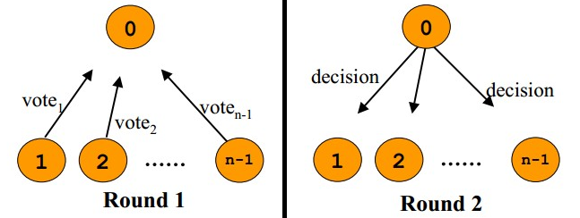

:toc:

:icons: font

:path: 分布式/
:imagesdir: ../image/

// 只有book调用的时候才会走到这里
ifdef::rootpath[]
:imagesdir: {rootpath}{path}{imagesdir}
endif::rootpath[]

== 分布式常见知识点

=== 分布式系统的事务处理

在实际生产中，随着业务的组件扩大使用单个服务器提供数据服务时，常常会遇到以下问题：

- 一台服务器的性能不足以提供足够的能力服务于所有的网络请求
- 服务器可能停机导致当前的服务不可用

所有的问题都指向一个结论那就是需要加入更多的机器来分担性能上的问题，以及单点故障的问题。通常在实际生产中采用以下手段来扩展数据服务：

- 数据分区：就是把数据分块放到不同的服务器上(比与微观的缓存cache way和hash桶等类似)
- 数据镜像：所有服务端都有相同的数据，提供相同的服务。

使用数据分区我们无法解决数据丢失的问题，单台服务器出现问题时还是会有部分数据丢失。因此、想要数据的高可用必须通过数据镜像，通过数据的冗余存储来实现数据高可用。
但是加入多个机器会让数据处理变的复杂，尤其是跨服务器事务处理，跨服务器事务处理牵涉到数据一致性，常用来保持数据一致性的算法是paxos和raft。

在保持数据一致性的时候我们需要考虑以下几种情况：

- 容灾：要有多个节点，保证数据不丢失
- 数据一致性：事务处理
- 性能：吞吐量足够、响应足够快

简单的来说，容灾就是让数据高可用，保证数据有多份，一份数据不能使用时可以通过数据副本进行恢复；要保存多份数据，就会存在数据一致性问题，这时就需要使用数据一致算法保证多份数据更新时的一致性；要保存多份数据，还要好保证多份数据一致性又会导致性能下降，因此在设计一致性算法时还要兼顾性能，保证性能能够满足要求。

软件开发不能大的小的都要，必须懂得取舍，鱼与熊掌不可兼得在软件开发中绝对适用。

==== 一致性模型

说起数据一致性来说，简单说有三种类型（细分的话，还有很多一致性模型，如：顺序一致性，FIFO一致性，会话一致性，单读一致性，单写一致性，但为了本文的简单易读，我只说下面三种）：

- Weak弱一致性：当你协议一个值，读操作在副本上肯能读出来，也可能读不出来。比如某些cache系统，或者是搜索引擎中的特例-百度搜索引擎(作恶)
- Eventually 最终一致性：当你写入一个新值后，有可能读不出来，但在某个时间窗口之后保证最终能读出来。比如：DNS，电子邮件、Amazon S3，Google搜索引擎这样的系统。
- Strong 强一致性：新的数据一旦写入，在任意副本任意时刻都能读到新值。比如：文件系统，RDBMS，Azure Table，etcd都是强一致性的。

从这三种一致性模型来说，我们我们可以看到，Weak和Eventually一般来说是异步冗余的，而strong一般来说是同步冗余的，异步的通常意味着更好的性能，但是也意味着更加复杂的状态同步控制，同步更加简单，但是简单的同时是以牺牲性能为代价的。

*Master-Slave*

在这种结构中slave一般是master的备份，在这种设计中一般：

1. 读写请求都是由master负责
2. 写请求由Master负责写入，并同步到slave上

参考，etcd，zk等(有少许不同)，的集群设计。

*Master-Master*

Master-Master又叫多主模式，是指一个系统中有一个或者多个master，每个master都提供Read-write服务，这种服务一般是master-slave的加强版，数据同步一般是通过master之间的异步完成的，所以是最终一致性的一致性模型。使用Master-Master的好处就是一台服务器挂了另外一天服务器能正常进行服务-

但是当多个Master同时进行数据修改时，对于Master-Master这种结构就是灾难性的，对于这种情况SVN采取的解决策略是让用户自己来解决。

https://en.wikipedia.org/wiki/Vector_clock[vector_clock]

*Two/Three Phase Commit*

这个协议的缩写又叫做2PC，中文叫两阶段提交。在分布式系统中，每个节点虽然可以知道自己操作的成功与失败，却无法知晓其他节点的成功与失败。当一个事务跨越多个节点时，为了保持事务的ACID特性，需要引入一个节点来掌控所有节点，并最终由该节点指示其他节点是否真正的进行提交。

[red]#第一阶段#

- 协调参与者进行事务操作，并根据协调结果来决定事务是否能够提交操作
- 各个参与者开始为资源申请资源，执行必要的操作，并在事务内准备完成undo/redo等操作
- 参与者响应该协调者，根据自身资源执行状况反馈给协调者该事务是否可以提交或者不可以提交

[red]#第二阶段#

如果所有参与者或者超过半数的参与者(etcd)回应可以进行提交则进行事务提交，如果有一个参与者恢复拒绝或者etcd中超过半数的参与者恢复决绝提交则进行事务回滚

