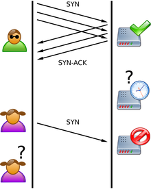
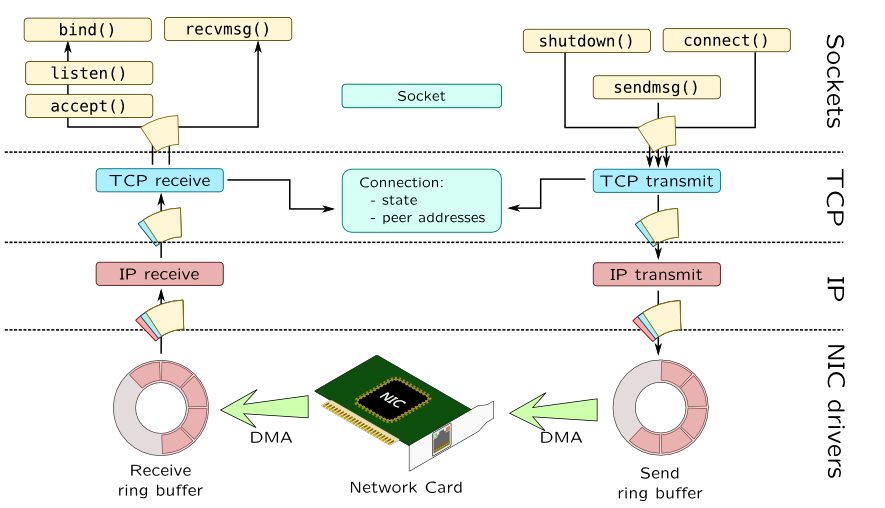

:toc:

:icons: font

// 保证所有的目录层级都可以正常显示图片
:path: 网络/
:imagesdir: ../image/
:srcdir: ../src

// 只有book调用的时候才会走到这里
ifdef::rootpath[]
:imagesdir: {rootpath}{path}{imagesdir}
:srcdir: {rootpath}../src/
endif::rootpath[]

ifndef::rootpath[]
:rootpath: ../
:srcdir: {rootpath}{path}../src/
endif::rootpath[]

== tcp

=== tcp哪些不得不知的事情

.TCP
****
TCP很复杂，复杂到难以想象，很多人抱怨为什么TCP不能精简点，有这样想法的人是没有看TCP的发展史。因为实际网络中的各种不确定情况都需要靠TCP来解决，而这些问题还会导致一些列子问题，问题带问题子子孙孙无穷尽已。但是这并不是说TCP不值得学，而是TCP太值得学习了，你通过学习TCP能学习很多问题的解决方案，也能学习到很多best practice，而这些都是经过无数次实践检验的宝贵经验。
****

- 为什么要记录那么多，因为TCP真他妈太复杂了，不记录一些知识点肯定会被忘记的
- 经过30多年的修改，TCP的复杂程度已经到了无以复加的程度，所以很多组织和公司开始绕过内核的tcp来实现一些功能如：DPDK, XDP

==== tcp头格式

image::image-2023-06-12-11-21-27-954.png[ipheader]
image::image-2023-06-12-11-21-47-333.png[tcpheader]
image::image-2023-06-12-11-25-21-439.png[tcpoptions]
image::image-2023-06-12-11-22-04-655.png[udpheader]

这里我们只看tcp的：

- TCP的包是没有IP地址的，那是IP层上的事。但是有源端口和目标端口。
- 一个TCP连接需要四个元组来表示是同一个连接（src_ip, src_port, dst_ip, dst_port）准确说是五元组，还有一个是协议。但因为这里只是说TCP协议，所以，这里我只说四元组。
- 注意上图中的四个非常重要的东西：
    1. Sequence Number是包的序号，用来解决网络包乱序（reordering）问题。
    2. Acknowledgement Number就是ACK——用于确认收到，用来解决不丢包的问题。
    3. Window又叫Advertised-Window，也就是著名的滑动窗口（Sliding Window），用于解决流控的。
    4. TCP Flag ，也就是包的类型，主要是用于操控TCP的状态机的。

==== tcp的状态机

IP是没有连接的，为什么建立在IP协议之上的TCP就是有连接的？这是因为TCP所谓的连接，其实质不过是通讯双方维护的一个连接状态，让它看起来好像有连接一样，因此、了解tcp状态变换对于理解tcp非常重要。

image::image-2023-06-12-11-24-03-990.png[tcp状态机]
image::image-2023-06-12-13-28-46-574.png[tcp timeline]

建立连接为什么要3次握手，断开连接为什么要4次挥手？

- 对于建立连接的三次握手：主要来初始化序列号(sequence number)，通信双方需要通知对方自己的sequence number初始值(ISN: Initial sequence number) -- 也叫SYN,全称synchronize sequence number。初始这些号就是为了解决网络传输出现乱序的问题，出现乱序之后tcp使用这些序号对数据进行拼接。

- 4次挥手：如果有一方发送了fin报文，对方需要回复对方ack，并向复方发送ack。如果双方都有连接管理，也可能同时发送fin给对方。在完成四次挥手之后客户端和服务端都会进入time_wait状态

[caption="tcp四次挥手: ", link=http://www.tcpipguide.com/free/t_TCPConnectionTermination-4.htm]
image::image-2023-06-12-13-30-37-335.png[]
http://www.tcpipguide.com/free/t_TCPConnectionTermination-4.htm[图片来源]

- 建立连接时SYN超时：试想一下， 如果server端接到了clien发的SYN后回了SYN-ACK后client掉线了，server端没有收到client回来的ACK，那么这个时候server的连接处于一个中间状态，即没成功，也没失败。server端如果在一定时间内没有收到会重发SYN-ACK。在Linux下，默认重试次数为5次，第 1 次重试发生在 1 秒钟后，接着会以翻倍的方式在第 2、4、8、16、32 秒共做 6 次重试，最后一次重试会等待 64 秒，如果仍然没有返回 ACK，才会终止三次握手。所以，总耗时是 1+2+4+8+16+32+64=127 秒，超过 2 分钟，TCP才会把断开这个连接。
- 关于SYN Flood攻击。一些恶意的人就为此制造了SYN Flood攻击——给服务器发了一个SYN后，就下线了，于是服务器需要默认等63s才会断开连接，这样，攻击者就可以把服务器的syn连接的队列耗尽，让正常的连接请求不能处理。于是，Linux下给了一个叫tcp_syncookies的参数来应对这个事——当SYN队列满了后，TCP会通过源地址端口、目标地址端口和时间戳打造出一个特别的Sequence Number发回去（又叫cookie），如果是攻击者则不会有响应，如果是正常连接，则会把这个 SYN Cookie发回来，然后服务端可以通过cookie建连接（即使你不在SYN队列中）。请注意，请先千万别用tcp_syncookies来处理正常的大负载的连接的情况。因为，synccookies是妥协版的TCP协议，并不严谨。对于正常的请求，你应该调整三个TCP参数可供你选择，第一个是：tcp_synack_retries 可以用他来减少重试次数；第二个是：tcp_max_syn_backlog，可以增大SYN连接数；第三个是：tcp_abort_on_overflow 处理不过来干脆就直接拒绝连接了。

关于ISN的初始化。ISN是不能hard code的，不然会出问题的——比如：如果连接建好后始终用1来做ISN，如果client发了30个segment过去，但是网络断了，于是 client重连，又用了1做ISN，但是之前连接的那些包到了，于是就被当成了新连接的包，此时，client的Sequence Number 可能是3，而Server端认为client端的这个号是30了。全乱了。RFC793中说，ISN会和一个假的时钟绑在一起，这个时钟会在每4微秒对ISN做加一操作，直到超过2^32，又从0开始。这样，一个ISN的周期大约是4.55个小时。因为，我们假设我们的TCP Segment在网络上的存活时间不会超过Maximum Segment Lifetime（缩写为MSL – Wikipedia语条），所以，只要MSL的值小于4.55小时，那么，我们就不会重用到ISN。
关于 MSL 和 TIME_WAIT。通过上面的ISN的描述，相信你也知道MSL是怎么来的了。我们注意到，在TCP的状态图中，从TIME_WAIT状态到CLOSED状态，有一个超时设置，这个超时设置是 2*MSL（RFC793定义了MSL为2分钟，Linux设置成了30s）为什么要这有TIME_WAIT？为什么不直接给转成CLOSED状态呢？主要有两个原因：1）TIME_WAIT确保有足够的时间让对端收到了ACK，如果被动关闭的那方没有收到Ack，就会触发被动端重发Fin，一来一去正好2个MSL，2）有足够的时间让这个连接不会跟后面的连接混在一起（你要知道，有些自做主张的路由器会缓存IP数据包，如果连接被重用了，那么这些延迟收到的包就有可能会跟新连接混在一起）。你可以看看这篇文章《TIME_WAIT and its design implications for protocols and scalable client server systems》
关于TIME_WAIT数量太多。从上面的描述我们可以知道，TIME_WAIT是个很重要的状态，但是如果在大并发的短链接下，TIME_WAIT 就会太多，这也会消耗很多系统资源。只要搜一下，你就会发现，十有八九的处理方式都是教你设置两个参数，一个叫tcp_tw_reuse，另一个叫tcp_tw_recycle的参数，这两个参数默认值都是被关闭的，后者recyle比前者resue更为激进，resue要温柔一些。另外，如果使用tcp_tw_reuse，必需设置tcp_timestamps=1，否则无效。这里，你一定要注意，打开这两个参数会有比较大的坑——可能会让TCP连接出一些诡异的问题（因为如上述一样，如果不等待超时重用连接的话，新的连接可能会建不上。正如官方文档上说的一样“It should not be changed without advice/request of technical experts”）。
关于tcp_tw_reuse。官方文档上说tcp_tw_reuse 加上tcp_timestamps（又叫PAWS, for Protection Against Wrapped Sequence Numbers）可以保证协议的角度上的安全，但是你需要tcp_timestamps在两边都被打开（你可以读一下tcp_twsk_unique的源码 ）。我个人估计还是有一些场景会有问题。
关于tcp_tw_recycle。如果是tcp_tw_recycle被打开了话，会假设对端开启了tcp_timestamps，然后会去比较时间戳，如果时间戳变大了，就可以重用。但是，如果对端是一个NAT网络的话（如：一个公司只用一个IP出公网）或是对端的IP被另一台重用了，这个事就复杂了。建链接的SYN可能就被直接丢掉了（你可能会看到connection time out的错误）（如果你想观摩一下Linux的内核代码，请参看源码 tcp_timewait_state_process）。
关于tcp_max_tw_buckets。这个是控制并发的TIME_WAIT的数量，默认值是180000，如果超限，那么，系统会把多的给destory掉，然后在日志里打一个警告（如：time wait bucket table overflow），官网文档说这个参数是用来对抗DDoS攻击的。也说的默认值180000并不小。这个还是需要根据实际情况考虑。
Again，使用tcp_tw_reuse和tcp_tw_recycle来解决TIME_WAIT的问题是非常非常危险的，因为这两个参数违反了TCP协议（RFC 1122）

其实，TIME_WAIT表示的是你主动断连接，所以，这就是所谓的“不作死不会死”。试想，如果让对端断连接，那么这个破问题就是对方的了，呵呵。另外，如果你的服务器是于HTTP服务器，那么设置一个HTTP的KeepAlive有多重要（浏览器会重用一个TCP连接来处理多个HTTP请求），然后让客户端去断链接（你要小心，浏览器可能会非常贪婪，他们不到万不得已不会主动断连接）。

参考： +
https://github.com/InterviewMap/CS-Interview-Knowledge-Map/blob/master/Network/Network_en.md[Network] +
https://www.filibeto.org/sun/lib/networking/tuning/ttcp.html[tcp transaction] +
https://blog.liu-kevin.com/2021/01/04/linuxzhi-wang-luo/[tcp调优] +
https://www.cnblogs.com/LOVE0612/p/15043947.html[tcp相关算法] +
https://en.wikipedia.org/wiki/SYN_flood[syn flood攻击] +
https://www.rfc-editor.org/rfc/rfc4987[rfc4987] +
https://www.sobyte.net/post/2021-12/whys-the-design-tcp-time-wait/[为什么TCP有一个time wait状态]

=== TCP连接建立过程

- 为什么服务端程序需要先listen一下
- 半连接和全连接队列长度如何确定

> tcp服务端在处理三次握手的时候需要有半连接和全连接队列配合完成，那么这两个队列在内核中是什么样子？如何想修改他们的长度如何完成？

- cannot assign requested address这个报错你知道是怎么回事吗？该如何解决
- 一个客户端端口可以同时用在两个连接上吗？

> 假设一个客户端某个端口号已经和某个服务端建立连接了，那么再想和其他服务端建立连接这个端口还能用吗？

- 服务端的全连接和半连接全满了会怎么样？

> 如果服务端连接请求过于频繁，导致全连接和半连接全部都满了会怎样？会不会导致线上问题？会不会导致连接队列溢出，如果有，怎么办？怎样才能解决？

- 创建新连接时，新连接的socket内核对象是什么时候创建的？
- 建立一条tcp连接需要消耗多长时间？
- 服务器负载正常但是CPU被打到底(100%)了是怎么回事？

.网络协议栈

=== 深入理解listen

参考：

https://mp.weixin.qq.com/s?__biz=MzA3NjY2NzY1MA==&mid=2649740393&idx=1&sn=b048e8e068052549af0c44cb678a7140&chksm=8746ba04b0313312fe87e346c0c68d235a8e81b31de1453392427af6384e612ad44713627eb0&scene=27[eBPF内核协议栈背负太多的历史包袱]
https://mp.weixin.qq.com/s/uWRg1fhHZh_ttd2NUsAh9w[XDPF/eBPF]
https://mp.weixin.qq.com/s/TwKOwg2RFBYKZF160Zw7lA[一个奇葩的网络问题]

https://coolshell.cn/articles/11564.html[tcp那些事]

