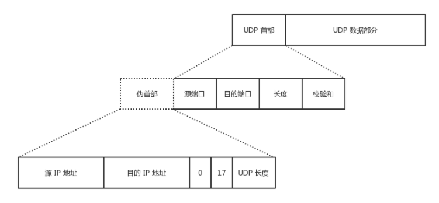

:toc:

:icons: font

// 保证所有的目录层级都可以正常显示图片
:path: 网络/
:imagesdir: ../image/
:srcdir: ../src

// 只有book调用的时候才会走到这里
ifdef::rootpath[]
:imagesdir: {rootpath}{path}{imagesdir}
:srcdir: {rootpath}../src/
endif::rootpath[]

ifndef::rootpath[]
:rootpath: ../
:srcdir: {rootpath}{path}../src/
endif::rootpath[]

== 网络常见知识点

=== 网络分层

.计算机网络体系结构
image::image-2024-09-16-20-30-44-067.png[]

=== 各层作用及协议

[cols="1,2,2", options="header"]
|===
|分层 | 作用 | 协议

|物理层 | 通过媒介传输比特，确定机械及电气规范（比特 Bit） | RJ45、CLOCK、IEEE802.3（中继器，集线器）
|数据链路层|将比特组装成帧和点到点的传递（帧 Frame）| PPP、FR、HDLC、VLAN、MAC（网桥，交换机）
|网络层|负责数据包从源到宿的传递和网际互连（包 Packet）|IP、ICMP、ARP、RARP、OSPF、IPX、RIP、IGRP（路由器）
|运输层|提供端到端的可靠报文传递和错误恢复（ 段Segment）|TCP、UDP、SPX
|会话层|建立、管理和终止会话（会话协议数据单元 SPDU）|NFS、SQL、NETBIOS、RPC
|表示层|对数据进行翻译、加密和压缩（表示协议数据单元 PPDU）|JPEG、MPEG、ASII
|应用层|允许访问OSI环境的手段（应用协议数据单元 APDU）|FTP、DNS、Telnet、SMTP、HTTP、WWW、NFS

|===

=== 物理层

* 传输数据的单位：比特
* 数据传输系统：源系统（源点、发送器） --> 传输系统 --> 目的系统（接收器、终点）

通道：

* 单向通道（单工通道）：只有一个方向通信，没有反方向交互，如广播
* 双向交替通信（半双工通信）：通信双方都可发消息，但不能同时发送或接收
* 双向同时通信（全双工通信）：通信双方可以同时发送和接收信息

通道复用技术：

* 频分复用（FDM，Frequency Division Multiplexing）：不同用户在不同频带，所用用户在同样时间占用不同带宽资源
* 时分复用（TDM，Time Division Multiplexing）：不同用户在同一时间段的不同时间片，所有用户在不同时间占用同样的频带宽度
* 波分复用（WDM，Wavelength Division Multiplexing）：光的频分复用
* 码分复用（CDM，Code Division Multiplexing）：不同用户使用不同的码，可以在同样时间使用同样频带通信

=== 数据链路层

主要信道：

* 点对点信道
* 广播信道

==== 点对点信道

* 数据单元：帧

三个基本问题：

* 封装成帧：把网络层的 IP 数据报封装成帧，`SOH - 数据部分 - EOT`
* 透明传输：不管数据部分什么字符，都能传输出去；可以通过字节填充方法解决（冲突字符前加转义字符）
* 差错检测：降低误码率（BER，Bit Error Rate），广泛使用循环冗余检测（CRC，Cyclic Redundancy Check）

点对点协议（Point-to-Point Protocol）：

* 点对点协议（Point-to-Point Protocol）：用户计算机和 ISP 通信时所使用的协议

==== 广播信道

广播通信：

* 硬件地址（物理地址、MAC 地址）
* 单播（unicast）帧（一对一）：收到的帧的 MAC 地址与本站的硬件地址相同
* 广播（broadcast）帧（一对全体）：发送给本局域网上所有站点的帧
* 多播（multicast）帧（一对多）：发送给本局域网上一部分站点的帧

=== 网络层

* IP（Internet Protocol，网际协议）是为计算机网络相互连接进行通信而设计的协议。
* ARP（Address Resolution Protocol，地址解析协议）
* ICMP（Internet Control Message Protocol，网际控制报文协议）
* IGMP（Internet Group Management Protocol，网际组管理协议）

==== IP 网际协议

IP 地址分类：

* `IP 地址 ::= {<网络号>,<主机号>}`

[cols="1,1,1,1,1", options="header"]
|===
|IP 地址类别 | 网络号 | 网络范围 | 主机号 | IP 地址范围
|A 类 | 8bit，第一位固定为 0 | 0 —— 127 | 24bit | 1.0.0.0 —— 127.255.255.255
|B 类 | 16bit，前两位固定为  10 | 128.0 —— 191.255 | 16bit | 128.0.0.0 —— 191.255.255.255
|C  类 | 24bit，前三位固定为  110 | 192.0.0 —— 223.255.255 | 8bit | 192.0.0.0 —— 223.255.255.255
|D  类 | 前四位固定为 1110，后面为多播地址
|E  类 | 前五位固定为 11110，后面保留为今后所用
|===

.IP 数据报格式
image::image-2024-09-16-20-32-05-073.png[IP数据报格式]

==== ICMP 网际控制报文协议

.ICMP 报文格式：
image::image-2024-09-12-22-14-39-480.png[]

应用：

* PING（Packet InterNet Groper，分组网间探测）测试两个主机之间的连通性
* TTL（Time To Live，生存时间）该字段指定 IP 包被路由器丢弃之前允许通过的最大网段数量

==== 内部网关协议

* RIP（Routing Information Protocol，路由信息协议）
* OSPF（Open Sortest Path First，开放最短路径优先）

==== 外部网关协议

* BGP（Border Gateway Protocol，边界网关协议）

==== IP多播

* IGMP（Internet Group Management Protocol，网际组管理协议）
* 多播路由选择协议

==== VPN 和 NAT

* VPN（Virtual Private Network，虚拟专用网）
* NAT（Network Address Translation，网络地址转换）

==== 路由表包含什么？

1. 网络 ID（Network ID, Network number）：就是目标地址的网络 ID。
2. 子网掩码（subnet mask）：用来判断 IP 所属网络
3. 下一跳地址/接口（Next hop / interface）：就是数据在发送到目标地址的旅途中下一站的地址。其中 interface 指向 next hop（即为下一个 route）。一个自治系统（AS, Autonomous system）中的 route 应该包含区域内所有的子网络，而默认网关（Network id: `0.0.0.0`, Netmask: `0.0.0.0`）指向自治系统的出口。

根据应用和执行的不同，路由表可能含有如下附加信息：

1. 花费（Cost）：就是数据发送过程中通过路径所需要的花费。
2. 路由的服务质量
3. 路由中需要过滤的出/入连接列表

=== 运输层

协议：

* TCP（Transmission Control Protocol，传输控制协议）
* UDP（User Datagram Protocol，用户数据报协议）

端口：

[cols="2,1,1,1,1,1,1,1,1", options="header"]
|===
|应用程序 | FTP | TELNET | SMTP | DNS | TFTP | HTTP | HTTPS | SNMP
|端口号 | 21 | 23 | 25 | 53 | 69 | 80 | 443 | 161
|===

==== TCP

* TCP（Transmission Control Protocol，传输控制协议）是一种面向连接的、可靠的、基于字节流的传输层通信协议，其传输的单位是报文段。

特征：

* 面向连接
* 只能点对点（一对一）通信
* 可靠交互
* 全双工通信
* 面向字节流

TCP 如何保证可靠传输：

* 确认和超时重传
* 数据合理分片和排序
* 流量控制
* 拥塞控制
* 数据校验

.TCP  首部
image::image-2024-09-16-20-33-25-757.png[]

TCP：状态控制码（Code，Control Flag），占 6 比特，含义如下：

* URG：紧急比特（urgent），当 `URG＝1` 时，表明紧急指针字段有效，代表该封包为紧急封包。它告诉系统此报文段中有紧急数据，应尽快传送(相当于高优先级的数据)， 且上图中的 Urgent Pointer 字段也会被启用。
* ACK：确认比特（Acknowledge）。只有当 `ACK＝1` 时确认号字段才有效，代表这个封包为确认封包。当 `ACK＝0` 时，确认号无效。
* PSH：（Push function）若为 1 时，代表要求对方立即传送缓冲区内的其他对应封包，而无需等缓冲满了才送。
* RST：复位比特(Reset)，当 `RST＝1` 时，表明 TCP 连接中出现严重差错（如由于主机崩溃或其他原因），必须释放连接，然后再重新建立运输连接。
* SYN：同步比特(Synchronous)，SYN 置为 1，就表示这是一个连接请求或连接接受报文，通常带有 SYN 标志的封包表示『主动』要连接到对方的意思。
* FIN：终止比特(Final)，用来释放一个连接。当 `FIN＝1` 时，表明此报文段的发送端的数据已发送完毕，并要求释放运输连接。

==== UDP

* UDP（User Datagram Protocol，用户数据报协议）是 OSI（Open System Interconnection 开放式系统互联） 参考模型中一种无连接的传输层协议，提供面向事务的简单不可靠信息传送服务，其传输的单位是用户数据报。

特征：

* 无连接
* 尽最大努力交付
* 面向报文
* 没有拥塞控制
* 支持一对一、一对多、多对一、多对多的交互通信
* 首部开销小

https://github.com/JerryC8080/understand-tcp-udp[TCP/UDP图片来源]

==== TCP 与 UDP 的区别

1. TCP 面向连接，UDP 是无连接的；
2. TCP 提供可靠的服务，也就是说，通过 TCP 连接传送的数据，无差错，不丢失，不重复，且按序到达；UDP 尽最大努力交付，即不保证可靠交付
3. TCP 的逻辑通信信道是全双工的可靠信道；UDP 则是不可靠信道
4. 每一条 TCP 连接只能是点到点的；UDP 支持一对一，一对多，多对一和多对多的交互通信
5. TCP 面向字节流（可能出现黏包问题），实际上是 TCP 把数据看成一连串无结构的字节流；UDP 是面向报文的（不会出现黏包问题）
6. UDP 没有拥塞控制，因此网络出现拥塞不会使源主机的发送速率降低（对实时应用很有用，如 IP 电话，实时视频会议等）
7. TCP 首部开销20字节；UDP 的首部开销小，只有 8 个字节

=== 基础知识

==== bit\frame\packet\segment\data区别

1. 物理层发出的数据成为bit,物理层传输的是比特流。
2. 数据链路层发出的数据包称为frame，地址是链路层的地址，如mac地址；
3. 网络层发出的数据包称为packet，地址是网络层地址，如ip地址；
4. 传输层发出的数据包称为segment，地址是传输层地址，如TCP的端口号。

数据的封装过程：

1. data
2. segment
3. packet
4. frame
5. bit

对应的协议：
1.application-session （Represen layer is in the middle) layer
2.transprot layer
3.network layer
4.data link layer
5.physical layer

'''

datagram（数据报）与packet（数据包）区别：

datagram（数据报） – 在网络层中的传输单元（例如IP）。一个datagram可能被压缩成一个或几个packets，在数据链路层中传输。

packet（数据包） – 封装的基本单元，它穿越网络层和数据链路层的分解面。通常一个packet映射成一个frame，但也有例外：即当数据链路层执行拆分或将几个packet合成一个frame的时候。

二层的PDU叫做Frame;
IP的叫做Packet;
TCP的叫做Segment；
UDP的叫做Datagram。

OSI参考模型的各层传输的数据和控制信息具有多种格式,常用的信息格式包括帧、数据包、数据报、段、消息、元素和数据单元。信息交换发生在对等OSI层之间，在源端机中每一层把控制信息附加到数据中，而目的机器的每一层则对接收到的信息进行分析，并从数据中移去控制信息，下面是各信息单元的说明：

- 帧（frame）是一种信息单位，它的起始点和目的点都是数据链路层。
- 数据包（packet）也是一种信息单位，它的起始和目的地是网络层。
- 数据报（datagram）通常是指起始点和目的地都使用无连接网络服务的的网络层的信息单元。
- 段（segment）通常是指起始点和目的地都是传输层的信息单元。
- 消息（message）是指起始点和目的地都在网络层以上（经常在应用层）的信息单元。
- 元素（cell）是一种固定长度的信息，它的起始点和目的地都是数据链路层。元素通常用于异步传输模式（ATM）和交换多兆位数
- 服务（SMDS）网络等交换环境。
- 数据单元（data unit）指许多信息单元。常用的数据单元有服务数据单元（SDU）、协议数据单元（PDU）。SDU是在同一机器上的两层之间传送信息。PDU是发送机器上每层的信息发送到接收机器上的相应层（同等层间交流用的）。

=== 如果让你设计一个聊天应用层协议，需要考虑哪些问题？
1. 要考虑基于哪些网络层，一般要基于传输层和应用层来分工完成整个聊天应用的通信
2. 应用层还需要传输一些信息来控制程序的运行过程，因此还需要自行定义应用层协议
 - TCP/Websocket协议维护长连接
 - UDP进行消息/文件的传输和接收
 - HTTP/HTTPS完成用户登录，用户注销等
 - 设计心跳保活命令

=== 服务端挂了，客户端的tcp连接还在吗？

- 如果服务端进程崩溃，那么内核会发送FIN报文，与客户端进行四次挥手
tcp的连接是内核维护的，所以当服务端的进程崩溃之后，内核需要回收进程的所有TCP连接资源，因此内核会在回收资源时断开对应的tcp连接，整个过程并不需要对应进程的参与，所以即使服务端进程退出了还是能与客户端完成tcp的四次挥手

- 如果服务端宕机，服务端不会进行四次挥手，后续发生的事情会根据客户端是否重新发送数据变现的不同
1. 如果客户端会发送数据，由于服务端已经不存在了，客户端的数据会一直超时重传，当重传次数超过一定阈值后会断开TCP连接
2. 如果客户端一直不发送数据，需要根据客户端是否开启TCP keepalive机制，如果开启超时检测服务端已经不存在就会断开连接，如果没有开启客户端的tcp会一直存在，并不会断开

服务端发生宕机之后无法和客户端进行四次挥手，所以在服务端发生宕机的时刻起，客户端是无法感知到服务端的宕机的，只能在后续的数据交互来判断服务端是否存在

如果服务端宕机之后客户端会发送数据，在超时之后客户端会启用超时重传机制，用来重传那些发送了但是没有得到回复的数据。当重传次数到达一定阈值之后内核就会判定该TCP连接出现了问题，然后通过socket接口通知该应用该tcp连接出现了问题，客户端在接收到这个问题反馈之后，会断开TCP的连接

Linux中可以通过 tcp_retries2的配置项来设置重传超时时间。
[source, bash]
.tcp_retries2
----
$cat /proc/sys/net/ipv4/tcp_retries2
15
----
tcp_retries2不是代表重传的次数，该数值只是用来计算重传超时的，设置为15大概超时时间为timeout= 924600ms，如果重传间隔超过这个timeout就会认为停止重传，然后就会断开tcp连接

在发生超时重传的过程中，每一轮的超时时间(RTO)都是倍数增长的，如果第一轮的超时时间为200ms那么第二轮的RTO就会调整为400ms......, RTO是根据RTT计算出来的，如果发生超时重传，那么重复几次之后就会达到timeout的值了。

RTO在Linux中使用宏定义进行预定义，以Linux2.6+为例，HZ为1000ms那么TCP_RTO_MIN为200ms， TCP_RTO_MAX为120s

[source, c]
.RTO 定义
----
#define TCP_RTO_MAX ((unsigned)(120*HZ))
#define TCP_RTO_MIN ((unsigned)(HZ/5))
----

=== 位域和大小端

因为C/C++定义中有一个规定，无论是大端还是小端，先定义的成员一定是低字节和低位

1. 大端和小端存储相反，字节顺序相反，高低位相反
2. 那么当位域中先定义的成员一定是低字节和低位的条件限制时，就会出现一个问题，那就是low无论在小端还是大端机器中都是去低字节和低位(4位)，那么大小端中low和high就会存在互换的情况

[source, cpp]
----
struct Data {
    union {
        uint8_t res;
        struct {
           uint8_t low : 4;
           uint8_t high : 4;
        };
    };
};
----

=== 为什么本地通信无论写的什么IP地址最终都会走lo虚拟地址

在内核初始化local路由表的时候，回把路由表项都设置为RTN_LOCAL，这个过程是在设置本机IP的时候调用fib_inetaddr_event实现的，也就是说本机IP的类型都是RTN_LOCAL

[source, cpp]
----
void fib_add_ifaddr(struct in_ifaddr *ifa)
{
	fib_magic(RTM_NEWROUTE, RTN_LOCAL, addr, 32, prim);
}
----

使用本机IP即使不使用127.0.0.1，内核在查找的时候判断类型依然是RTN_LOCAL，也就是net->loopback_dev，也就是本机lo虚拟网卡。

在跨机网络包的接收过程中，需要经过硬中断然后才能出发软中断，在本机网络IO过程中，由于并不是真的过网卡，所以网卡的发送过程、硬中断都省去了直接从软中断开始

=== 网络相关参考

https://coolshell.cn/articles/11564.html

=== 网络问题排查

==== ethtool工具

*查看和修改网卡RingBuffer最大值和当前设置*
[source, bash]
----
# 查看
$ ethtool -g ens160
# 修改网卡硬件缓存大小
$ ethtool -G eth0 rx 4096 tx 4096
----

*查看网卡丢包统计*

[source, bash]
----
$ ethtool -S eth0
----

*查看网卡配置状态*
[source, bash]
----
$ethtool ens160
Settings for ens160:
	Supported ports: [ TP ]
	Supported link modes:   1000baseT/Full
	                        10000baseT/Full
	Supported pause frame use: No
	Supports auto-negotiation: No
	Supported FEC modes: Not reported
	Advertised link modes:  Not reported
	Advertised pause frame use: No
	Advertised auto-negotiation: No
	Advertised FEC modes: Not reported
	Speed: 10000Mb/s
	Duplex: Full
	Port: Twisted Pair
	PHYAD: 0
	Transceiver: internal
	Auto-negotiation: off
	MDI-X: Unknown
Cannot get wake-on-lan settings: Operation not permitted
	Link detected: yes
----

如果通过ethtool查看网卡的speed等配置不符合预期，可以通过ethtool让网卡自动协商。

[source, bash]
----
$ethtool -r  eth1/eth0;
----

如果发现，上下游设备不支持自协商，可以强制设置端口的速率：
[source, bash]
----
$ethtool -s eth1 speed 1000 duplex full autoneg off
----

*查看流控统计信息*

[source, bash]
----
$ethtool -S eth1 | grep control
----

*查看网络流控配置*
[source, bash]
----
$ethtool -a eth1
----

*关闭网卡流控*
[source, bash]
----
ethtool -A ethx autoneg off //自协商关闭
ethtool -A ethx tx off //发送模块关闭
ethtool -A ethx rx off //接收模块关闭
----

*查看网卡firmware版本*
[source, bash]
----
$ethtool -i eth0
----

*单核负载过高导致丢包*
当单核心因为软中断占用过多时会导致新来的数据软中断无法处理而丢包，导致网络数据的处理速度跟不上网卡的接收速度。
通过命令mpstat -P ALL 1可以每隔一秒查看一下当前cpu的使用情况
[source, bash]
----
mpstat -P ALL 1
Linux 3.10.0-862.11.6.el7.x86_64 (localhost.localdomain) 	10/26/2023 	_x86_64_	(4 CPU)
01:27:31 PM  CPU    %usr   %nice    %sys %iowait    %irq   %soft  %steal  %guest  %gnice   %idle
01:27:32 PM  all    7.30    0.00    7.03    0.00    0.00    0.00    0.00    0.00    0.00   85.68
01:27:32 PM    0    5.43    0.00    7.61    0.00    0.00    0.00    0.00    0.00    0.00   86.96
01:27:32 PM    1    7.45    0.00    7.45    0.00    0.00    0.00    0.00    0.00    0.00   85.11
01:27:32 PM    2    5.43    0.00    5.43    0.00    0.00    1.09    0.00    0.00    0.00   88.04
01:27:32 PM    3   11.83    0.00    6.45    0.00    0.00    0.00    0.00    0.00    0.00   81.72
----

如果出现这种情况，比如soft占用100%，这个时候可以通过一下几种方法中的一种或者多种组合来解决问题：

- 调整RSSfootnote:[Receive Side Scaling,用于多核系统中分发网络流量到不同的CPU核心进行处理]队列。

[source, bash]
----
# 查看RSS队列配置
ethtool -x eth0
# 调整配置
ethtool -X eth0 xxx
----

- 保证网卡中断配置均衡 `cat /proc/interrupts`

[source, bash]
----
# 调整irq
irqbalance
# 查看当前运行情况
service irqbalance status
# 终止服务
service irqbalance stop
#中断绑CPU核
echo mask > /proc/irq/xxx/smp_affinity
----

- 根据CPU和网卡队列个数调整网卡多队列和RPS配置

协议栈开启RPS并设置RPS
[source, bash]
----

echo $mask（CPU配置）> /sys/class/net/$eth/queues/rx-$i/rps_cpusecho 4096（网卡buff）> /sys/class/net/$eth/queues/rx-$i/rps_flow_cnt2）
#CPU小于网卡队列个数，绑中断就可以，可以试着关闭RPS看一下效果：
echo 0 > /sys/class/net/<dev>/queues/rx-<n>/rps_cpu
----

- numa CPU调整，对其网卡位置，可以提高内核处理速度，从而给更多CPU应用包，从而减缓丢包率
[source, bash]
----
ethtool -i eth1|grep bus-info
lspci -s bus-info -vv|grep node
----
上面中断和 RPS 设置里面 mask 需要重新按 numa CPU 分配重新设置；

- 可以试着开启中断聚合(需要网卡支持)

[source, bash]
----
# 查看是否支持
ethtool -c ethx
# 调整
ethtool -C ethx adaptive-rx on
----

*分片重组导致丢包*

[source, bash]
----
# 查看是否有分片重组导致丢包发生
netstat -s|grep timeout
601 fragments dropped after timeout
# 通过调整分片重组超时时间来解决
# 通过
sysctl -a| grep net.ipv4.ipfrag_time
net.ipv4.ipfrag_time = 30
sysctl -w net.ipv4.ipfrag_time=60
----

=== 连接失败问题查询

主要通过观察listen队列和accept队列的问题来断定连接创建失败时由于具体哪个地方导致的问题。

.通过ss查看accept队列的大小以及当前队列中现存待连接完成的个数
[source, bash]
----
# -l 显示正在监听的socket
# -n 不解析服务器名称
# -t 只显示tcp socket
[wangyz@localhost /home/wangyz]$ss  -lnt
State       Recv-Q Send-Q                             Local Address:Port                                            Peer Address:Port
LISTEN      0      100                                    127.0.0.1:25                                                         *:*
LISTEN      0      128                                    127.0.0.1:6010                                                       *:*
LISTEN      0      100                                            *:16506                                                      *:*
LISTEN      0      100                                            *:20571                                                      *:*
LISTEN      0      50                                             *:8091                                                       *:*
LISTEN      0      128                                  10.20.26.58:36379                                                      *:*
----

Recv-Q代表待accept的个数，也就是队列中有多少连接，Send-Q代表队列的最大值，队列的大小长度取决于somaxconn配置和backlog之间的最小值，min(somaxconn, backlog)，somaxconn是内核配置，backlog是listen中传入

[source, bash]
----
[wangyz@localhost /home/wangyz]$date;netstat -s|grep overflowed
2024年 06月 05日 星期三 14:22:15 CST
    48883 times the listen queue of a socket overflowed
----

通过netstat查看listen溢出的数量，如果一直在增加说明存在accept溢出问题。

